Part 1: Composer Playground Set-Up
==================================

1. Go to http://composer-playground.mybluemix.net/login from a browser. Either Firefox or Chrome will do the trick

2. Click on Let’s Blockchain!

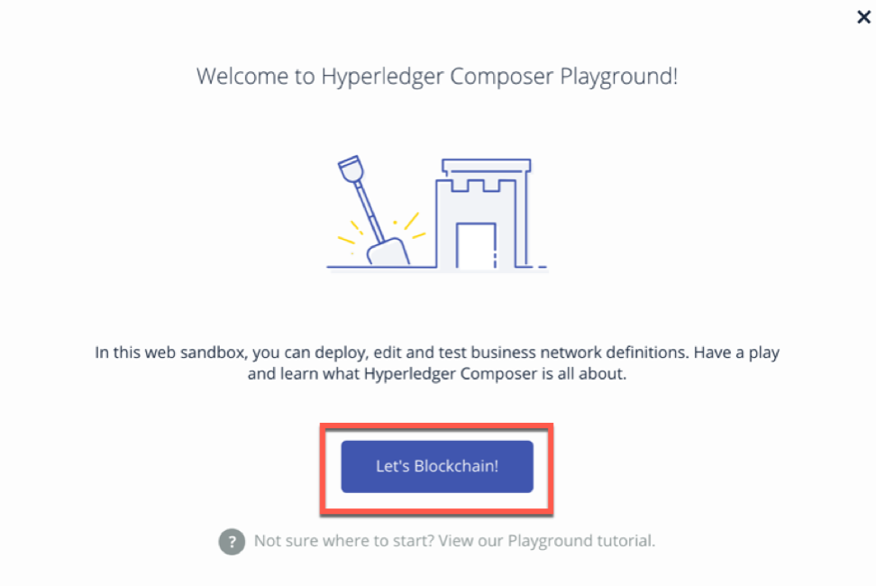

3. Click on Deploy a New Business Network, which is to the right of the Hello, Composer card

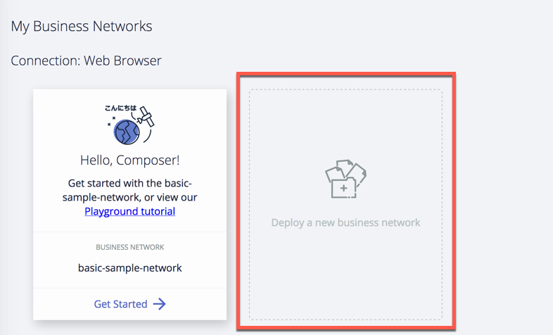

4. Scroll all the way to the bottom and select Vehicle-Manufacturing Network

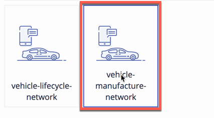

5. Scroll back up and click on Deploy

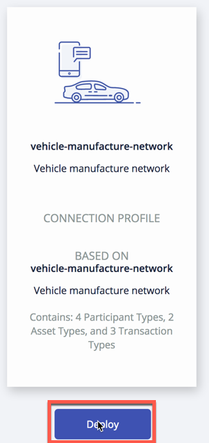

6. You will then be taken to the Composer Playground homepage, but with an admin@basic-sample-network card. It will have an User ID of admin and the business network will say vehicle-manufacturing-network

7. Click on Connect Now to access your Vehicle-Manufacturing business network

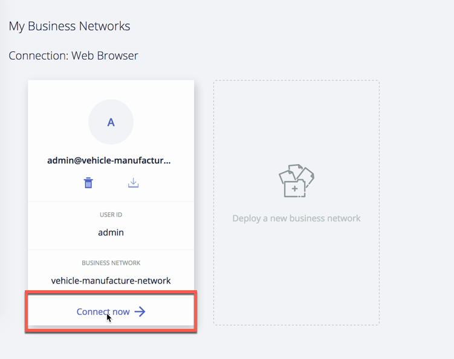

Part 2: Vehicle-Manufacturing Network Framework
===============================================

1. View the About page. It holds information about the business network, like the business network purpose and what each asset or participant means and does. 

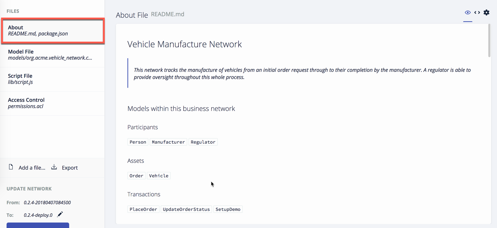

2. Jump to the Model File. This file defines all the participants, assets and transactions. It uses a modeling language. If you were a developer and you want to start to define your business network, you would go into the model file to define the various participants and assets you have in your network.

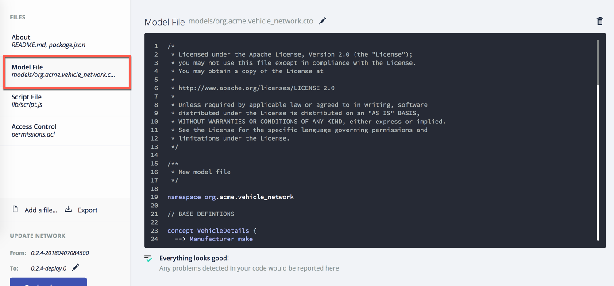

3. Next, go to the Script file. This is the file where all your transactions are stored and defined. It uses JavaScript. If you were a developer, you would house all your transactions in this file

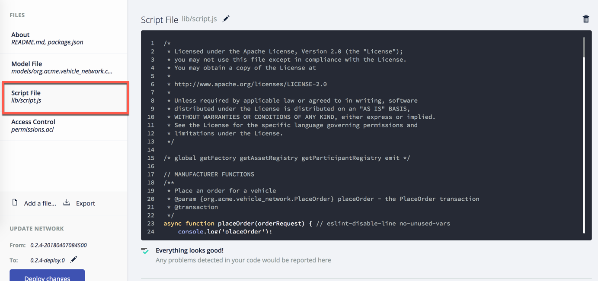

4. Finally, go to the Access Control file. This is your permissions. Basically, it is a way to add privacy or security to your network. It allows or prevents participants from doing actions in the network. For example, in this business network we have a regulator. They can only read everything in the network. 

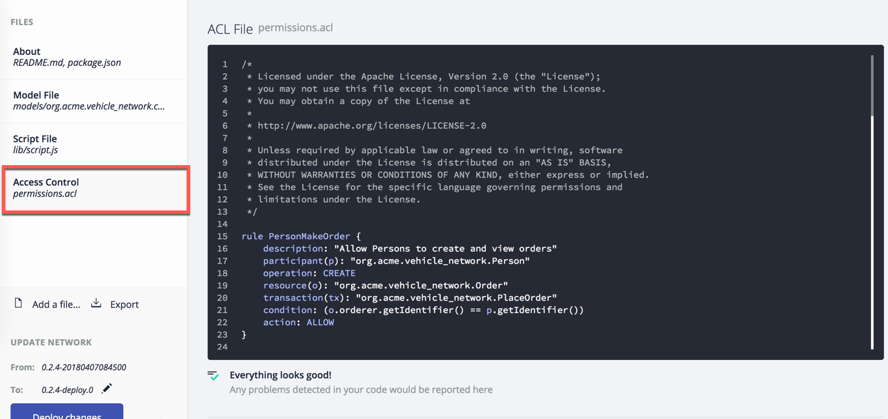

Part 3: Adding Participants and Assets
======================================

1. Up at the top, you will see Define and Test. Define is where you define your network and test is where you test your network that you just defined. Click on Test. Your screen should look like this:

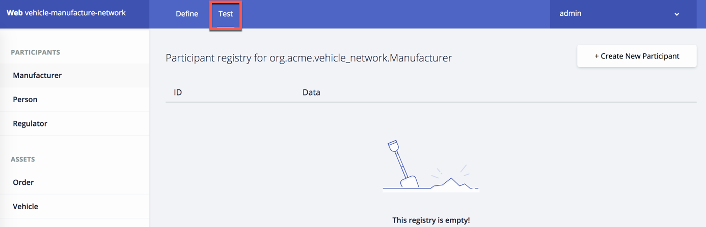

2. You will see your participants are defined in the Model File. We have Manufacturer, Person and Regulator as our participants. Then we have Order and Vehicle as our assets.

3. Click on Manufacturer and then click on +Create a New Participant in the top right

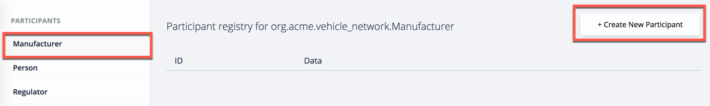

4. You will have a pop-up appear. You can leave the Company ID or you can change it, to make it much simpler for you as start submitting transactions. Then you can fill in the name section whatever you want your manufacturer to be. Click on Create when you have what you want. Here is what I did below:

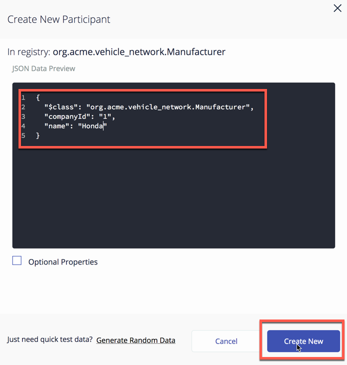

5. Go ahead and create a Person as well

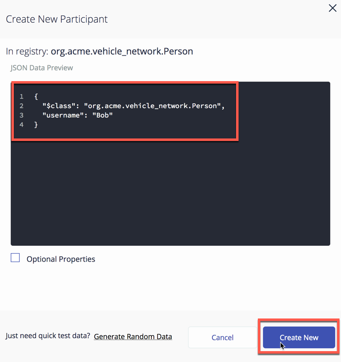

6. Once you have a person, create a Regulator

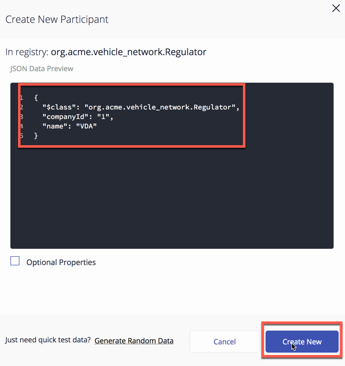

7. Once you have 1 participant for all our participants (Manufacturer, Person and Regulator), go ahead and make 1 more participant for each of our participants

8. Once you have done step 7, you should now have 6 total participants. 2 Manufacturers, 2 People (Person) and 2 Regulators

Part 4: Submitting Transactions
===============================

1. We should in great shape, if you’ve made it this far. Go ahead and submit a transaction. You can submit a transaction by clicking on the Submit Transaction in the bottom left. 

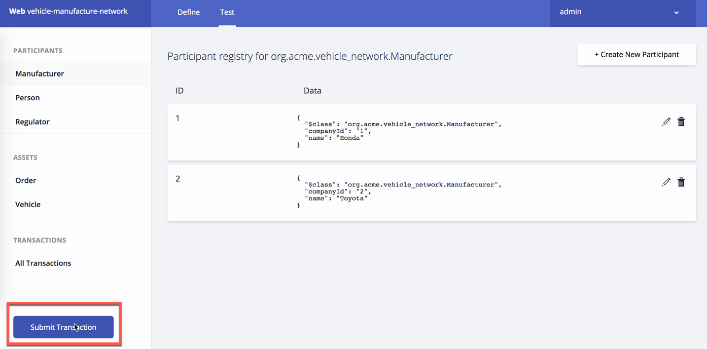

2. You will get a new pop-up to appear. Don’t get overwhelmed by the businesses of the pop-up, but we will try to make this very simple. Go ahead give this order an ID number. Also, fill in a model type and colour. You assign this order to manufacturer by removing the generated number in the make section to one of the manufacturing numbers you create in part 3. Once you have completed the top half, you can fill in different options you want in the options section. At the end you assign this order to a person you created in part 3. Here is what I did with my order: 

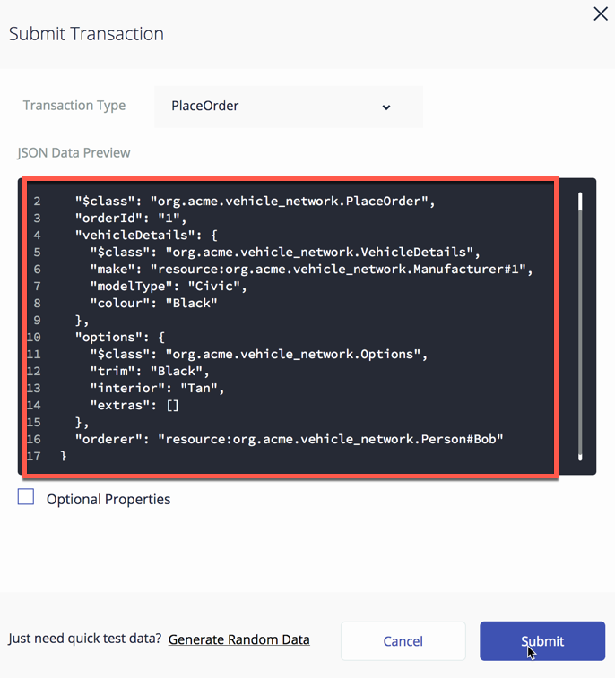

3. When you have what you want, click on Submit to submit the transaction

4. Now, click on the Order section on the left. You will now see a new order. This means our transaction was successful. If you want to, go to All Transaction on the left. You will see the list of transactions you have already done. You can view more information of these transaction by clicking on View Record

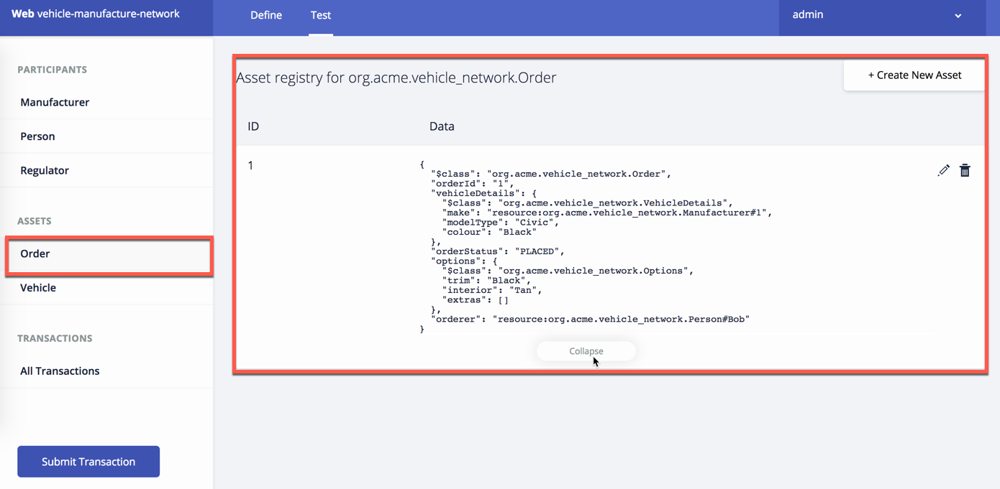

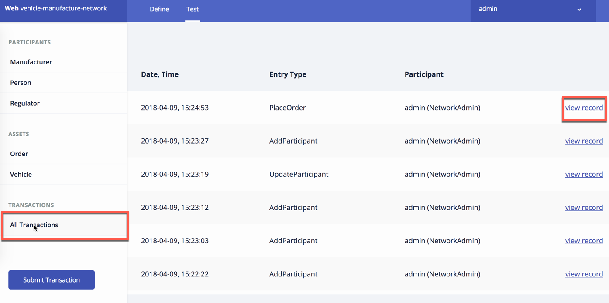

5. Now that we have an order, we need to make it an official vehicle. Click on Submit Transaction. Once you have the pop-up, you can change the transaction to a different transaction. Replace Place Order transaction to Update Order Status transaction. 

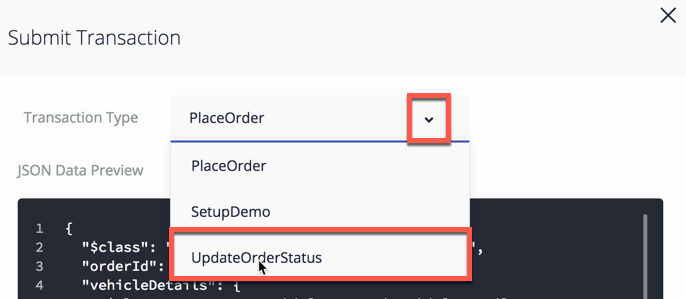

6. Now that we are on the Update Order Status transaction, replace the word PLACED to SCHEDULED_FOR_MANUFACTURE. Then assign this transaction to a specific order that has already been placed. Below is a picture of what I did in this transaction

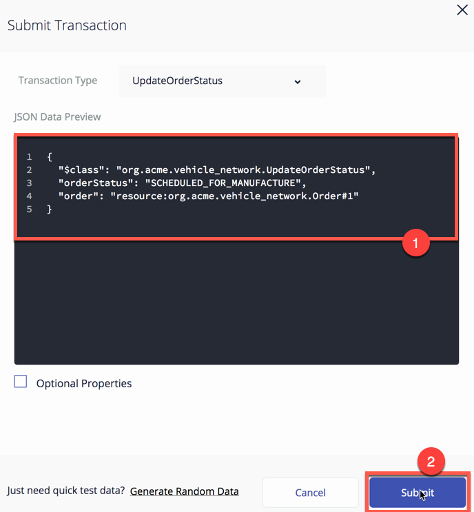

7. Once you have what you want, click on Submit.

In a production environment, this would be done from the manufacturer perspective. The person who placed the order would see that their car – that they ordered – is scheduled for manufacturing. We will actually do that later on in this lab

8. Go ahead and click on Submit Transaction again, an Update Status Order. Now, replace the word PLACED to VIN_ASSIGNED. Once you have what you want, click on Optional Properties. This will pop-up another field called vin. Vin is a vehicle identification number. Fill in vin with whatever number you desire. Below is what I did with my transaction:  

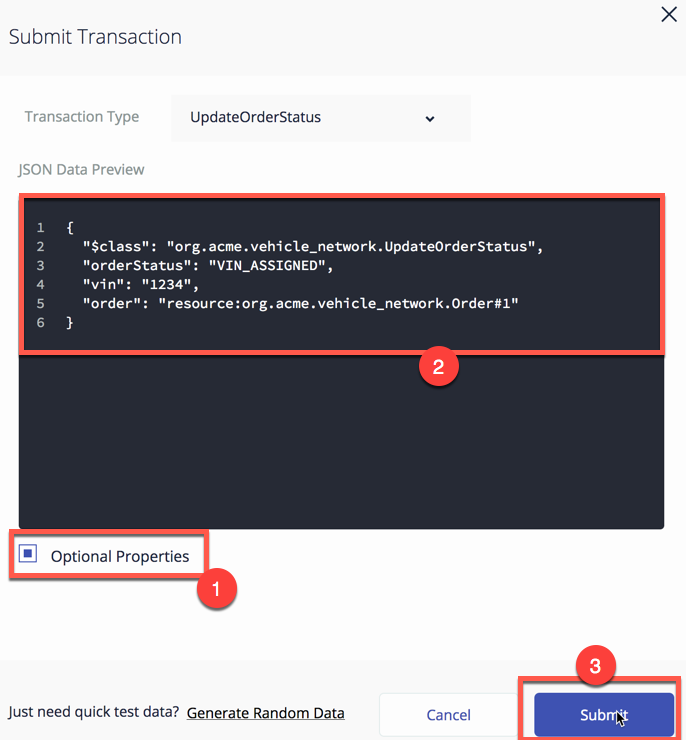

10. Now, click on click on Submit Transaction again and change to Update Order Status. This time replace PLACED with OWNER_ASSIGNED. Click on optional properties again. Fill in vin field with the same vin number you gave in step 8. Below is what I did with my transaction:

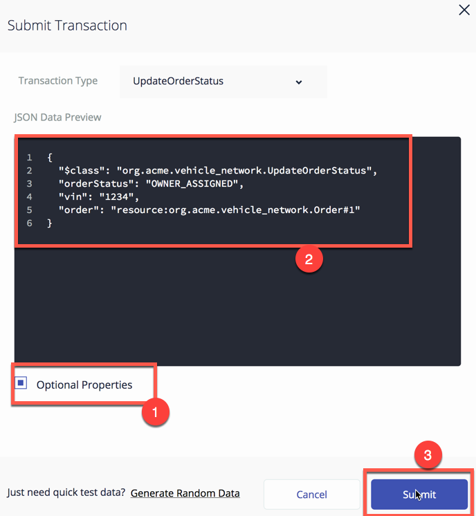

11. Click on Submit. This means that the person who ordered the car now has been assigned the car. 

12. Now, click on click on Submit Transaction again and change to Update Order Status. This time replace PLACED with DELIVERED. Click on optional properties and fill it in with the vin number from step 8 and 10. This means the car was delivered to the person who ordered the car

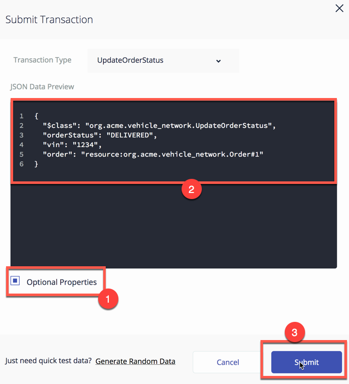

13. You can view the car in the Vehicle section on the left

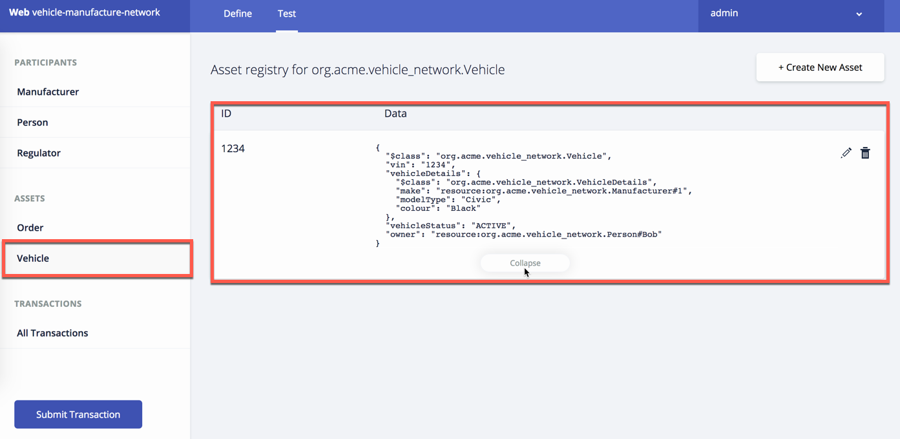

14. Go ahead and submit other transactions against other participants and assets. Don’t do the Setup Demo transaction. We will do that in the next section.

Part 5: Identities
==================

1. As promised in Part 4, Step 12; Submit the Setup Demo transaction. This will create a lot of participants and vehicles. We could have done this from the start of this lab, but that wouldn’t be fun. 

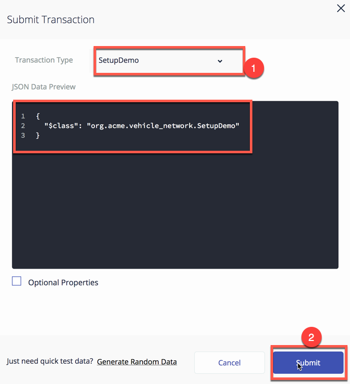

2. From the Test section, click on the various participants and you’ll notice a lot of participants and vehicles that we just generated. 

3. Now that we have an abundance of participants. Now, is a good time to create identities. You will see admin in the top right. If you click on admin and then ID Registry. Your screen should look like this below:

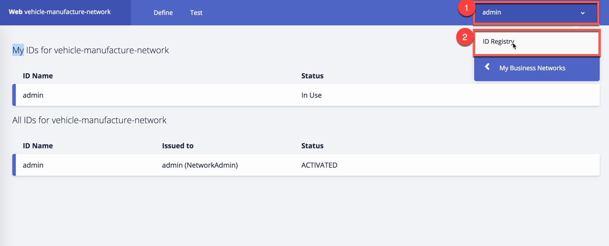

4. Now, click on Issue New ID in the top right. This process will create a new ID card that you can find in the Composer-Playground homepage. These identities will act as different perspectives tied to our Vehicle-Manufacturing business network. 

5. You will get a pop-up (so many pop-ups these days!). We will first create a card for one of our manufacturers. Give your card an ID Name. Then in the next section start typing out our manufacturing company and there should be a drop down of that manufacturer. Below is what my ID generation looks like. 

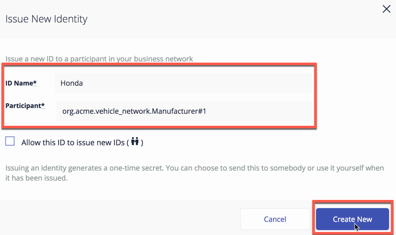

6. Now once you have what you want, click on Create New

7. Go ahead and create other ID cards (identities) for our other participants. You don’t need to create an ID card for each participant, but at least 1 card for our manufacturer, person and regulator. 

8. You screen should look like this when you have created various ID cards. 

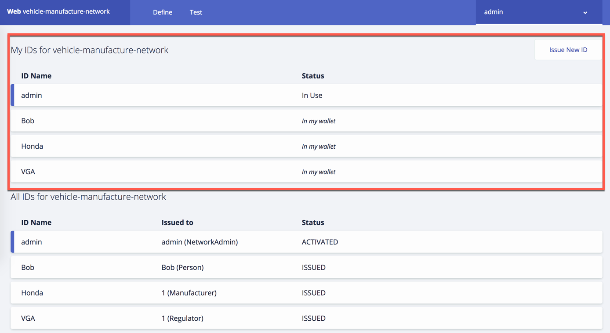

9. Now, click on admin in the top right, but this time click on My Business Networks. This will bring us to our Composer-Playground homepage. You screen should be filled with ID cards. 

.. image:: Images/VM_Images/5.5.png

10. Click on Connect Now of our Manufacturer ID card. You will now enter the Manufacturer perspective of our Vehicle-Manufacturing network. 

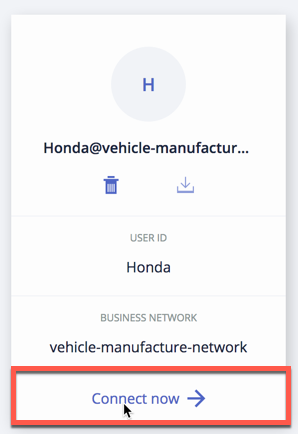

11. Jump over to the Test section and click around on the other various participants. You will only see the Manufacturer and Regulator in our network. If you click on Order and Vehicle section on the left, you notice you only see orders and vehicles that are tied to this manufacturer. 

Manufacturer:

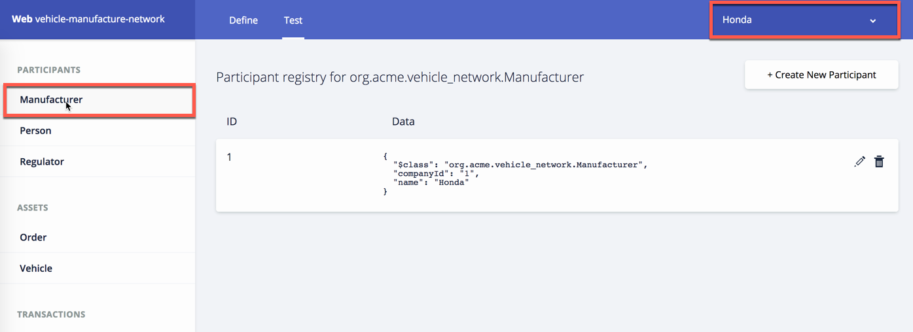

Regulator:

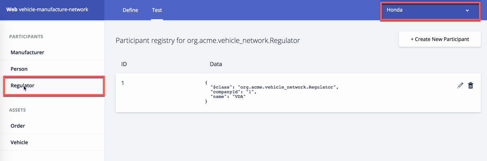

Order:

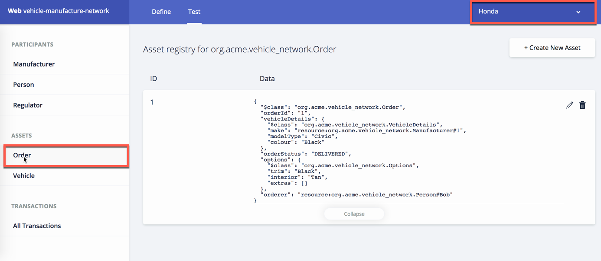

Vehicle:

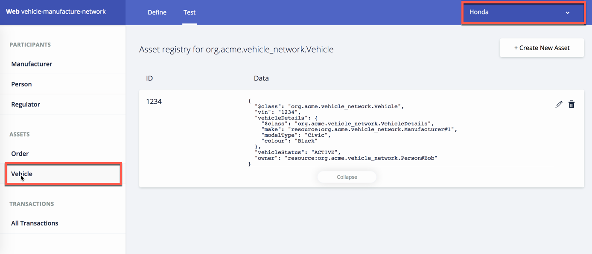

12. Go ahead and jump to our person’s ID card. Again, click on the various participants. The only section you will see is the person section and that’s only you. You don’t see other people (person) in the network.

Person:

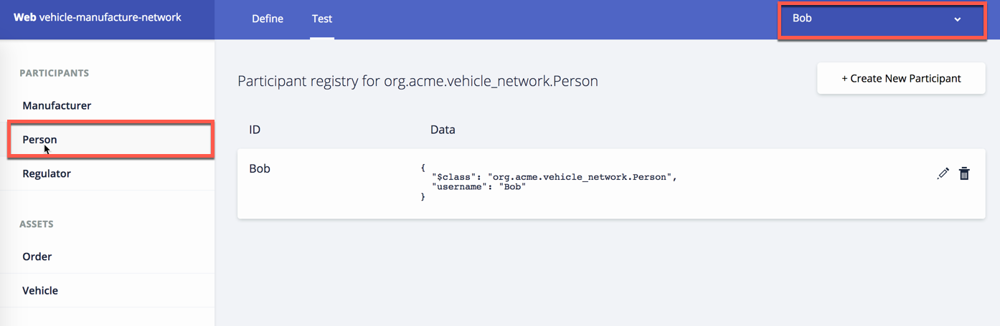

13. Go ahead and submit transaction and place and order. Place the order to the manufacture ID card we have already. Here is what I placed below in my transaction:

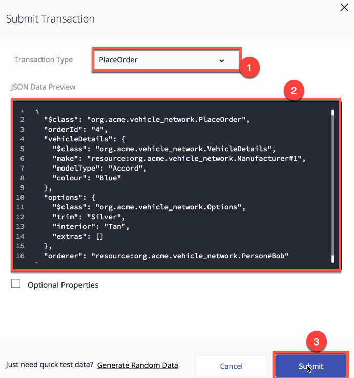

14. Once you have successfully submitted a transaction, jump back over to the Manufacturer that you just assigned that order to

15. Click on Test and then the Order section on the left. You should see a new order that you just created

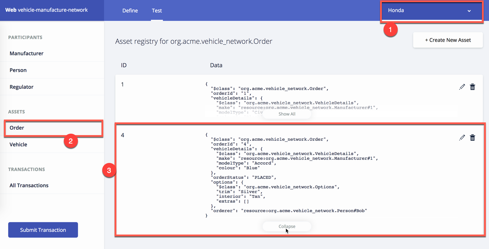

16. What’s an order if we don’t actually make it? Go ahead from the Manufacturer perspective and submit a transaction, Update Order Status transaction. Replace PLACED to SCHEDULED_FOR_MANUFACTURE. Here is what my transaction says below: 

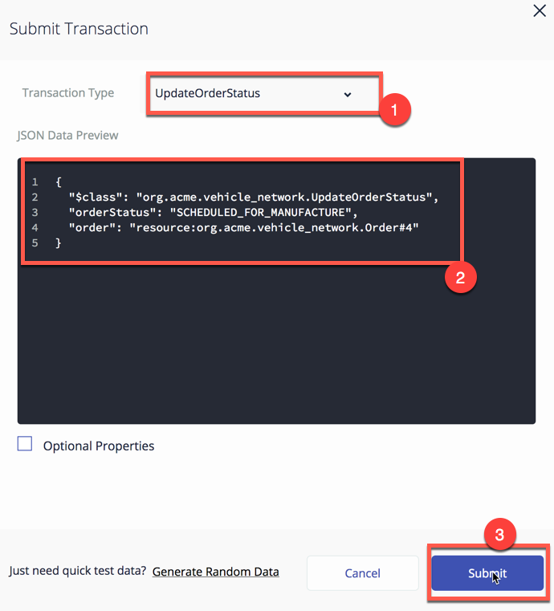

18. Jump to the Regulator in this business network. 

19. Click on the various participants. You’ll notice that the regulator has authorization to view everything in the network, hence why they are the regulator. You can modify to the Access Control file to prevent them from seeing other participants, like other Regulators in the network. 

20. Continue to play with Hyperledger Composer by making various transactions and jumping to various perspectives. 

Bonus. If you don’t like the way the Access Control file is setup and you want to modify a permission, see if you can modify it successfully. 

**End of Lab!**

 
