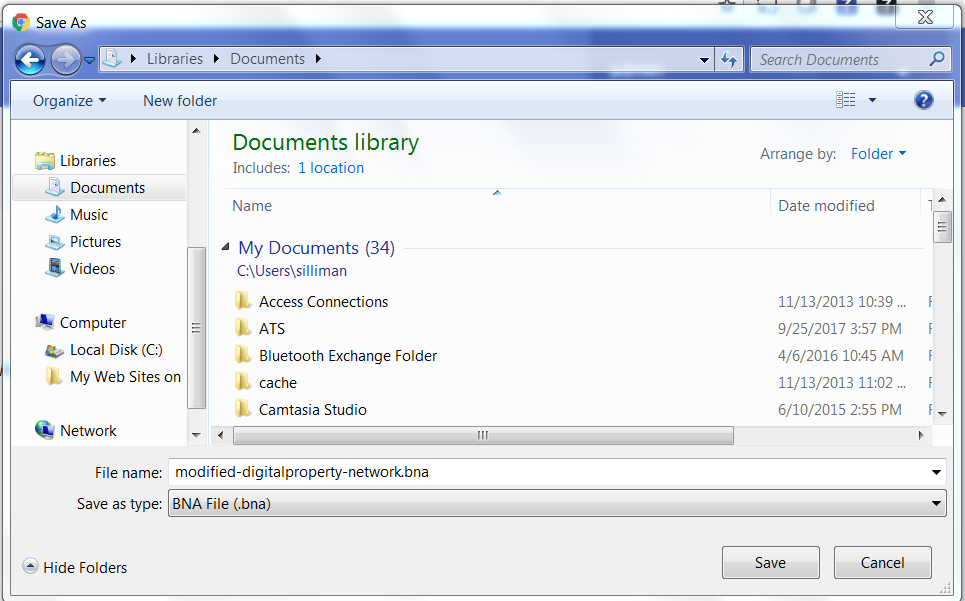
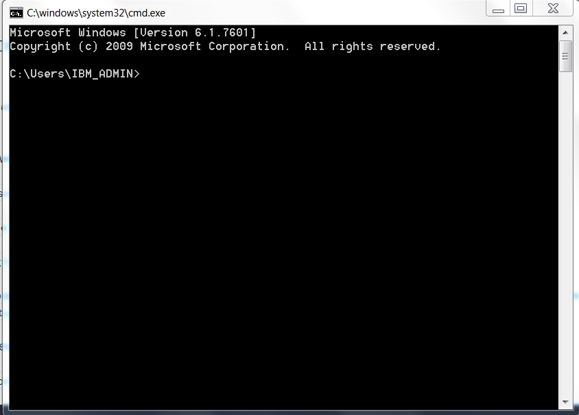
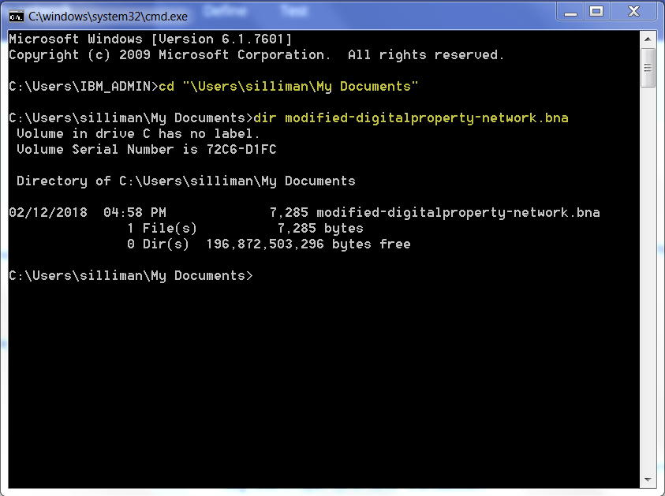
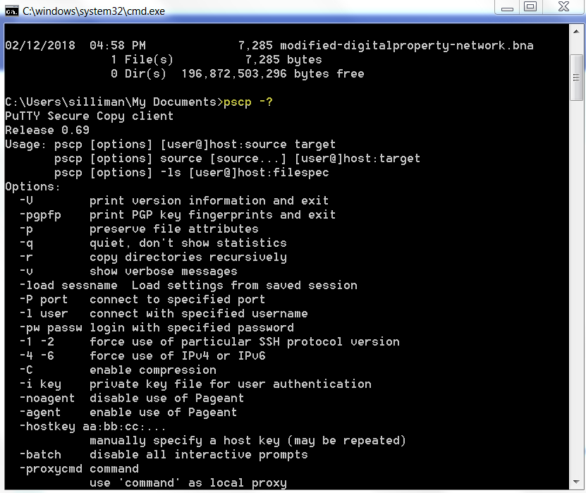
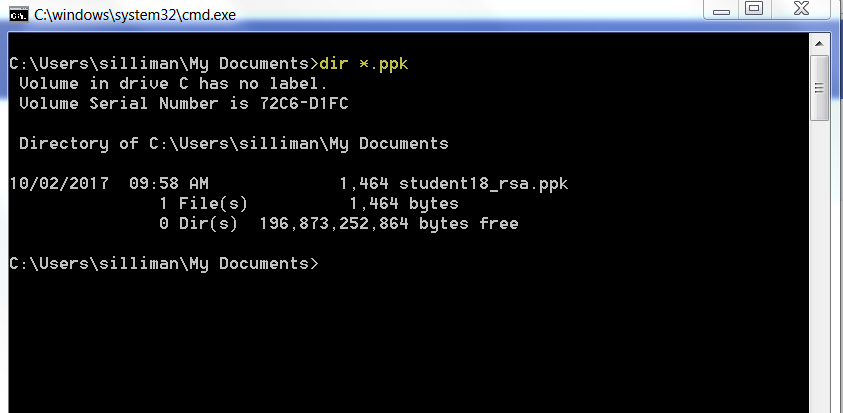
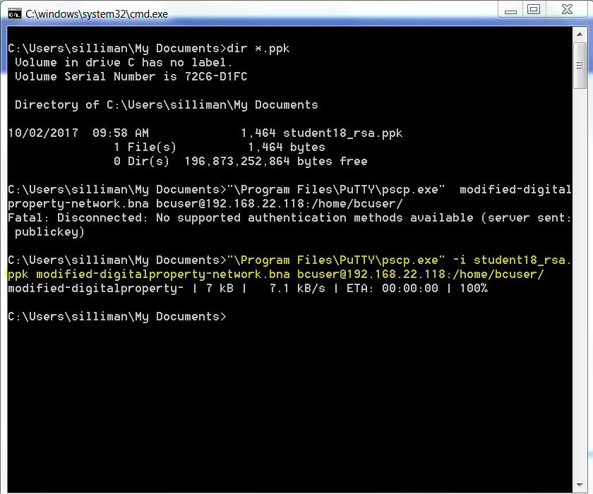

PuTTY scp (pscp) Instructions
=============================

These instructions as written show you saving the *'.bna'* file to your *Documents* folder on your Windows workstation.
They were prepared on the instructor's Windows 7 workstation.  If your classroom laptop has a different OS your experience
may differ slightly, e.g. in "look and feel" compared to the illustrations shown here, or in the *pscp* program location, etc.
It is quite possible that if this is the case, your instructors will provide guidance to navigate you through these hurdles.

**Step P.1:** Please save the file to your Documents folder.  You don't have to, but all of the screen shots in the remainder of this
supplement assume that you did put it there, so if you didn't, you'll have to adjust accordingly. The actual file transfer using
*pscp* requires you to specify your PuTTY Private Key, and that resides in your Documents folder, so make it easy on yourself
and save the *'.bna'* file there as well.  Here is an example screenshot
where I'm preparing to save the file to my Documents folder:

**Step P.2:** Find a DOS Command prompt, e.g. I clicked the Windows Start button, then *Run..* and typed in *cmd* and hit Enter, so I
got something like this:

**Step P.3:** Navigate to the directory where you saved the *'.bna'* file.  Here I show where I changed directories to get to my *Documents*
folder and then did a *dir* command to verify that I'm in the right place:

**Step P.4:** Try just typing ``pscp -?`` and hit Enter to see if you are lucky enough to have *pscp* in your path already.  If so, your screen
will look like below where you get a bunch of help about the command, and you can skip *Step P.5* and go directly to *Step P.6*. Lucky!!

**Step P.5:** If you're reading this, you either didn't have *pscp* in your path already, or you're not good at following directions, or
you're just plain curious.  You will need to specify the fully-qualified path name of the location of the *pscp* program.  E.g., in the 
below screenshot, my *pscp* program is at *\Program Files\PuTTY* so I typed in what is shown below to verify that I am able to find and
use *pscp*:

.. image:: images/putty/p.5.pscpNotInPath.png

**Step P.6:** Remember when in *Step P.1* I said you'll need to use your PuTTY Private Key to make the copy using *pscp*.  Enter
``dir *.ppk`` and you shouuld see the PuTTY Private Key file for your team.  The example shown below shows the file for Team 18.  Your
file name will be different.  (Unless you're Team 18):

**Step P.7:** Enter the command highlighted below, substituting your team number and IP address as appropriate. 
If *pscp* was in your path, you don't need to enter the full path. The example shows
Team 18 and 192.168.22.118.  Your IP address will be 192.168.22.[your team number + 100], e.g. Team 12 would specify 192.168.22.112
as their IP address:

**Note:** The first *pscp* command in the above screenshot shows what might happen to you if you forget to specify your PuTTY Private Key- it won't
work!

**You can now return to *Step 4.2* in the Composer Smorgasboard lab**
