Part 1. Car Auction Setup
=========================

**1.** Open a web browser and go to http://composer-playground.mybluemix.net. Dismiss the welcome screen to show the playground wallet screen which is used to connect and deploy new business networks:

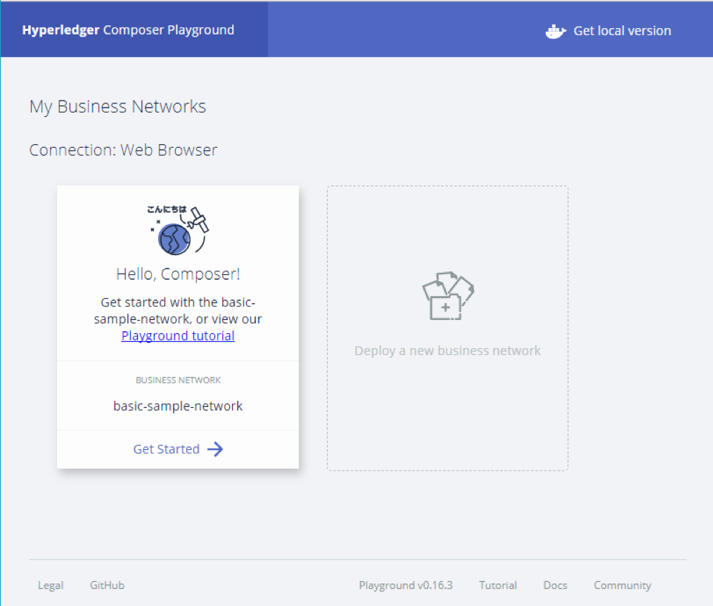

**2.** Click the “Deploy a business network” box. Then scroll down and select the carauction-network:

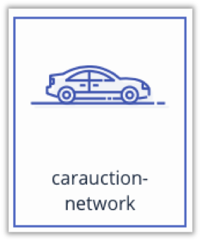

**3.** Next give the business network a name and description

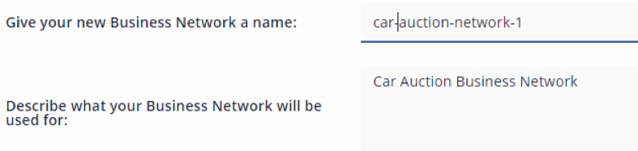

**4.** Click the Deploy button to deploy the new car auction business network:

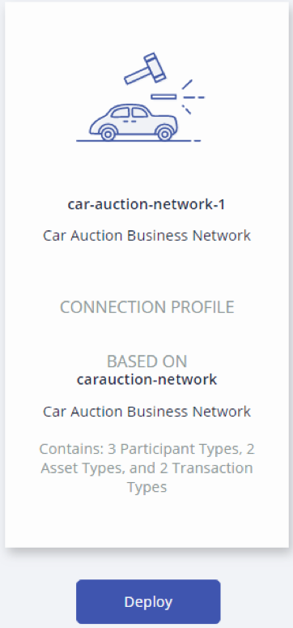

**5.** Click “Connect now” in the new identity card for the car-auction-network:

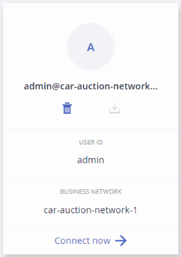

**6.** Take a few minutes to read through the description of the car auction sample, to help understand the participants, assets and transactions associated with this particular network.

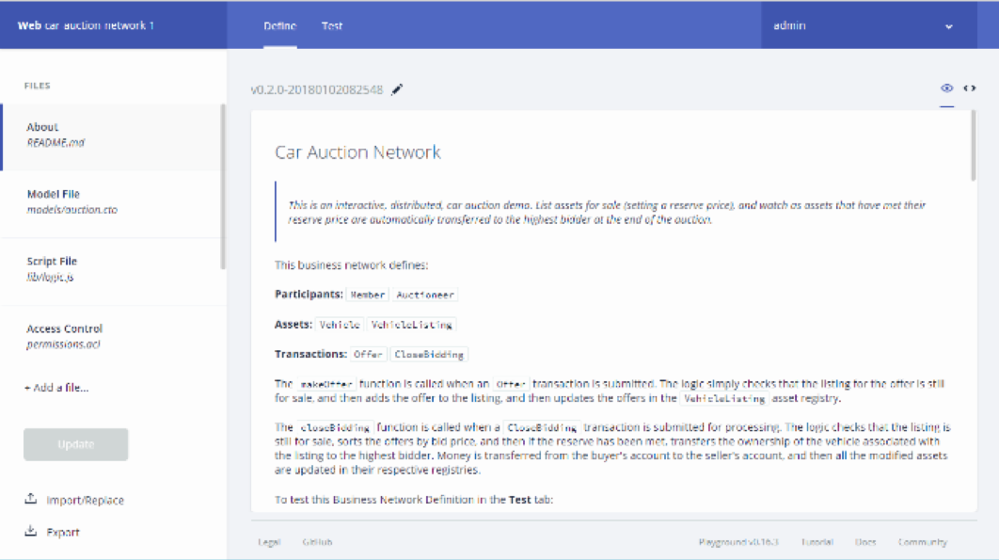

Part 2: Add Participants
========================

In the next section we will now work with the deployed car auction Blockchain network. 

We will first add three Member participants of the car auction business network:

  - Alice Smith (alice@email.com), who will make a bid on a car,
  - Bob Jones (bob@email.com), who will also make a bid on a car, and
  - Charlie Brown (charlie@email.com), who currently owns a car.

**1.** Click the Test tab and then click on the Member participant registry:

The registry is empty as no members have currently been defined. 

**2.** Click on Member to view there are no current members in the environment 
Note: make sure you choose “Member” and not Auctioneer”

**3.** Click Create New Participant to add a new Member.

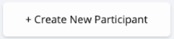

**4.** Type the correct values into the JSON data structure to add Alice to the business network. Let’s give her a starting balance of 10000.

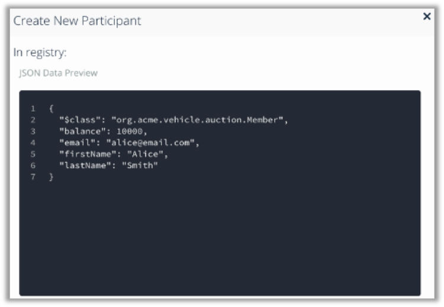

**5.** Click Create New to add Alice to the registry.

.. image:: Images/CA_Images/2.5.png

**6.** Do the same for Bob. Let’s give him a starting balance of 5000.

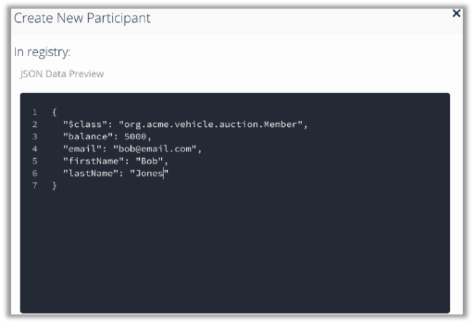

**7.** Finally do the same for Charlie. He hasn’t got so much money (he’s selling his car, after all) so let’s give him a starting balance of 100.

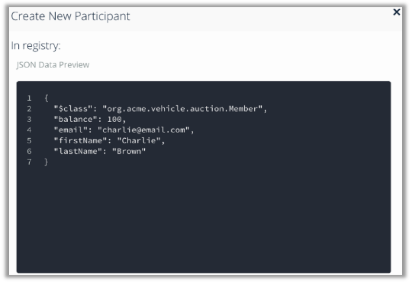

**8.** Verify that all participants in the business network have been correctly defined. Use the appropriate Edit button (pencil) to make any changes. 

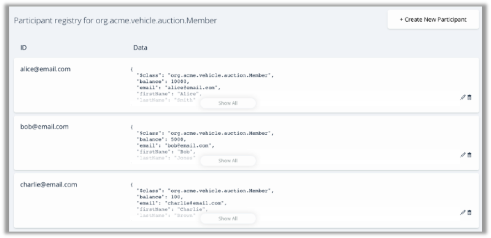

Part 3: Add an Asset
====================

We will now add Charlie’s car to the Vehicle Asset registry.

**1.** Click the Vehicle asset registry.

**2.** This registry contains no assets currently. Click the Create New Asset button to add a new asset. 

**3.** Add an asset, car, by adding a vehicle identification number (VIN) of 1234 and assign it to Charlie by filling in the JSON object as follows. (We use his email address to identify him; this was specified as the key field in the User definition using the ‘identified by’ statement.)

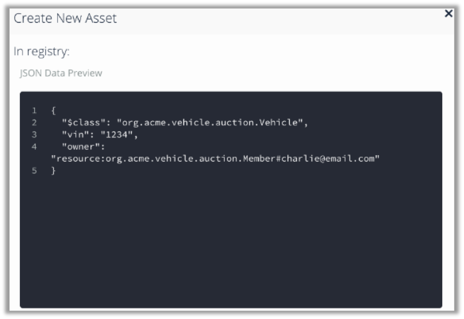

**4.** Click Create New to add the new vehicle to the registry.

.. image:: Images/CA_Images/3.3.png

**5.** View your newly added asset in the registry.

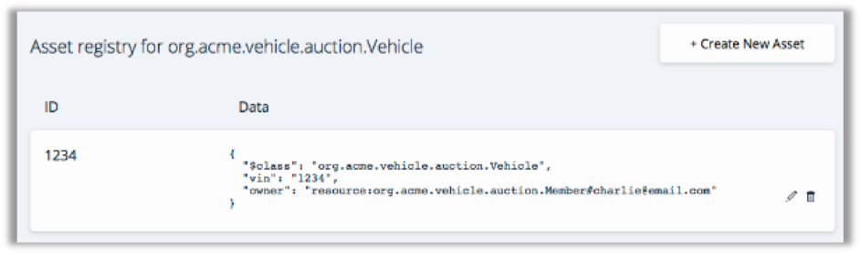

Part 4: Add a Vehicle Listing
=============================

In this section we will put the car up for sale by creating a VehicleListing instance. 

**1.** Click the VehicleListing asset registry. Once more, the VehicleListing registry should be empty.

**2.** Click the Create New Asset button to add the asset. 

**3.** Update the fields and remove the random offers to show the below. Syntactic validation of the object occurs at this point, so correct any errors if necessary.

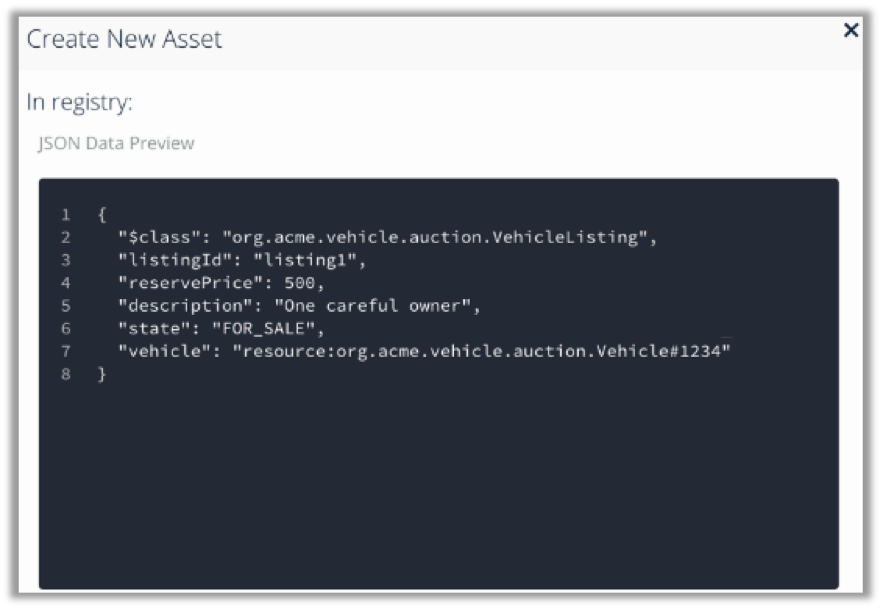

**4.** Click Create New to add the new vehicle listing to the registry.

**5.** View the listing in the registry.

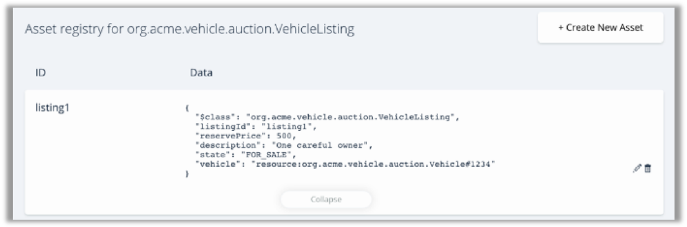

Part 5: Submit offers on the vehicle
====================================

We will now let Alice and Bob bid on the vehicle.

**1.** Click on the Submit Transaction button

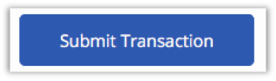

**2.** Let Alice put in a bid of 6000.

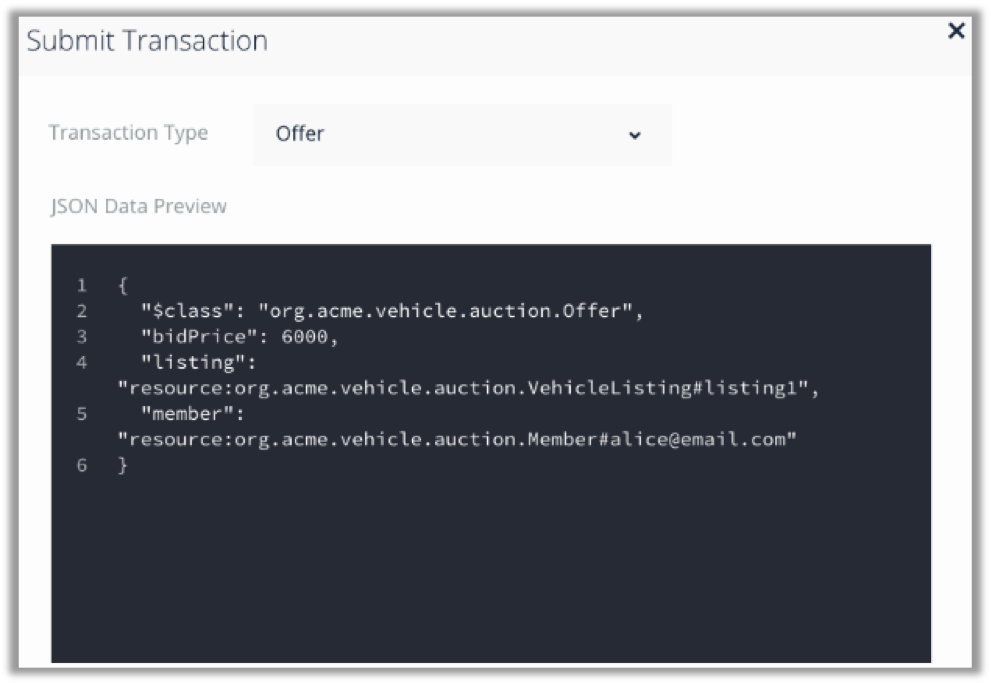

**3.** Click Submit to submit the offer transaction.

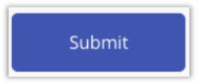

**4.** See the transaction successful appear in the Historian registry. Switch to view all transactions by clicking ‘All Transactions’:

**5.** You will also notice additional transactions for creating participants and assets. Click “view data” for more information.

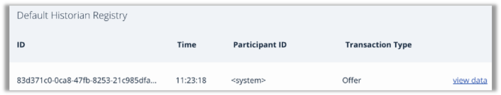

**6.** Let Bob put in a bid of 4000.

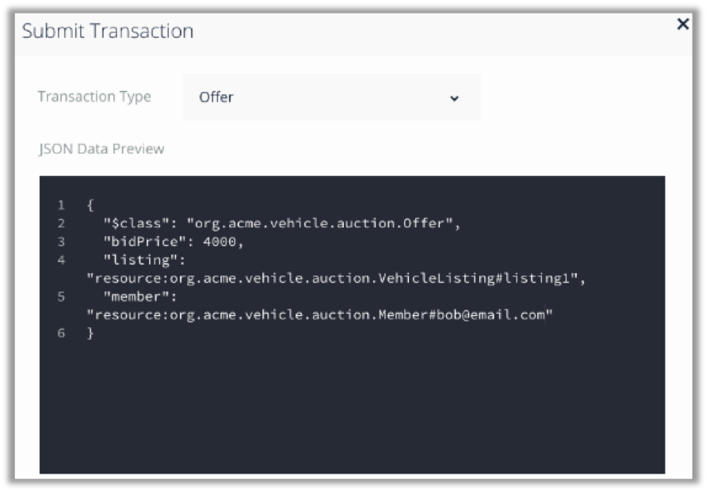

**7.** Verify the transactions in the registry. 

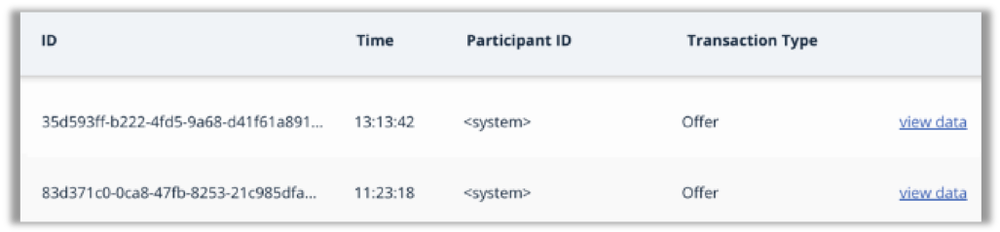

Note that the transactions cannot be edited or individually deleted once submitted; this is one of the defining characteristics of a Blockchain 

Part 6: Closing the bidding
===========================

To close the bidding on the listing we need to submit a CloseBidding transaction.

**1.** Submit a new transaction, this time selecting CloseBidding from the drop-down ‘Transaction Type’ field.

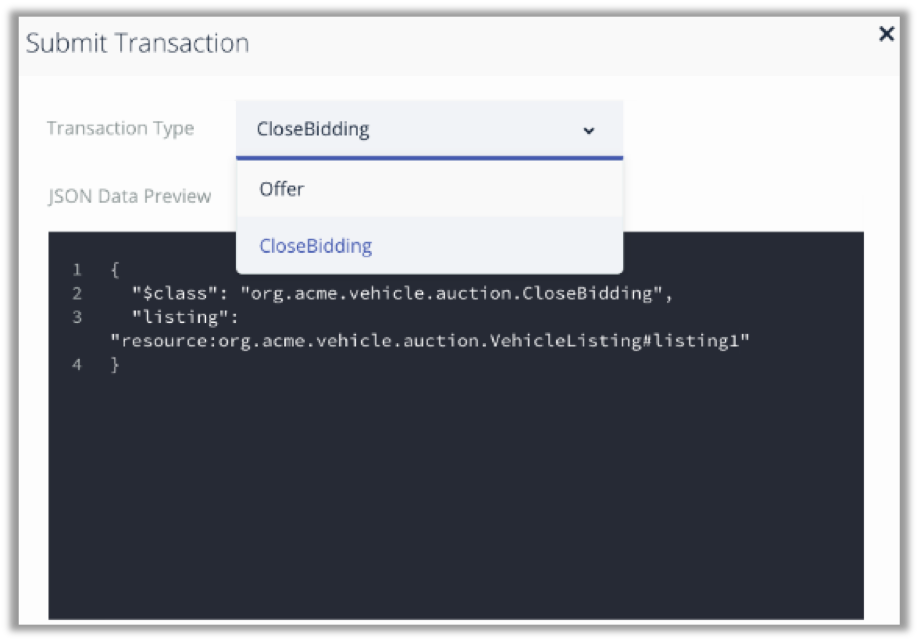

**2.** Click Submit to submit the CloseBidding transaction.

.. image:: Images/CA_Images/6.2.png

**3.** Verify that the transaction has been added to the Blockchain transaction registry. Click on ‘view data’ to see the content of the transaction.

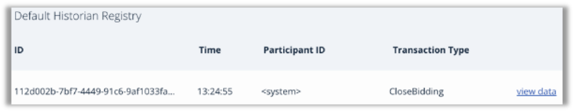

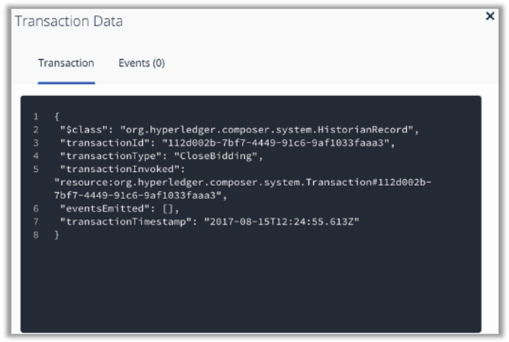

Based on the bids we submitted, Alice should now be the owner as she put in the highest bid. We should also be able to verify that the owner of the car has changed and appropriate balances increased or decreased accordingly. 

**4.** Go to the Vehicle asset registry to see the vehicle owner has been updated to Alice.

**5.** You will see the following vehicle owned by Alice in the vehicle registry.

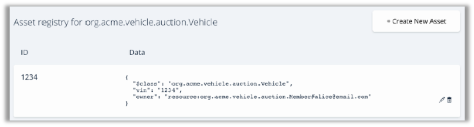

**6.** Go to the Member asset registry to see that Charlie’s balance has increased by the winning bid amount, and that Alice’s balance has decreased by the same.

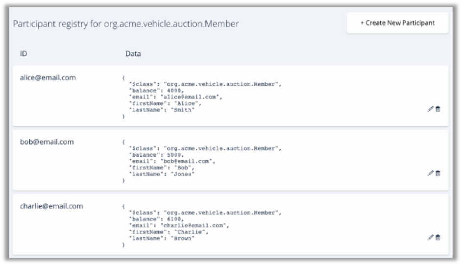

Part 7: Explore the Editor Views
================================

Model File

**1.** Click on the define tab to go back to the main playground window.

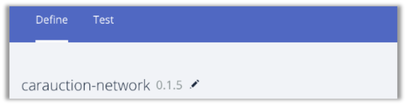

**2.** Click the Model File (models/auction.cto) to open it.

This .cto file models the assets, participants and transactions for this Blockchain application.
 
**3.** Look at the Vehicle asset:

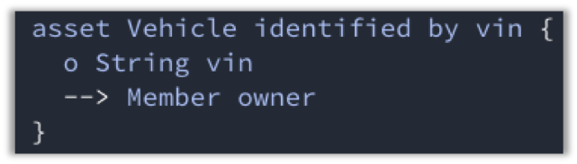

This uses the Hyperledger Composer Modeling Language which will be looked at more later. An asset is anything of worth that will be transferred around the Blockchain. Here we can see the asset class is called ‘Vehicle’ and will have an associated vin and a reference (indicated by “-->”) to a ‘Member’ participant that we will call ‘owner’. 

**4.** Type and add some characters in an appropriate point to show the live validation of the model.

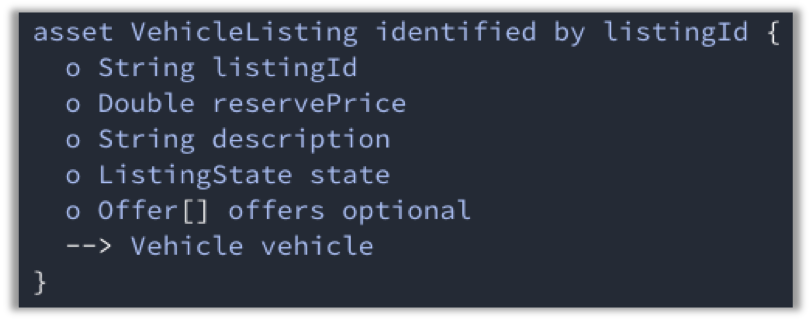

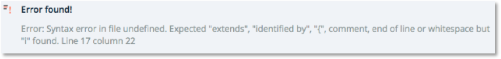

**5.** Scroll down and look at the abstract ‘User’ participant.

The participant will be the people or companies within the business network. Each User participant will be defined as having a email, firstName and lastName. As the class is abstract instances of it cannot be created; instances are instead implemented by the Member and Auctioneer classes.

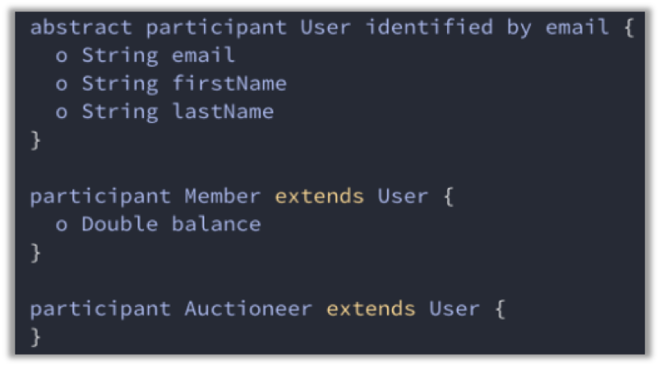

Here the user can become a Member requiring a balance, or an Auctioneer that does not.

**6.** Look at the Offer and CloseBidding transaction definitions:

.. image:: Images/CA_Images/7.7.png

The transaction definitions give a description of the transactions that can be performed on the Blockchain. They are implemented in a Transaction Processor file using the Javascript language.

Transaction Processors

**1.** Click on the lib/logic.js file:

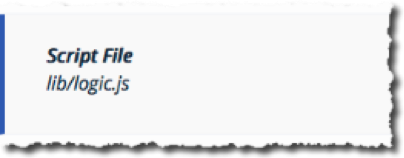

**2.** Scroll to the bottom of the file to review the logic used to make an offer on a car being auctioned:

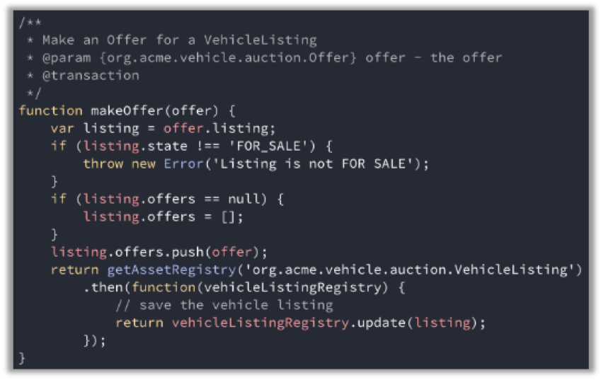

This implements the makeOffer function, which is executed when the Offer transaction is invoked on the Blockchain. (It is the @param comment above the function that links the full transaction name as defined by the model to the Javascript method that implements it.)

Other Interesting areas of the function implementation include:

The logic that the vehicle must be for sale to submit an offer on it
The retrieval and update of the asset registry a few lines later
Saving the updated asset back to the registry

Access Control List

The final file that defines the Blockchain application is the Access Control List, which describes the rules which govern which participants in the business network can work with which parts of the Blockchain.

**1.** Click the permissions.acl file:

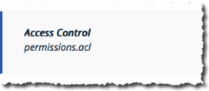

**2.** Look at the ACL rules defined:

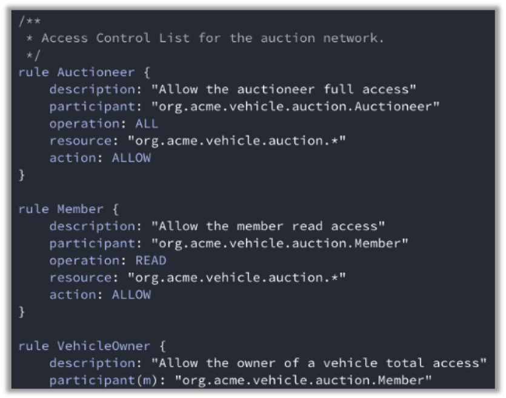

The rule allows or denies users to access aspects of the Blockchain.

Part 8: Updating the Model (Advanced and Optional)
==================================================

**1.** Try updating the model (auction.cto) for the Vehicle asset definition to include manufacturer make and model fields. Add in new String fields and click ‘Deploy Changes’ to make the changes live.

Note that when you update the model, the syntax of any existing assets in the registry must be compatible with the new model. Use the optional qualifier next to the new fields. If you make incompatible changes, you must first reset the demo.

Once you’ve made the changes, try adding new Vehicle assets to the registry to test the changes.

For more information on the Hyperledger Composer modelling language please refer to: https://hyperledger.github.io/composer/reference/cto_language.html

Part 9: Export the Business Network Archive (Optional)
======================================================

**1.** Exporting to a Business Network Archive will save the Read Me, Model File(s), Script File(s) and Access Control rules that can be easily imported to a local developer enviroment, handed to a network operator to deploy to a live network or saved asa backup. More details on local installation at https://hyperledger.github.io/composer/installing/installing-index.html.

**End of Lab!**
