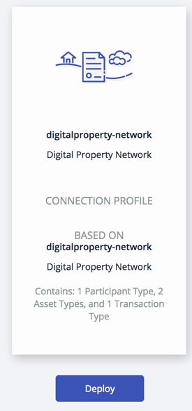
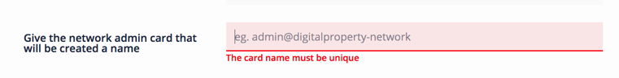
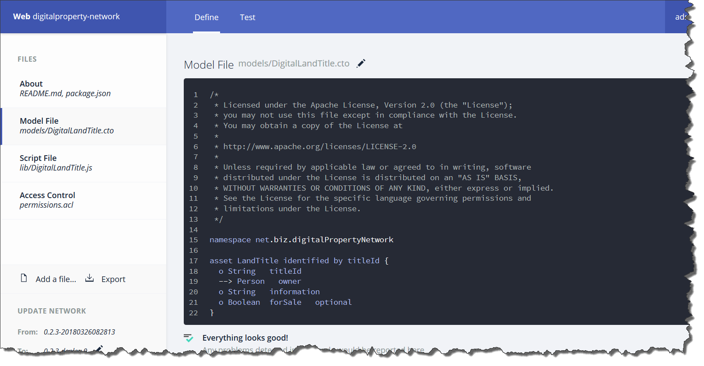
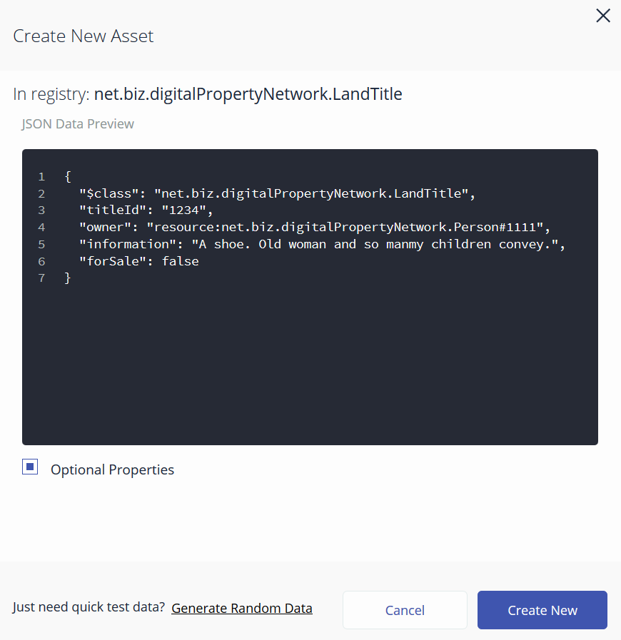
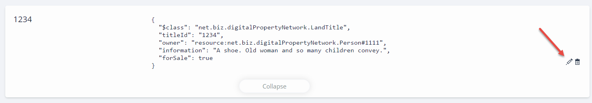
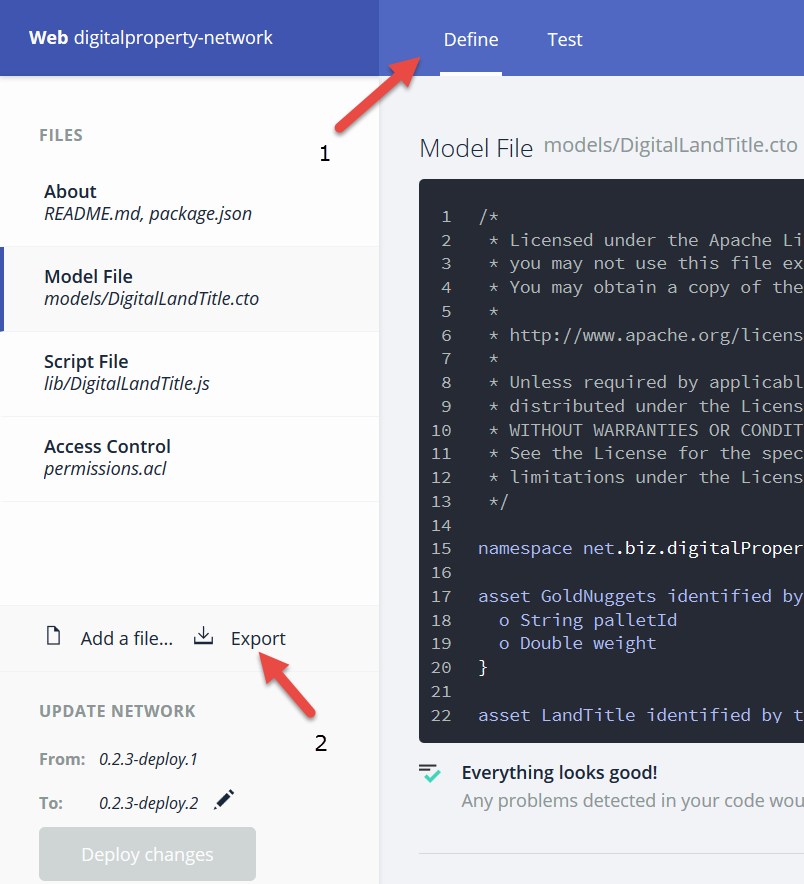
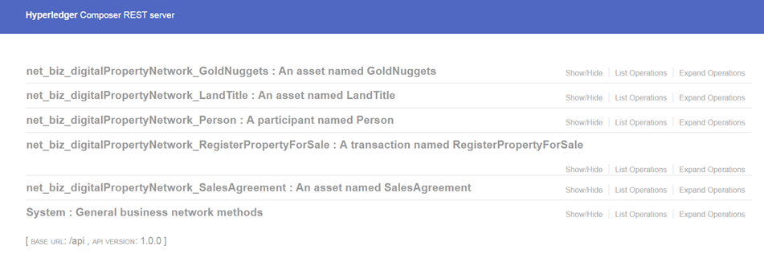
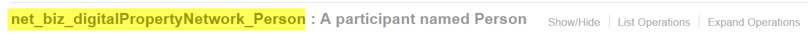
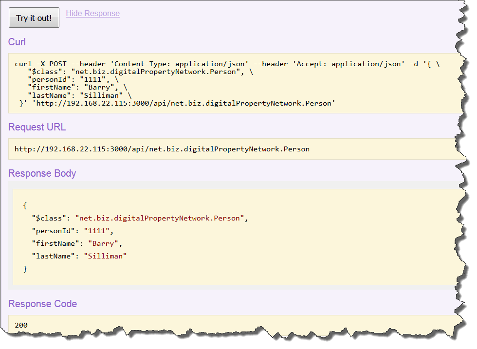
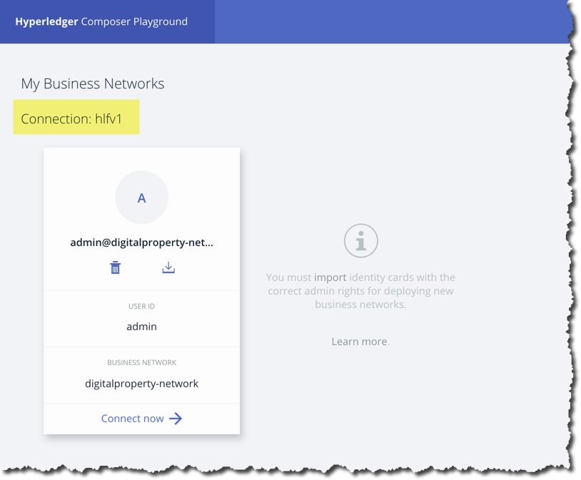

Section 1:  Lab Overview
========================

This lab will give you an opportunity to have hands-on experience with Hyperledger Composer.
You will:

*	Install the Hyperledger Composer command line interface (CLI)
*	Use the CLI to deploy a Hyperledger Composer business network on a Hyperledger Fabric network
*	Install the Hyperledger Composer Playground and use it in “web browser” mode
*	Install and use the Hyperledger Composer REST Server
*	Generate an AngularJS GUI application based on a Hyperledger Composer business network
*	Use the Hyperledger Composer Playground directly connected to a Hyperledger Fabric network

Section 2: Install Hyperledger Composer Command Line Interface
==============================================================

In this section, you will install the Hyperledger Composer Command Line Interface (CLI) using *npm*.  Then you will download a Hyperledger Composer sample business 
network from GitHub and prepare it for deployment on a Hyperledger Fabric network.  You will start a Hyperledger Fabric network via 
scripts provided by Hyperledger Composer for this purpose.  You will deploy the Hyperledger Composer business network onto the 
Hyperledger Fabric network and work with it.

**Step 2.1:** Check the location of the Hyperledger Composer CLI binary::

 bcuser@ubuntu16044:~$ which composer
 bcuser@ubuntu16044:~$
 
Observe that there is no output from the command- you are simply presented with the command prompt.  This is an indication that this program is not accessible to you in your environment's PATH.  Technically speaking, the program could be installed elsewhere on this system and just not available to you, but in the case of this lab, please take my word for it that *composer* has not been installed anywhere on your system yet.  You will do that in the next step.

**Step 2.2:** Install Hyperledger Composer using *npm*.  Enter this command::

 bcuser@ubuntu16044:~$ npm install -g composer-cli@0.19.0

This will take a few minutes to run, and will produce a lot of output.  If you do not see any error messages at the end of the output, chances are you are in good shape.  Warning messages are okay.

**Step 2.3:** Check the location of the Hyperledger Composer binary again (this is the same command you issued in *Step 2.1*, so if you were to hit the 'up arrow' key twice you might not have to copy and paste it in again or type it in again- it's up to you)::

 bcuser@ubuntu16044:~$ which composer
 /home/bcuser/bin/composer

Notice that now the location within your environment's PATH where the *composer* program was found is listed.

**Step 2.4** Check the Hyperledger Composer version that you just installed::

 bcuser@ubuntu16044:~$ composer --version
 v0.19.0

**Step 2.5:** Go to your home directory::

 bcuser@ubuntu16044:~$ cd $HOME   # you may already be in your home directory but this command won't hurt
 bcuser@ubuntu16044:~$
 
**Step 2.6:** Get the Hyperledger Composer sample applications from GitHub::

 bcuser@ubuntu16044:~$ git clone https://github.com/hyperledger/composer-sample-applications
 Cloning into 'composer-sample-applications'...
 remote: Counting objects: 1766, done.
 remote: Compressing objects: 100% (116/116), done.
 remote: Total 1766 (delta 64), reused 135 (delta 56), pack-reused 1591
 Receiving objects: 100% (1766/1766), 34.86 MiB | 37.27 MiB/s, done.
 Resolving deltas: 100% (769/769), done.
 Checking connectivity... done.

**Step 2.7:** Change to the *composer-sample-applications/packages/digitialproperty-app* directory::

 bcuser@ubuntu16044:~$ cd composer-sample-applications/packages/digitalproperty-app
 bcuser@ubuntu16044:~/composer-sample-applications/packages/digitalproperty-app $ 
 
**Step 2.8:** Within the directory you just navigated to, there is a sample application called the *Digital Property
Network* that you will be working with throughout the lab.  This is just one of many sample applications provided by
the Hyperledger Composer project.  

Ideally right now you could set this application up for use without further ado; however, at this point in time you will make a slight change to a file named *package.json*. The reason is that within this lab you will be using specific versions of Hyperledger Composer and Hyperledger Fabric- you will be using Hyperledger Composer v0.19.0 and Hyperledger Fabric v1.1.0.

Within the *package.json* file for the *Digital Property Network* sample application, requests are being made to install some Hyperledger Composer components at any level of 0.19.*.  While not likely, it's possible that a future upgrade, say 0.19.1 or 0.19.2 might accidentally break this lab.  So in order to eliminate that possibility, you will make a change to ensure that 0.19.0, and only 0.19.0, will be installed.  The next several steps will guide you through that process.

First, issue this *grep* command to find the occurrences of the string *0.19.0* within *package.json*::

 bcuser@ubuntu16044:~/composer-sample-applications/packages/digitalproperty-app$ grep 0\.19\.0 package.json
     "composer-cli": "^0.19.0",
     "composer-client": "^0.19.0",
    
It is the caret ('^') character that directs *npm* to install newer levels of 0.19.* when they become available.  In order to ensure that only 0.19.0 is installed, you will remove that caret in the next step.

**Note:** The backslashes in the previous command tell *grep* to look for the period character *('.')*.  Without the backslash the *grep* command would interpret the period character to mean "any single character", so, e.g., if you specified ``0.19.0`` instead of ``0\.19\.0`` *grep* would match that against *0.19.3* but also against things like *0a19b0* which is not what we want here.  In this particular file, you probably would not find any unwanted matches even if you did leave the backslashes out, but you may not be so fortunate in future searches.  

**Step 2.9:** This *sed* command will replace the occurrences of *^0.19.0* with *0.19.0* for the two npm packages listed in the output from the previous *grep* command.::

 bcuser@ubuntu16044:~/composer-sample-applications/packages/digitalproperty-app$ sed -i "s/\^0\.19\.0/0.19.0/" package.json
 
Note that, in accordance with the note from the prior step, you are specifying the backslashes in the first part of the *-i* argument to the *sed* command - *\^0\.19\.0*- where you specify what to look for, but not for the second part- *0.19.0* where you are specifying what you wish to replace the string in the first part with.  That is, the command you issued follows this general pattern:  *sed -i "s/<string_to_search_for>/<string_to_replace_it_with>/" file_to_change*.  Note that this particular form of the command changed the file in place-  fair enough for this lab, but in a more critical environment I'd recommend you make a backup of your file first.

**Step 2.10** Enter this *grep* command now to verify that the changes you intended to make in the prior step were made successfully::

 bcuser@ubuntu16044:~/composer-sample-applications/packages/digitalproperty-app$ grep 0\.19\.0 package.json 
     "composer-cli": "0.19.0",
     "composer-client": "0.19.0",

**Important:** If you do not see the output as shown above, now would be a really good time to ask an instructor for help, because if you don't get this step right, things will get, shall we say, "challenging" for you later.

**Step 2.11:** Open the *package.json* file in read-only mode by adding the *-R* argument to the *vi* command::

 bcuser@ubuntu16044:~/composer-sample-applications/packages/digitalproperty-app$ vi -R package.json 

*package.json* contains information used by the *npm install* command.  If you look at the top of the *package.json* file, you see a section named 
scripts::

  "scripts": {
    "postinstall": "composer --version",
    "preinstall": "./rootcheck.sh ",
    "test": "npm run bootstrapAssets && npm run listAssets && npm run submitTransaction",
    "submitTransaction": "node cli.js landregistry submit && node cli.js landregistry list",
    "listAssets": "node cli.js landregistry list",
    "bootstrapAssets": "node cli.js landregistry bootstrap",
    "deployNetwork": "./deployNetwork.sh",
    "updateNetwork": "./updateNetwork.sh"
  },

When *npm install* is run, it first runs the commands listed in the *“preinstall”* name/value pair.  Then, it installs any packages in 
the *“dependencies”* section (not shown in this output snippet) that are not already installed.  After that it will run the command listed in 
the *“postinstall”* name/value pair.

**Step 2.12:** You can exit this file now by typing in ``:q!`` - if hitting the colon key does not take your cursor to the command line 
at the bottom of your screen try hitting the **Escape key** and retrying ``:q!``.

**Step 2.13:** Now that you've changed *package.json* to ask for 0.19.0 packages instead of ^0.19.0 packages for Hyperledger Composer, and peeked a bit at the inside of that file, go ahead and run the *npm install* command::

 bcuser@ubuntu16044:~/composer-sample-applications/packages/digitalproperty-app$ npm install
 
It will take a couple of minutes and produce a lot of output.

**Step 2.14:** The *digitalproperty-app* sample application is capable of running in a Hyperledger Fabric network- this could be running on your own server, it could be running in the cloud, e.g. on the IBM Cloud, it could even be running on your own laptop.  For this lab, it will run here, on the same Linux on IBM Z guest that you are currently logged in to.  But, you haven't started a Hyperledger Fabric network yet.  

The good news is that the Hyperledger Composer team has provided some tooling that makes it easy for you to stand up a small, simple, uncomplicated Hyperledger Fabric network that is suitable for development purposes.  You could stand up your own Hyperledger Fabric network that is as large and complex as you wish, and run Hyperledger Composer on it, but that overly complicates things if your main task is to learn how to use Hyperleger Composer.

Take advantage of the convenience that the Hyperledger Composer team has provided for you.  Get started by switching to your $HOME directory::
 
 bcuser@ubuntu16044:~/composer-sample-applications/packages/digitalproperty-app$ cd $HOME
 bcuser@ubuntu16044:~$ 

**Step 2.15:** Use *git* to get the GitHub repository that contains these convenient scripts::

 bcuser@ubuntu16044:~$ git clone https://github.com/hyperledger/composer-tools
 Cloning into 'composer-tools'...
 remote: Counting objects: 1275, done.
 remote: Compressing objects: 100% (19/19), done.
 remote: Total 1275 (delta 6), reused 13 (delta 4), pack-reused 1252
 Receiving objects: 100% (1275/1275), 8.33 MiB | 0 bytes/s, done.
 Resolving deltas: 100% (644/644), done.
 Checking connectivity... done.

**Step 2.16:** Change to the *composer-tools/packages/fabric-dev-servers* directory::

 bcuser@ubuntu16044:~$ cd composer-tools/packages/fabric-dev-servers
 bcuser@ubuntu16044:~/composer-tools/packages/fabric-dev-servers$ 

**Step 2.17:** Run *npm install*::

 bcuser@ubuntu16044:~/composer-tools/packages/fabric-dev-servers$ npm install
 
**Step 2.18:** Enter the *docker images* command to see that you currently have no Docker images on your system::

 bcuser@ubuntu16044:~/composer-tools/packages/fabric-dev-servers$ docker images
 REPOSITORY          TAG                 IMAGE ID            CREATED             SIZE

You just see column headings.  You do not yet have any Docker images on your system.  You will soon and then you will issue this command again and see those images.

**Step 2.19:** Run the *downloadFabric.sh* script in order to pull the necessary Hyperledger Fabric v1.1.0 images from the Hyperledger project's public Docker Hub repositories::

 bcuser@ubuntu16044:~/composer-tools/packages/fabric-dev-servers$ ./downloadFabric.sh
 
**Step 2.20:** Enter the *docker images* command again and this time you should see that several Hyperledger Fabric v1.1.0 Docker images are available on your system::

 bcuser@ubuntu16044:~/composer-tools/packages/fabric-dev-servers$ docker images
 REPOSITORY                   TAG                 IMAGE ID            CREATED             SIZE
 hyperledger/fabric-ca        s390x-1.1.0         94dfe94d3c21        6 days ago          292MB
 hyperledger/fabric-orderer   s390x-1.1.0         1cb2d169fd41        6 days ago          203MB
 hyperledger/fabric-peer      s390x-1.1.0         c6be68b16d38        6 days ago          210MB
 hyperledger/fabric-ccenv     s390x-1.1.0         c6000e685bca        6 days ago          1.3GB
 hyperledger/fabric-couchdb   s390x-0.4.6         2aecbce9f786        4 weeks ago         1.56GB

**Note:** I mentioned that this is a simple Hyperledger Fabric network.  There are several other Hyperledger Fabric Docker images that are necessary in a more complicated network.

**Step 2.21:** You are about to start your Hyperledger Fabric network.  But before you do that, enter this command to show that you do not currently have any Docker containers running::

 bcuser@ubuntu16044:~/composer-tools/packages/fabric-dev-servers$ docker ps -a
 CONTAINER ID        IMAGE               COMMAND             CREATED             STATUS              PORTS               NAMES
 bcuser@ubuntu16044:~/composer-tools/packages/fabric-dev-servers$

**Step 2.22:** Run the script to start the Hyperledger Fabric network::

 bcuser@ubuntu16044:~/composer-tools/packages/fabric-dev-servers$ ./startFabric.sh
 Development only script for Hyperledger Fabric control
 Running 'startFabric.sh'
 FABRIC_VERSION is set to 'hlfv11'
 FABRIC_START_TIMEOUT is unset, assuming 15 (seconds)
 Removing network composer_default
 WARNING: Network composer_default not found.
 Creating couchdb ... done
 Creating peer0.org1.example.com ... done
 Creating couchdb ... 
 Creating orderer.example.com ... 
 Creating peer0.org1.example.com ... 
 sleeping for 15 seconds to wait for fabric to complete start up
 2018-03-22 17:58:04.636 UTC [msp] GetLocalMSP -> DEBU 001 Returning existing local MSP
 2018-03-22 17:58:04.636 UTC [msp] GetDefaultSigningIdentity -> DEBU 002 Obtaining default signing identity
 2018-03-22 17:58:04.637 UTC [channelCmd] InitCmdFactory -> INFO 003 Endorser and orderer connections initialized
 2018-03-22 17:58:04.637 UTC [msp] GetLocalMSP -> DEBU 004 Returning existing local MSP
 2018-03-22 17:58:04.637 UTC [msp] GetDefaultSigningIdentity -> DEBU 005 Obtaining default signing identity
 2018-03-22 17:58:04.638 UTC [msp] GetLocalMSP -> DEBU 006 Returning existing local MSP
 2018-03-22 17:58:04.638 UTC [msp] GetDefaultSigningIdentity -> DEBU 007 Obtaining default signing identity
 2018-03-22 17:58:04.638 UTC [msp/identity] Sign -> DEBU 008 Sign: plaintext: 0AA2060A074F7267314D53501296062D...6D706F736572436F6E736F727469756D 
 2018-03-22 17:58:04.638 UTC [msp/identity] Sign -> DEBU 009 Sign: digest: 2050542A9506BA83E706D0F4322BE15C71FBCC2608709EEDF0B6D41FAC6FD2B8 
 2018-03-22 17:58:04.638 UTC [msp] GetLocalMSP -> DEBU 00a Returning existing local MSP
 2018-03-22 17:58:04.638 UTC [msp] GetDefaultSigningIdentity -> DEBU 00b Obtaining default signing identity
 2018-03-22 17:58:04.638 UTC [msp] GetLocalMSP -> DEBU 00c Returning existing local MSP
 2018-03-22 17:58:04.638 UTC [msp] GetDefaultSigningIdentity -> DEBU 00d Obtaining default signing identity
 2018-03-22 17:58:04.638 UTC [msp/identity] Sign -> DEBU 00e Sign: plaintext: 0ADF060A1B08021A0608ACDDCFD50522...FD940262C3959BF7514635C9BEF0DDD3 
 2018-03-22 17:58:04.638 UTC [msp/identity] Sign -> DEBU 00f Sign: digest: B59E767F73E4026A4510F927C289DA537CACE7C5A7EE72A9A102788AAC20A7D5 
 2018-03-22 17:58:04.666 UTC [msp] GetLocalMSP -> DEBU 010 Returning existing local MSP
 2018-03-22 17:58:04.666 UTC [msp] GetDefaultSigningIdentity -> DEBU 011 Obtaining default signing identity
 2018-03-22 17:58:04.666 UTC [msp] GetLocalMSP -> DEBU 012 Returning existing local MSP
 2018-03-22 17:58:04.666 UTC [msp] GetDefaultSigningIdentity -> DEBU 013 Obtaining default signing identity
 2018-03-22 17:58:04.666 UTC [msp/identity] Sign -> DEBU 014 Sign: plaintext: 0ADF060A1B08021A0608ACDDCFD50522...755D023C0E1612080A021A0012021A00 
 2018-03-22 17:58:04.666 UTC [msp/identity] Sign -> DEBU 015 Sign: digest: 0E030B470064F51EEF6EC0DE55692D7276E23068AEB24C885CD6B20D8FA02000 
 2018-03-22 17:58:04.667 UTC [channelCmd] readBlock -> DEBU 016 Got status: &{NOT_FOUND}
 2018-03-22 17:58:04.667 UTC [msp] GetLocalMSP -> DEBU 017 Returning existing local MSP
 2018-03-22 17:58:04.667 UTC [msp] GetDefaultSigningIdentity -> DEBU 018 Obtaining default signing identity
 2018-03-22 17:58:04.687 UTC [channelCmd] InitCmdFactory -> INFO 019 Endorser and orderer connections initialized
 2018-03-22 17:58:04.888 UTC [msp] GetLocalMSP -> DEBU 01a Returning existing local MSP
 2018-03-22 17:58:04.888 UTC [msp] GetDefaultSigningIdentity -> DEBU 01b Obtaining default signing identity
 2018-03-22 17:58:04.888 UTC [msp] GetLocalMSP -> DEBU 01c Returning existing local MSP
 2018-03-22 17:58:04.888 UTC [msp] GetDefaultSigningIdentity -> DEBU 01d Obtaining default signing identity
 2018-03-22 17:58:04.888 UTC [msp/identity] Sign -> DEBU 01e Sign: plaintext: 0ADF060A1B08021A0608ACDDCFD50522...D90EA4EAEE4712080A021A0012021A00 
 2018-03-22 17:58:04.888 UTC [msp/identity] Sign -> DEBU 01f Sign: digest: E4444CC2983CEFAC6B87AFB95FF8EDF9C7F2666BF3216E52C692630126A18121 
 2018-03-22 17:58:04.891 UTC [channelCmd] readBlock -> DEBU 020 Received block: 0
 2018-03-22 17:58:04.891 UTC [main] main -> INFO 021 Exiting.....
 2018-03-22 17:58:04.987 UTC [msp] GetLocalMSP -> DEBU 001 Returning existing local MSP
 2018-03-22 17:58:04.987 UTC [msp] GetDefaultSigningIdentity -> DEBU 002 Obtaining default signing identity
 2018-03-22 17:58:04.988 UTC [channelCmd] InitCmdFactory -> INFO 003 Endorser and orderer connections initialized
 2018-03-22 17:58:04.988 UTC [msp/identity] Sign -> DEBU 004 Sign: plaintext: 0AA0070A5C08011A0C08ACDDCFD50510...82F1C82606031A080A000A000A000A00 
 2018-03-22 17:58:04.988 UTC [msp/identity] Sign -> DEBU 005 Sign: digest: 27C95F0BE7E2CC92F5387A28E0E40CC836B1F072B49EFA9A61B9CD466BAB6017 
 2018-03-22 17:58:05.076 UTC [channelCmd] executeJoin -> INFO 006 Successfully submitted proposal to join channel
 2018-03-22 17:58:05.076 UTC [main] main -> INFO 007 Exiting.....

**Step 2.23:** Now enter *docker ps -a* to see if your Docker containers are running.  They should all be in the *Up* status::

 bcuser@ubuntu16044:~/composer-tools/packages/fabric-dev-servers$ docker ps -a
 CONTAINER ID        IMAGE                                    COMMAND                  CREATED             STATUS              PORTS                                            NAMES
 ebd165b8249a        hyperledger/fabric-peer:s390x-1.1.0      "peer node start"        2 minutes ago       Up 2 minutes        0.0.0.0:7051->7051/tcp, 0.0.0.0:7053->7053/tcp   peer0.org1.example.com
 fda8a4161ab6        hyperledger/fabric-orderer:s390x-1.1.0   "orderer"                2 minutes ago       Up 2 minutes        0.0.0.0:7050->7050/tcp                           orderer.example.com
 e9476fcec230        hyperledger/fabric-couchdb:s390x-0.4.6   "tini -- /docker-e..."   2 minutes ago       Up 2 minutes        4369/tcp, 9100/tcp, 0.0.0.0:5984->5984/tcp       couchdb
 104b8a355a46        hyperledger/fabric-ca:s390x-1.1.0        "sh -c 'fabric-ca-..."   2 minutes ago       Up 2 minutes        0.0.0.0:7054->7054/tcp                           ca.org1.example.com

**Important:** All four containers listed should be in the *Up* status.  If any of them say *Exited*, ask an instructor for help.

**Step 2.24:** Now you must create a Hyperledger Composer Peer Admin business network card. A business network card is the “glue” that lets Hyperledger Composer know how a particular user is going to connect to a Hyperledger Fabric network.  The *Peer Admin* is a special user that has administrative authority on the Hyperledger Fabric peer node and thus has the ability to install Hyperledger Composer business networks on the Hyperledger Fabric peer. 

A script has been provided to do this. Run the *createPeerAdminCard* script::

 bcuser@ubuntu16044:~/composer-tools/packages/fabric-dev-servers$ ./createPeerAdminCard.sh
 Development only script for Hyperledger Fabric control
 Running 'createPeerAdminCard.sh'
 FABRIC_VERSION is unset, assuming hlfv11
 FABRIC_START_TIMEOUT is unset, assuming 15 (seconds)

 Using composer-cli at v0.19.0

 Successfully created business network card file to 
 	Output file: /tmp/PeerAdmin@hlfv1.card

 Command succeeded

 Successfully imported business network card 
 	Card file: /tmp/PeerAdmin@hlfv1.card
 	Card name: PeerAdmin@hlfv1

 Command succeeded

 The following Business Network Cards are available:

 Connection Profile: hlfv1
 ┌─────────────────┬───────────┬──────────────────┐
 │ Card Name       │ UserId    │ Business Network │
 ├─────────────────┼───────────┼──────────────────┤
 │ PeerAdmin@hlfv1 │ PeerAdmin │                  │
 └─────────────────┴───────────┴──────────────────┘

 Issue composer card list --card <Card Name> to get details a specific card

 Command succeeded

 Hyperledger Composer PeerAdmin card has been imported, host of fabric specified as 'localhost'
 bcuser@ubuntu16044:~/composer-tools/packages/fabric-dev-servers$
 
**Note:** Notice from the above output that the "Card Name" *PeerAdmin@hlfv1*, associated with the "UserId" *PeerAdmin* does not have any information listed under the "Business Network".  The *PeerAdmin* user has authority to install Hyperledger Composer business networks, but it does not have authority to connect to and use them.  When a Hyperledger Composer business network is installed under PeerAdmin's authority, a separate business network administrator is created for that specific business network that does have authority to connect and use just that one business network.  

**Step 2.25:** Go back to the sample application that you downloaded by changing back to this directory::

 bcuser@ubuntu16044:~/composer-tools/packages/fabric-dev-servers$ cd ~/composer-sample-applications/packages/digitalproperty-app/
 bcuser@ubuntu16044:~/composer-sample-applications/packages/digitalproperty-app$

**Step 2.26:** Run the *npm* command to deploy the *digitalproperty-network* Hyperledger Composer business network onto the Hyperledger 
Fabric network that you just created::

 bcuser@ubuntu16044:~/composer-sample-applications/packages/digitalproperty-app$ npm run deployNetwork

 > digitalproperty-app@0.0.7 deployNetwork /home/bcuser/composer-sample-applications/packages/digitalproperty-app
 > ./deployNetwork.sh

 VERSION=$(node -e 'console.log(require("digitalproperty-network/package.json").version)')
 node -e 'console.log(require("digitalproperty-network/package.json").version)'
 composer archive create --sourceName digitalproperty-network --sourceType module --archiveFile digitalPropertyNetwork.bna
 Creating Business Network Archive

 Looking for package.json of Business Network Definition
 	Input directory: /home/bcuser/composer-sample-applications/packages/digitalproperty-app/node_modules/digitalproperty-network

 Found:
 	Description: Digital Property Network
 	Name: digitalproperty-network
 	Identifier: digitalproperty-network@0.2.2

 Written Business Network Definition Archive file to  
	Output file: digitalPropertyNetwork.bna

 Command succeeded

 composer network install --archiveFile ./digitalPropertyNetwork.bna --card PeerAdmin@hlfv1
 ✔ Installing business network. This may take a minute...
 Successfully installed business network digitalproperty-network, version 0.2.2

 Command succeeded

 composer network start --networkName digitalproperty-network --networkVersion ${VERSION} --card PeerAdmin@hlfv1 -A admin -S adminpw -l INFO
 Starting business network digitalproperty-network at version 0.2.2

 Processing these Network Admins: 
 	userName: admin

 ✔ Starting business network definition. This may take a minute...
 Successfully created business network card:
 	Filename: admin@digitalproperty-network.card

 Command succeeded

 composer card import --file ./admin@digitalproperty-network.card

 Successfully imported business network card
 	Card file: ./admin@digitalproperty-network.card
 	Card name: admin@digitalproperty-network

 Command succeeded

 composer network list --card admin@digitalproperty-network
 ✔ List business network from card admin@digitalproperty-network
 models: 
   - org.hyperledger.composer.system
   - net.biz.digitalPropertyNetwork
 scripts: 
   - lib/DigitalLandTitle.js
 registries: 
   net.biz.digitalPropertyNetwork.LandTitle: 
     id:           net.biz.digitalPropertyNetwork.LandTitle
     name:         Asset registry for net.biz.digitalPropertyNetwork.LandTitle
     registryType: Asset
   net.biz.digitalPropertyNetwork.SalesAgreement: 
     id:           net.biz.digitalPropertyNetwork.SalesAgreement
     name:         Asset registry for net.biz.digitalPropertyNetwork.SalesAgreement
     registryType: Asset
   net.biz.digitalPropertyNetwork.Person: 
     id:           net.biz.digitalPropertyNetwork.Person
     name:         Participant registry for net.biz.digitalPropertyNetwork.Person
     registryType: Participant

 Command succeeded

**Note:** You can see from the end of this output that this sample network has two Asset types, *LandTitle* and *SalesAgreement*, and one Participant type, *Person*.

**Step 2.27:** Run this Docker command and you will see that a new Docker image was created for 
the Hyperledger Composer business network that you just deployed::

 bcuser@ubuntu16044:~/composer-sample-applications/packages/digitalproperty-app$ docker images dev-*
 REPOSITORY                                                                                                                   TAG                 IMAGE ID            CREATED              SIZE
 dev-peer0.org1.example.com-digitalproperty-network-0.2.2-8eb8214bbd3977ac522750fde0f2ed8d133fe4782f7f82a37a8793fd9ca6659e   latest              cc4c174c984e        5 minutes ago       1.45GB
 
**Step 2.28:** Run the Docker command to show your Docker containers and you will see that a Docker container based on your new Docker image has been created (it should be the first container listed in the output)::

 bcuser@ubuntu16044:~/composer-sample-applications/packages/digitalproperty-app$ docker ps
 CONTAINER ID        IMAGE                                                                                                                        COMMAND                  CREATED             STATUS              PORTS                                            NAMES
 0bf9d5d41681        dev-peer0.org1.example.com-digitalproperty-network-0.2.2-8eb8214bbd3977ac522750fde0f2ed8d133fe4782f7f82a37a8793fd9ca6659e   "/bin/sh -c 'cd /u..."   6 minutes ago       Up 6 minutes                                                         dev-peer0.org1.example.com-digitalproperty-network-0.2.2
 ebd165b8249a        hyperledger/fabric-peer:s390x-1.1.0                                                                                          "peer node start"        44 minutes ago      Up 44 minutes       0.0.0.0:7051->7051/tcp, 0.0.0.0:7053->7053/tcp   peer0.org1.example.com
 fda8a4161ab6        hyperledger/fabric-orderer:s390x-1.1.0                                                                                       "orderer"                44 minutes ago      Up 44 minutes       0.0.0.0:7050->7050/tcp                           orderer.example.com
 e9476fcec230        hyperledger/fabric-couchdb:s390x-0.4.6                                                                                       "tini -- /docker-e..."   44 minutes ago      Up 44 minutes       4369/tcp, 9100/tcp, 0.0.0.0:5984->5984/tcp       couchdb
 104b8a355a46        hyperledger/fabric-ca:s390x-1.1.0                                                                                            "sh -c 'fabric-ca-..."   44 minutes ago      Up 44 minutes       0.0.0.0:7054->7054/tcp                           ca.org1.example.com

**Step 2.29:** A few steps ago I mentioned in the notes that when the *PeerAdmin* deploys a Hyperledger Composer business network, it creates a business network administrator for that network.  Run this command to see that this new business network administrator, named *admin@digitalproperty-network*, has been created::

 bcuser@ubuntu16044:~/composer-sample-applications/packages/digitalproperty-app$ composer card list 
 The following Business Network Cards are available:

 Connection Profile: hlfv1
 ┌───────────────────────────────┬───────────┬─────────────────────────┐
 │ Card Name                     │ UserId    │ Business Network        │
 ├───────────────────────────────┼───────────┼─────────────────────────┤
 │ admin@digitalproperty-network │ admin     │ digitalproperty-network │
 ├───────────────────────────────┼───────────┼─────────────────────────┤
 │ PeerAdmin@hlfv1               │ PeerAdmin │                         │
 └───────────────────────────────┴───────────┴─────────────────────────┘

 Issue composer card list --name <Card Name> to get details a specific card

 Command succeeded

**Step 2.30:** At this point you have deployed a Hyperledger Composer Business Network on a Hyperledger Fabric v1.1.0 network, but you 
have not actually created any participants or assets on the network.  Run this command and you will see that you will not have 
any “Land Titles” listed (if there had been any they would have been under the column headings surrounded by boxes at the bottom of 
this output)::

 bcuser@ubuntu16044:~/composer-sample-applications/packages/digitalproperty-app$ npm run listAssets

 > digitalproperty-app@0.0.7 listAssets /home/bcuser/composer-sample-applications/packages/digitalproperty-app
 > node cli.js landregistry list

 info: [DigitalProperty-App] Hyperledger Composer: Digital Property console application
 info: [DigitalProperty-App] LandRegistry:<init> businessNetworkDefinition obtained digitalproperty-network@0.2.2
 info: [DigitalProperty-App] listTitles Getting the asset registry
 info: [DigitalProperty-App] listTitles Getting all assest from the registry.
 info: [DigitalProperty-App] listTitles Current Land Titles
 info: [DigitalProperty-App] Titles listed
 info: [DigitalProperty-App] 
 ┌─────────┬─────────┬────────────┬─────────┬─────────────┬─────────┐
 │ TitleID │ OwnerID │ First Name │ Surname │ Description │ ForSale │
 └─────────┴─────────┴────────────┴─────────┴─────────────┴─────────┘
 info: [DigitalProperty-App] Command completed successfully.

**Step 2.31:** Run the following *npm test* command which will define two assets owned by Fred Bloggs, list them, set one for sale, and 
list them again.  Everything below the *npm test* command that you will enter is output.  Look carefully at the tables and you will see 
that Fred Bloggs’ nice house in the country was initially listed as not for sale but then was made available for sale as the result of 
a Business Network transaction::

 bcuser@ubuntu16044:~/composer-sample-applications/packages/digitalproperty-app$ npm test
 
 > digitalproperty-app@0.0.7 test /home/bcuser/composer-sample-applications/packages/digitalproperty-app
 > npm run bootstrapAssets && npm run listAssets && npm run submitTransaction

 > digitalproperty-app@0.0.7 bootstrapAssets /home/bcuser/composer-sample-applications/packages/digitalproperty-app
 > node cli.js landregistry bootstrap

  info: [DigitalProperty-App] Hyperledger Composer: Digital Property console application
  info: [DigitalProperty-App] Adding default land titles to the asset registry
  info: [DigitalProperty-App] LandRegistry:<init> businessNetworkDefinition obtained digitalproperty-network@0.2.2
  info: [DigitalProperty-App] LandRegistry:_bootstrapTitles getting asset registry for "net.biz.digitalPropertyNetwork.LandTitle"
  info: [DigitalProperty-App] about to get asset registry
  info: [DigitalProperty-App] LandRegistry:_bootstrapTitles got asset registry
  info: [DigitalProperty-App] LandRegistry:_bootstrapTitles getting factory and adding assets
  info: [DigitalProperty-App] LandRegistry:_bootstrapTitles Creating a person
  info: [DigitalProperty-App] LandRegistry:_bootstrapTitles Creating a land title#1
  info: [DigitalProperty-App] LandRegistry:_bootstrapTitles Creating a land title#2
  info: [DigitalProperty-App] LandRegistry:_bootstrapTitles Adding these to the registry
  info: [DigitalProperty-App] Default titles added
  info: [DigitalProperty-App] Command completed successfully.

  > digitalproperty-app@0.0.7 listAssets /home/bcuser/composer-sample-applications/packages/digitalproperty-app
  > node cli.js landregistry list

  info: [DigitalProperty-App] Hyperledger Composer: Digital Property console application
  info: [DigitalProperty-App] LandRegistry:<init> businessNetworkDefinition obtained digitalproperty-network@0.2.2
  info: [DigitalProperty-App] listTitles Getting the asset registry
  info: [DigitalProperty-App] listTitles Getting all assest from the registry.
  info: [DigitalProperty-App] listTitles Current Land Titles
  info: [DigitalProperty-App] Titles listed
  info: [DigitalProperty-App] 
  ┌──────────┬────────────────┬────────────┬─────────┬─────────────────────────────┬─────────┐
  │ TitleID  │ OwnerID        │ First Name │ Surname │ Description                 │ ForSale │
  ├──────────┼────────────────┼────────────┼─────────┼─────────────────────────────┼─────────┤
  │ LID:1148 │ PID:1234567890 │ Fred       │ Bloggs  │ A nice house in the country │ No      │
  ├──────────┼────────────────┼────────────┼─────────┼─────────────────────────────┼─────────┤
  │ LID:6789 │ PID:1234567890 │ Fred       │ Bloggs  │ A small flat in the city    │ No      │
  └──────────┴────────────────┴────────────┴─────────┴─────────────────────────────┴─────────┘
  info: [DigitalProperty-App] Command completed successfully.

  > digitalproperty-app@0.0.7 submitTransaction /home/bcuser/composer-sample-applications/packages/digitalproperty-app
  > node cli.js landregistry submit && node cli.js landregistry list

  info: [DigitalProperty-App] Hyperledger Composer: Digital Property console application
  info: [DigitalProperty-App] LandRegistry:<init> businessNetworkDefinition obtained digitalproperty-network@0.2.2
  info: [DigitalProperty-App] updateForSale Getting assest from the registry.
  info: [DigitalProperty-App] updateForSale Submitting transaction
  info: [DigitalProperty-App] Transaction Submitted
  info: [DigitalProperty-App] Command completed successfully.
  info: [DigitalProperty-App] Hyperledger Composer: Digital Property console application
  info: [DigitalProperty-App] LandRegistry:<init> businessNetworkDefinition obtained digitalproperty-network@0.2.2
  info: [DigitalProperty-App] listTitles Getting the asset registry
  info: [DigitalProperty-App] listTitles Getting all assest from the registry.
  info: [DigitalProperty-App] listTitles Current Land Titles
  info: [DigitalProperty-App] Titles listed
  info: [DigitalProperty-App] 
  ┌──────────┬────────────────┬────────────┬─────────┬─────────────────────────────┬─────────┐
  │ TitleID  │ OwnerID        │ First Name │ Surname │ Description                 │ ForSale │
  ├──────────┼────────────────┼────────────┼─────────┼─────────────────────────────┼─────────┤
  │ LID:1148 │ PID:1234567890 │ Fred       │ Bloggs  │ A nice house in the country │ Yes     │
  ├──────────┼────────────────┼────────────┼─────────┼─────────────────────────────┼─────────┤
  │ LID:6789 │ PID:1234567890 │ Fred       │ Bloggs  │ A small flat in the city    │ No      │
  └──────────┴────────────────┴────────────┴─────────┴─────────────────────────────┴─────────┘
  info: [DigitalProperty-App] Command completed successfully.

Section 3: Install Hyperledger Composer Playground
==================================================

In this section, you will install Hyperledger Composer Playground on your Ubuntu IBM on Z instance, and run the Playground on this instance.

You will then load into the Playground the same DigitalProperty Network that you just used in the prior section of this lab, but, you will be working in Web Browser mode-  the changes you make with the Playground will be within your web browser storage only, and will not be reflected in the Hyperledger Fabric network until near the end of *Section 4*, when you will take specific steps to export your changes from the Playground and update your Hyperledger Fabric network to use them.

Later in this lab, in *Section 7*, you will connect the Playground directly to the Hyperledger Fabric network and the changes you make in that section will be immediately available there.  That sounds simpler, and it is, so why am I asking you to do it the "hard way" where you are working in the web browser storage only to export it to the real Fabric later?  I can think of a few reasons:

*1)* If you are connected to a running Hyperledger Fabric network, your changes will make permanent updates.  Maybe you're very early in your development cycle and don't wish to do that yet.

*2)* With the process you'll learn first, you could actually run a Hyperledger Composer playground instance on your laptop and work with your Hyperledger Composer business network while disconnected from the Hyperledger Fabric network, for instance, even while on an airplane (!), and then later import the changes into the Hyperledger Fabric when you are connected again.

*3)* When you export your Hyperledger Composer Business Network from Web Browser mode, it only exports the *definitions* of your Participant and Asset types, but it does not export any actual instances of those types that you may have created for testing purposes.  Which may be what you want, if you were creating lots of different particpant or asset instances for testing purposes but want to throw them away when you're done testing.

I think I may have confused you enough for now.  Let's get started.

**Step 3.1:** Go to your home directory::

 bcuser@ubuntu16044:~/composer-sample-applications/packages/digitalproperty-app$ cd ~
 bcuser@ubuntu16044:~$ 
 
**Step 3.2:** Verify that Hyperledger Composer Playground is not currently available to you::

 bcuser@ubuntu16044:~$ which composer-playground
 bcuser@ubuntu16044:~$ 

**Step 3.3:** Install it with *npm*::

 bcuser@ubuntu16044:~$ npm install -g composer-playground@0.19.0

**Step 3.4:** Start composer-playground by simply entering *composer-playground* without any arguments.  Notice that Composer Playground is listening on port 8080::

 bcuser@ubuntu16044:~$ composer-playground
 info: [Hyperledger-Composer] undefined:LoadModule               :loadModule()              Loading composer-wallet-filesystem from /home/bcuser/lib/node_modules/composer-playground/node_modules/composer-wallet-filesystem
 info: [Hyperledger-Composer] undefined:PlaygroundAPI            :createServer()            Playground API started on port 8080

**Step 3.5:** Open Chrome or Firefox and go to the *URL http://<your_hostname_or_IP>:8080* and you should first see a browser frame pop up that looks like this:
 
.. image:: images/lab4/3_01_LetsBlockchain.png

**Note:** The Hyperledger Composer team quite often "tweaks" the Playground's user interface to improve the user experience. Every effort has been made to keep the screenshots in this lab up to date to match the actual code-  in some cases there may be minor cosmetic differences between what you see in your browser and what is shown in this lab, but these differences should not impact your ability to work through the steps.  If you do see something bewildering that doesn't match the lab instructions, please ask an instructor for help.

**Step 3.6:** Click the button that says **Let’s Blockchain!** to clear this popup window.

**Step 3.7:** You will initially see a screen that looks like this (minus the red lines I added to the screen shot):

.. image:: images/lab4/3.07_ScrollDown.png

Do not click on this!  This would connect you to the Hyperledger Fabric.  That comes later.  For now, scroll down until you see the heading *Connection: Web Browser* and click the big **Deploy a new business network** tile underneath it:

.. image:: images/lab4/3.08_DeployNewBusinessNetwork.png

**Step 3.8:** Scroll down until you see some tiles for sample networks that you can install.  Click on **digitalproperty-network**:

.. image:: images/lab4/3.08_digitalpropertynetwork.png

**Note:** This will load the same *Digital Property Network* sample application that you worked with in the prior section of this lab.  However, it is not loading it from your Ubuntu on IBM Z instance.  It is getting it from the Internet- but since you did not make any changes to the network definition in section 2, what you are getting here is the same as what you worked with in section 2.  I could have had you download the Business Network Archive file from your Ubuntu instance to your classroom laptop and then upload that file to the Hyperledger Composer Playground.  But to save you the tedium of having to do that now, I just had you load it from the Internet.  You only have the luxury of doing that because you are working with Hyperledger Composer-provided sample applications, so the Hyperledger Composer Playground GUI is aware of them.

**Step 3.9:** Scroll up in your browser window and in the upper right you should see some information about the digitalproperty-network:

Click the **Deploy** button underneath this information.

**Step 3.10:** The deployment attempt did not go through, and you are presented with a tiny error message:

Here is what happened.  I did not instruct you to fill in this field, so by default Hyperledger Composer is trying to create a new business network card with the name of *admin@digitalproperty-network* on your Ubuntu instance's file system. This business network card cannot exist already.  However, in the last section, your activities in that section already created a business network card of this name.  All of the Hyperledger Composer tools look for the business network cards in the same place, in ``$HOME/.composer``, so Hyperledger Composer Playground was smart enough to detect that a card by this name already existed. 

**Step 3.11:** Work around this by specifying a unique name in this field.  Type in **admin@digitalproperty-network-web** and then click **Deploy** again:

.. image:: images/lab4/3.11_GiveUniqueName.png

**Step 3.12:** The Deploy should work this time.  You may need to scroll down, but down in the *Connection: Web Browser* section (ensure you find that section) you should now see a big button for your newly created Business Network Card for *admin@digitalproperty-network-web*.  (This name is pretty long and is truncated on the big button but I hovered my mouse over the name long enough for the "ToolTip" to show its full name).

**Note:** Make sure you scroll down enough to select the card under the *Connection: Web Browser* section, and not the card under the *Connection: hlfv1* section.

.. image:: images/lab4/3.12_ConnectNow.png

Click the **Connect Now** link at the bottom of this button.

**Step 3.13:** After a few seconds you should see a screen that looks like this.  It is displaying a README.md file that is a good practice to include with the Business Network. This file is written in a simple markup language called Markdown (which explains the *.md* file extension):

.. image:: images/lab4/3.13_About.png

**Step 3.14:** Click the **Model File** link along the left.  This will allow 
you to see the definition of the business network participants, assets and transactions:

 
**Step 3.15:** Click the **Script File** link and you will be able to see the JavaScript implementation of the transaction defined in 
the *Model File*. In Hyperledger Composer parlance, these JavaScript functions that implement the transaction are called *transaction processor functions*.  Although multiple transaction processor functions may be defined in a business network, this sample network only has one defined.

.. image:: images/lab4/3_06_ScriptFile.png

**Step 3.16:** Click the **Access Control** link and you will see the default permissions defined for the Business Network.  The default permissions are wide open, allowing anyone access, and would almost certainly need modification for any realistic production scenario to ensure that desired access rights and restrictions are in place:

.. image::  images/lab4/3.16_AccessControl.png

In the next section, you are going to use the Hyperledger Composer Playground to make some changes to your Business Network model, export your updated Business Network model from the Playground, use this export to update the Business Network you deployed earlier to Hyperledger Fabric, and then finally you will confirm that your changes took effect.  

Section 4: Use Hyperledger Composer Playground to change your business network model
====================================================================================

In this section, you will start by verifying that you can use the Hyperledger Composer Playground to exercise the same functionality that you ran in *Section 2*.  In *Section 2* you used various *npm* commands such as *npm run listAssets* and *npm run submitTransaction* and *npm test* to do this.  With the Hyperledger Composer Playground, you will exercise the functionality with its GUI.

Then you will make some minor changes to your Business Network in Hyperledger Composer Playground.  You will add an asset, and you will modify your transaction.

After verifying that your modified transaction works, you will export the Business Network definition from Hyperledger Composer Playground, transfer the file to your Linux on Z instance, and you will update your already-deployed Business Network in Hyperledger Fabric. You will then verify that your updates are now in effect in the Business Network in Hyperledger Fabric.

**Step 4.1:** Click the **Test** link, then click the **Person** link, and if you see the same text as shown in the below diagram, *‘Participant registry for net.biz.digitalPropertyNetwork.Person’*, then click the **+Create New Participant** button:

.. image:: images/lab4/4_010_TestPerson.png
 
**Step 4.2:** You will see a window like this.  The *personId* field is the identifier field for a *Person* asset and it has been given a randomly assigned value by Hyperledger Composer Playground.  The other fields are left blank:

.. image:: images/lab4/4_020_CreateParticipant.png
 
**Step 4.3:** You can overtype the *personId* field with your own value or leave it as is.  You can change it to something simple for this lab, like *1111*.  You will be using this value in a moment, so whether you take what is presented to you or create your own, remember it or write it down.  Fill in the *firstName* and *lastName* with values that suit you.  Here is an example:

.. image:: images/lab4/4_030_CreateParticipantBarry.png
 
**Step 4.4:** Leave *$class* unchanged.  Click the **Create New** button after you have entered the other values (or accepted *personId* as presented to you). You should be returned to a page that shows that the *Person* you entered is now in the *Participant* registry:

.. image:: images/lab4/4_040_NewParticipant.png
 
**Step 4.5:** Click the **LandTitle** link on the left, and then click the **Create New Asset** button in the upper right:

.. image:: images/lab4/4_050_CreateNewAsset.png
 
**Step 4.6:** You will be given a screen similar to what you saw when you entered a person, only now it is for a *LandTitle* asset.   Click the checkbox next to *Optional Properties* in order to see the *forSale* name/value pair. Leave *$class* unchanged.  For *titleId*, accept the default or give it your own simple value that you can remember, for you will need this later on as well.  For *owner*, give it the *personId* you gave your new *Person* in the prior step-  **1111** in our example screenshots here. For information, give it something silly or serious, depending on your mood, but, please, please leave the *forSale* value as false, or you will destroy the integrity of the rest of the lab.  (Okay, maybe it is not that critical, but I am begging you to leave the value as *false* for now).  Here is an example (I am serious about teaching you, but I chose silly for my information-  learning is fun!)

 
**Note:** If you are wondering what the deal is with the shoe, this is a tribute to the English language nursery rhyme discussed at  https://en.wikipedia.org/wiki/There_was_an_Old_Woman_Who_Lived_in_a_Shoe

**Step 4.7:** Click the **Create New** button and you should see this new asset listed:

.. image:: images/lab4/4_070_NewAssetRegistry.png
 
**Step 4.8:** You are going to run a transaction which will put your property for sale.  Click the **Submit Transaction** button.  From the *TransactionType* dropdown list choose **RegisterPropertyForSale**. You will see a screen that looks like this.  Random values will be given to you:

.. image:: images/lab4/4_080_SubmitTransaction.png
 
**Step 4.9:** These random values given to you for *seller* and *title* do not match anything that you entered in the previous steps in this lab.  (If they do, end this lab immediately and go buy some lottery tickets).  Do not change anything, and click the **Submit** button.  You will probably see an error message between the JSON Data and the Submit button that looks like this::

 Error: Object with ID 'titleId:3603' in collection with ID 'Asset:net.biz.digitalPropertyNetwork.LandTitle' does not exist

**Step 4.10:** For the *seller*, now put in the actual *personID* for the *Person* you created in *Step 4.4*.  Leave the *title* field with the random value.  Click **Submit** again.  Now it is probably complaining still about the *LandTitle* not existing, e.g.:

.. image:: images/lab4/4_090_SubmitTransaction.png
 
**Step 4.11:** Finally, replace the *title* value with the *titleId* you gave your new *LandTitle* in *Step 4.7*.  E.g., to match the earlier steps, I did this:

.. image:: images/lab4/4_100_SubmitTransaction.png
 
**Step 4.12:** Now when you click **Submit** your transaction should be successful. Click The **All Transactions** link on the left of the *Test* page:

.. image:: images/lab4/4.13_AllTransactions.png

**Step 4.13:** You should see an entry for the *RegisterPropertyForSale* transaction you just submitted at the top of the list. Click the **view record** link to the right of it:

.. image:: images/lab4/4.13_ViewRecord.png

**Step 4.14:** You will now see a record of this transaction.  Notice that your input values are shown along with two fields added by Hyperledger Composer- a unique *transactionId* and the *timestamp* of the transaction. 

.. image:: images/lab4/4.14_HistorianRecord.png

**Note:** Remember, Hyperledger Composer is a framework that runs on top of Hyperledger Fabric.  The view of the transaction that you see in this view is from Hyperledger Composer's point of view.  The actual transaction record stored within a block in the blockchain by Hyperledger Fabric contains other information that is not shown in this view.

Close the small window showing the transaction record by clicking the *X* in the upper-right corner.
 
**Step 4.15:** Now click the **LandTitle** button on the left and you should observe that the *LandTitle* asset that you created earlier now has *true* in its *forSale* field because of the transaction that you just submitted:

.. image:: images/lab4/4_120_ChangedLandTitle.png
 
**Step 4.16:** Go back to the JavaScript transaction processor function by clicking **Define** at the top and then **Script File** at the left.   Scroll down if necessary until you see the line highlighted in the screen snippet below.  The highlighted line shows how the transaction changed the value of *forSale* from *false* to *true*:

.. image:: images/lab4/4_130_Transaction.png
 
**Step 4.17:** You are going to make a change to this function now.  Right below the line that is highlighted, add the following line::

 propertyForSale.title.information += ".  He really needs the money!";

so that your screen looks like this:

.. image:: images/lab4/4_140_ModifiedTransaction.png
 
**Step 4.18:** For your changes to take effect within the Playground, you must click the **Deploy changes** button on the left side of the screen.	

**Step 4.19:** After clicking *Deploy changes*, click the **Test** link at the top and then the **LandTitle** link on the left.  Your asset has a value of *true* for *forSale*.  Change it to *false* by **clicking on the little icon shaped like a pencil** to the right of the asset information:

 
**Step 4.20:** Change *true* back to *false* for *forSale* and then click the **Update** button:

.. image:: images/lab4/4_160_EditAssetInformation.png
 
**Step 4.21:** You should see the *LandTitle* showing a value of *false*.  Click the **Submit Transaction** button on the lower left of the page.

**Step 4.22:** Replace the randomly generated *seller* and *title* values with the actual values from what you created earlier, e.g.:

.. image:: images/lab4/4_170_SubmitModifiedTransaction.png
 
**Step 4.23:** After clicking **Submit**, you should see the transaction results appear briefly in a little popup window.  Then, you should see that the *information* value has been modified with the extra text that your code modification added:

.. image:: images/lab4/4_180_ModifiedAssets.png
 
**Step 4.24:** Click the **Define** link near the top, then click on the **Model File** link on the left.  Add the following lines of text, below the line starting with *namespace*, to create a new Asset in the model::

 asset GoldNuggets identified by palletId {
    o String palletId
    o Double weight
 }

**Step 4.25:** Then update the *LandTitle* asset by adding the following line to the bottom of its definition, but before the closing curly brace::

 o GoldNuggets[] tharsGoldInThemTharHills optional

**Step 4.26:** The updated portions of the code should like what is highlighted here:

.. image:: images/lab4/4_190_newAsset.png
 
**Step 4.27:** Make sure to click the **Deploy changes** button after you have made these changes.

**Step 4.28:** Click the **Test** button and you should see that *GoldNuggets* is now listed as an *Asset* type on the left:

.. image:: images/lab4/4_200_GoldNuggets.png
 
**Step 4.29:** Click the **Define** link near the top and then the **Export** link near the lower left of the page:

 
**Step 4.30:** Save the Business Network Archive file to your laptop or workstation, e.g. here I have saved it with the name *modified-digitalproperty-network.bna*:

.. image:: images/lab4/4_220_export.png
 
**Note:** This was a screenshot from Windows 7.  Your file saving dialog may appear different and you certainly won't have the same directory structure as shown in the screen shot, unless you swiped my laptop. The important thing is to save the file with the name I suggest here, *modified-digitalproperty-network.bna* so that the rest of the lab instructions stay in synch, but you can put the file anywhere on your laptop or workstation, you only have to remember where long enough to complete the next step!

**Step 4.31:** You need to transfer the file you just saved on your laptop or workstation up to your Linux on IBM Z instance. Here is an example where I used *scp* within a Cygwin xTerm session to get the desired file from my laptop to my Linux on z Systems instance::

 silliman@ADMINIB-BL1HU3C ~/scratchpad
 $ scp modified-digitalproperty-network.bna bcuser@192.168.22.225:~/
 modified-digitalproperty-network.bna                                                          100% 9899   179.4KB/s   00:00    

In this step, the command is performed on your laptop or workstation. The above command example sent this file to my home directory.  Remember where you send this file. You will come back to it in a moment but first you will rerun your *npm* transactions to verify that your Business Network is still working *without* your updates.

**Note:** This step shows an example using *scp* within a *Cygwin* session.  If you are using *PuTTY* or another program such as *Filezilla*, the instructors will have provided appropriate instructions for this command.

**Step 4.32:** Change to the directory from where you were previously working before you started working with Hyperledgver Composer Playground (you may need to start a new PuTTY session if Hyperledger Composer Playground is tying up your only other session)::

 bcuser@ubuntu16044:~$ cd ~/composer-sample-applications/packages/digitalproperty-app/
 bcuser@ubuntu16044:~/composer-sample-applications/packages/digitalproperty-app$

**Step 4.33:** Run the *composer network list* command to list your network’s assets.  Your new *goldNuggets* asset will *not* show up since you have updated your business network on the Hyperledger Fabirc yet::

 bcuser@ubuntu16044:~/composer-sample-applications/packages/digitalproperty-app$ composer network list --card admin@digitalproperty-network
 
  ✔ List business network from card admin@digitalproperty-network
  models: 
    - org.hyperledger.composer.system
    - net.biz.digitalPropertyNetwork
  scripts: 
    - lib/DigitalLandTitle.js
  registries: 
    net.biz.digitalPropertyNetwork.LandTitle: 
      id:           net.biz.digitalPropertyNetwork.LandTitle
      name:         Asset registry for net.biz.digitalPropertyNetwork.LandTitle
      registryType: Asset
      assets: 
        LID:1148: 
          $class:      net.biz.digitalPropertyNetwork.LandTitle
          titleId:     LID:1148
          owner:       resource:net.biz.digitalPropertyNetwork.Person#PID:1234567890
          information: A nice house in the country
          forSale:     true
        LID:6789: 
          $class:      net.biz.digitalPropertyNetwork.LandTitle
          titleId:     LID:6789
          owner:       resource:net.biz.digitalPropertyNetwork.Person#PID:1234567890
          information: A small flat in the city
    net.biz.digitalPropertyNetwork.SalesAgreement: 
      id:           net.biz.digitalPropertyNetwork.SalesAgreement
      name:         Asset registry for net.biz.digitalPropertyNetwork.SalesAgreement
      registryType: Asset
    net.biz.digitalPropertyNetwork.Person: 
      id:           net.biz.digitalPropertyNetwork.Person
      name:         Participant registry for net.biz.digitalPropertyNetwork.Person
      registryType: Participant
      assets: 
        PID:1234567890: 
          $class:    net.biz.digitalPropertyNetwork.Person
          personId:  PID:1234567890
          firstName: Fred
          lastName:  Bloggs

  Command succeeded
  
**Note:** Your updates were made in the Web Browser mode with Hyperledger Composer Playground, and they are saved in the *Business Network Archive (.bna)* that you just uploaded to your Ubuntu on IBM Z instance, but they haven't yet been added to the business network running on Hyperledger Fabric.

**Step 4.34:** Now run the *npm* command which will submit a transaction.  The output will *not* have your updates to the transaction where you added the phrase *“He really needs the money!”* to the *information*::

 bcuser@ubuntu16044:~/composer-sample-applications/packages/digitalproperty-app$ npm run submitTransaction
 
 > digitalproperty-app@0.0.7 submitTransaction /home/bcuser/composer-sample-applications/packages/digitalproperty-app
 > node cli.js landregistry submit && node cli.js landregistry list

 info: [DigitalProperty-App] Hyperledger Composer: Digital Property console application
 info: [DigitalProperty-App] LandRegistry:<init> businessNetworkDefinition obtained digitalproperty-network@0.2.2
 info: [DigitalProperty-App] updateForSale Getting assest from the registry.
 info: [DigitalProperty-App] updateForSale Submitting transaction
 info: [DigitalProperty-App] Transaction Submitted
 info: [DigitalProperty-App] Command completed successfully.
 info: [DigitalProperty-App] Hyperledger Composer: Digital Property console application
 info: [DigitalProperty-App] LandRegistry:<init> businessNetworkDefinition obtained digitalproperty-network@0.2.2
 info: [DigitalProperty-App] listTitles Getting the asset registry
 info: [DigitalProperty-App] listTitles Getting all assest from the registry.
 info: [DigitalProperty-App] listTitles Current Land Titles
 info: [DigitalProperty-App] Titles listed
 info: [DigitalProperty-App] 
 ┌──────────┬────────────────┬────────────┬─────────┬─────────────────────────────┬─────────┐
 │ TitleID  │ OwnerID        │ First Name │ Surname │ Description                 │ ForSale │
 ├──────────┼────────────────┼────────────┼─────────┼─────────────────────────────┼─────────┤
 │ LID:1148 │ PID:1234567890 │ Fred       │ Bloggs  │ A nice house in the country │ Yes     │
 ├──────────┼────────────────┼────────────┼─────────┼─────────────────────────────┼─────────┤
 │ LID:6789 │ PID:1234567890 │ Fred       │ Bloggs  │ A small flat in the city    │ No      │
 └──────────┴────────────────┴────────────┴─────────┴─────────────────────────────┴─────────┘
 info: [DigitalProperty-App] Command completed successfully.

**Step 4.35:** In order to get the changes you made in the last section, which are in the Business Network Archive (BNA) that you exported, two steps are required- a *composer network install* which reads the exported BNA and installs its definitions onto the Fabric peer, and then a *composer network upgrade* which will create a new chaincode image containing these updates, and then start a container based on this image.  Perform the first step::

 bcuser@ubuntu16044:~/composer-sample-applications/packages/digitalproperty-app$ composer network install -a ~/modified-digitalproperty-network.bna --card PeerAdmin@hlfv1
 ✔ Installing business network. This may take a minute...
 Successfully installed business network digitalproperty-network, version 0.2.3-deploy.2

 Command succeeded

**Note:** Make a note of the *version* that is listed in the output from this command- *0.2.3-deploy.2* in this example.  Yours may differ.  You will use this value in the next command.  

**Step 4.36:** Now run the *composer network upgrade* command.  If your version differs from *0.2.3-deploy.2* use the value shown on your system in place of *0.2.3-deploy.2* in the command::

 bcuser@ubuntu16044:~/composer-sample-applications/packages/digitalproperty-app$ composer network upgrade -n digitalproperty-network -V 0.2.3-deploy.2 -c PeerAdmin@hlfv1
 Upgrading business network digitalproperty-network to version 0.2.3-deploy.2

 ✔ Upgrading business network definition. This may take a minute...

 Command succeeded

**Step 4.37:** You can see that a new Docker image was created for the updated business network-  observe the first image listed in the output and see that its version name, *0.2.3-deploy.2* is part of the image name::

 bcuser@ubuntu16044:~/composer-sample-applications/packages/digitalproperty-app$ docker images dev-*
 REPOSITORY                                                                                                                           TAG                 IMAGE ID            CREATED             SIZE
 dev-peer0.org1.example.com-digitalproperty-network-0.2.3-deploy.2-984c792fce91c8d9872ca52995b51f556036a784cfa2e52040869798993995bb   latest              04533811ec75        52 seconds ago      1.45GB
 dev-peer0.org1.example.com-digitalproperty-network-0.2.2-b4853a73a04169a94401b06c47bb7cc1dcf40ca03ab324668fa7666ee09e40bd            latest              c9800079c1ea        About an hour ago   1.45GB

**Step 4.38:** Similary, you can see that a new Docker container has been created for the updated business network::

 bcuser@ubuntu16044:~/composer-sample-applications/packages/digitalproperty-app$ docker ps -a
 CONTAINER ID        IMAGE                                                                                                                                COMMAND                  CREATED             STATUS              PORTS                                            NAMES
 724d541aab2c        dev-peer0.org1.example.com-digitalproperty-network-0.2.3-deploy.2-984c792fce91c8d9872ca52995b51f556036a784cfa2e52040869798993995bb   "/bin/sh -c 'cd /u..."   2 minutes ago       Up 2 minutes                                                         dev-peer0.org1.example.com-digitalproperty-network-0.2.3-deploy.2
 3eb4b8b9e639        dev-peer0.org1.example.com-digitalproperty-network-0.2.2-b4853a73a04169a94401b06c47bb7cc1dcf40ca03ab324668fa7666ee09e40bd            "/bin/sh -c 'cd /u..."   2 hours ago         Up 2 hours                                                           dev-peer0.org1.example.com-digitalproperty-network-0.2.2
 15d5f88b2668        hyperledger/fabric-peer:s390x-1.1.0                                                                                                  "peer node start"        2 hours ago         Up 2 hours          0.0.0.0:7051->7051/tcp, 0.0.0.0:7053->7053/tcp   peer0.org1.example.com
 7a5105496bc5        hyperledger/fabric-orderer:s390x-1.1.0                                                                                               "orderer"                2 hours ago         Up 2 hours          0.0.0.0:7050->7050/tcp                           orderer.example.com
 66c68fca593f        hyperledger/fabric-couchdb:s390x-0.4.6                                                                                               "tini -- /docker-e..."   2 hours ago         Up 2 hours          4369/tcp, 9100/tcp, 0.0.0.0:5984->5984/tcp       couchdb
 9c3255ab704e        hyperledger/fabric-ca:s390x-1.1.0                                                                                                    "sh -c 'fabric-ca-..."   2 hours ago         Up 2 hours          0.0.0.0:7054->7054/tcp                           ca.org1.example.com

**Step 4.39:** Run the same *composer network list* command that you ran in *Step 4.33* and you will see that the asset type of *GoldNuggets* that you defined in the Playground is now present::

 bcuser@ubuntu16044:~/composer-sample-applications/packages/digitalproperty-app$ composer network list --card admin@digitalproperty-network

 ✔ List business network from card admin@digitalproperty-network
 models: 
   - org.hyperledger.composer.system
   - net.biz.digitalPropertyNetwork
 scripts: 
   - lib/DigitalLandTitle.js
 registries: 
   net.biz.digitalPropertyNetwork.GoldNuggets: 
     id:           net.biz.digitalPropertyNetwork.GoldNuggets
     name:         Asset registry for net.biz.digitalPropertyNetwork.GoldNuggets
     registryType: Asset
   net.biz.digitalPropertyNetwork.LandTitle: 
     id:           net.biz.digitalPropertyNetwork.LandTitle
     name:         Asset registry for net.biz.digitalPropertyNetwork.LandTitle
     registryType: Asset
     assets: 
       LID:1148: 
         $class:      net.biz.digitalPropertyNetwork.LandTitle
         titleId:     LID:1148
         owner:       resource:net.biz.digitalPropertyNetwork.Person#PID:1234567890
         information: A nice house in the country
         forSale:     true
       LID:6789: 
         $class:      net.biz.digitalPropertyNetwork.LandTitle
         titleId:     LID:6789
         owner:       resource:net.biz.digitalPropertyNetwork.Person#PID:1234567890
         information: A small flat in the city
   net.biz.digitalPropertyNetwork.SalesAgreement: 
     id:           net.biz.digitalPropertyNetwork.SalesAgreement
     name:         Asset registry for net.biz.digitalPropertyNetwork.SalesAgreement
     registryType: Asset
   net.biz.digitalPropertyNetwork.Person: 
     id:           net.biz.digitalPropertyNetwork.Person
     name:         Participant registry for net.biz.digitalPropertyNetwork.Person
     registryType: Participant
     assets: 
       PID:1234567890: 
         $class:    net.biz.digitalPropertyNetwork.Person
         personId:  PID:1234567890
         firstName: Fred
         lastName:  Bloggs

 Command succeeded

**Step 4.40:** Now rerun the *npm* command from *Step 4.34* and you will see that your modified transaction processor function was used.  The *LandTitle* information has been modified with your changes::

 bcuser@ubuntu16044:~/composer-sample-applications/packages/digitalproperty-app$ npm run submitTransaction

 > digitalproperty-app@0.0.7 submitTransaction /home/bcuser/composer-sample-applications/packages/digitalproperty-app
 > node cli.js landregistry submit && node cli.js landregistry list

 info: [DigitalProperty-App] Hyperledger Composer: Digital Property console application
 info: [DigitalProperty-App] LandRegistry:<init> businessNetworkDefinition obtained digitalproperty-network@0.2.3-deploy.2
 info: [DigitalProperty-App] updateForSale Getting assest from the registry.
 info: [DigitalProperty-App] updateForSale Submitting transaction
 info: [DigitalProperty-App] Transaction Submitted
 info: [DigitalProperty-App] Command completed successfully.
 info: [DigitalProperty-App] Hyperledger Composer: Digital Property console application
 info: [DigitalProperty-App] LandRegistry:<init> businessNetworkDefinition obtained digitalproperty-network@0.2.3-deploy.2
 info: [DigitalProperty-App] listTitles Getting the asset registry
 info: [DigitalProperty-App] listTitles Getting all assest from the registry.
 info: [DigitalProperty-App] listTitles Current Land Titles
 info: [DigitalProperty-App] Titles listed
 info: [DigitalProperty-App] 
 ┌──────────┬────────────────┬────────────┬─────────┬─────────────────────────────────────────────────────────┬─────────┐
 │ TitleID  │ OwnerID        │ First Name │ Surname │ Description                                             │ ForSale │
 ├──────────┼────────────────┼────────────┼─────────┼─────────────────────────────────────────────────────────┼─────────┤
 │ LID:1148 │ PID:1234567890 │ Fred       │ Bloggs  │ A nice house in the country. He really needs the money! │ Yes     │
 ├──────────┼────────────────┼────────────┼─────────┼─────────────────────────────────────────────────────────┼─────────┤
 │ LID:6789 │ PID:1234567890 │ Fred       │ Bloggs  │ A small flat in the city                                │ No      │
 └──────────┴────────────────┴────────────┴─────────┴─────────────────────────────────────────────────────────┴─────────┘
 info: [DigitalProperty-App] Command completed successfully.

An interesting thing to note is that you added an array of *GoldNuggets* to your definition of a *LandTitle* but did not make any changes to the JavaScript code in this sample application to deal with it, yet it did not impact your ability to continue working with the assets.  The reason this was so seamless is because you made it an optional field.  In general, if you are updating an existing asset or participant, you will want to make any new fields optional.

**Step 4.41:** Minimize it if you wish to reduce clutter, but leave your Hyperledger Composer Playground web browser window open. Similarly, please keep Hyperledger Composer Playground running in the PuTTY or SSH session where you started it. You will be coming back to it later in the lab, but next you will explore some more Hyperledger Composer tools.

Section 5: Install Hyperledger Composer REST Server
===================================================

The Hyperledger Composer REST Server reads a Business Network definition and exposes public APIs based on the model defined within the Business Network.  This allows programs written in any programming language that supports making HTTP calls- and almost all languages do-  to interface with a Hyperledger Composer Business Network.

**Step 5.1:** Navigate to your home directory.  Strictly speaking, this is not required, but it will shorten the command prompt which will be less of a distraction in the output snippets in this section that show commands and their output::

 bcuser@ubuntu16044:~/composer-sample-applications/packages/digitalproperty-app$ cd ~
 bcuser@ubuntu16044:~$

**Step 5.2:** Verify that the Hyperledger Composer REST server is not currently available to you::

 bcuser@ubuntu16044:~$ which composer-rest-server
 bcuser@ubuntu16044:~$

**Step 5.3:** Use *npm* to install the Hyperledger Composer REST server (output not shown)::

 bcuser@ubuntu16044:~$ npm install -g composer-rest-server@0.19.0

**Step 5.4:** Upon completion, verify that it is installed::

 bcuser@ubuntu16044:~$ which composer-rest-server
 /home/bcuser/bin/composer-rest-server
 bcuser@ubuntu16044:~$

**Step 5.5:** Start the Hyperledger Composer REST Server and it will prompt you to enter some information.  Enter the information as shown here::

 bcuser@ubuntu16044:~$ composer-rest-server
 ? Enter the name of the business network card to use: admin@digitalproperty-network
 ? Specify if you want namespaces in the generated REST API: always use namespaces
 ? Specify if you want to enable authentication for the REST API using Passport: No
 ? Specify if you want to enable event publication over WebSockets: No
 ? Specify if you want to enable TLS security for the REST API: No

 To restart the REST server using the same options, issue the following command:
    composer-rest-server -c admin@digitalproperty-network -n always

 Discovering types from business network definition ...
 Discovered types from business network definition
 Generating schemas for all types in business network definition ...
 Generated schemas for all types in business network definition
 Adding schemas for all types to Loopback ...
 Added schemas for all types to Loopback
 Web server listening at: http://localhost:3000
 Browse your REST API at http://localhost:3000/explorer

**Step 5.6:** Open a web browser and go to **http://<your_hostname_or_IP>:3000/explorer**. You should see a screen that looks like this:

**Step 5.7:** REST APIs have been built for each asset, participant and transaction defined in the business network model.  You can click on each line and it will expand to show the various APIs that are available.  For example, if you **click on the second line, for the LandTitle asset**, you will see this:

.. image:: images/lab4/5_020_LandTitle.png

The line you clicked on to expand and show the APIs for *LandTitle* acts like a toggle so that clicking it again hides the API.  Similarly, clicking an API expands it to give you the opportunity to enter the API.  You will use some APIs to interact directly with the business network.  You will create a new *Person*, and you will update a *LandTitle* to give ownership to that new person.  Then you will go back to your bash command line and query the business network to see these changes.

**Step 5.8:** **Click on the highlighted portion** of the following line in your browser to show the APIs built for the *Person* participant:

**Step 5.9:** **Click on the first API for Person** (shown highlighted here):

.. image:: images/lab4/5_040_PersonAPIs.png

**Step 5.10:** This API will get every *Person* defined in your business network.  Right now, you only have one person defined, Fred Bloggs.  Scroll down and click the **Try it out!** button. After you click the button, you should get a result that looks like this:

.. image:: images/lab4/5_050_PersonGET.png

**Step 5.11:** Now click on the portion of the second API, the POST, that is highlighted in this screen snippet:

.. image:: images/lab4/5_060_PersonPOST.png

**Step 5.12:** This will expand the POST operation. This API is used to create a new *Person*. Scroll down and you will see an empty *Data* box on the left and a box showing an *Example Value* on the right.  Click in the **Example Value** box and it will populate the *Data* box as shown here:

.. image:: images/lab4/5_070_PersonPOST.png

**Step 5.13:** Change the *personId*, *firstName*, and *lastName* to something besides “string”.  This is similar to what you did when using the Composer Playground.  Then click the **Try it out!** button.  Here is my output after specifying a *personId* of **“1111”**, *firstName* of **“Barry”** and *lastName* of **“Silliman”** and then clicking **Try it out!**:

**Step 5.14:** Run the **GET** API again, just like you did in *Step 5.10*.  This time it should show two users, Fred Bloggs and the user you added in *Step 5.13*, e.g.:
 
 .. image:: images/lab4/5_090_GetTwoPersons.png

**Step 5.15:** Now you will use more API calls to find Fred Blogg’s small flat in the city and change ownership to your new user.  In the API section for *LandTitle*, run the first **GET** API which will list all *LandTitle* assets.  Your output should look like this:

.. image:: images/lab4/5_100_GETLandTitles.png

**Step 5.16:** Fred’s small flat is the second asset listed, the one with a *titleId* of *LID:6789*.  Use your mouse to copy into your clipboard just this asset from the *Response* body from the previous step.  That is, copy what is within the box shown here:

.. image:: images/lab4/5_110_GETLandTitles2.png

**Step 5.17:** Expand the **PUT** API in *LandTitle*.  This is the API used to update an existing *LandTitle* asset:

.. image:: images/lab4/5_120_PUTLandTitle.png

**Step 5.18:** Clear anything that is in the *data* box (it may already be empty) and **paste in the information** you copied into your clipboard in *Step 5.16*.  Your *data* box should look like this:

.. image:: images/lab4/5_130_PUTLandTitle.png

**Hint:** You can grab the data box at its lower right corner and resize the data box if you do not see all of the data you have pasted.

**Step 5.19:** I highlighted two fields in the above screenshot.  You will need to take the value of the *titleId*, which is **LID:6789**, and repeat that in the *id* field just above the *data* box. (In the *id* field, do not put in the double-quotes). This is required for the API call to work.   The other change to make is to change the part of the *owner* value that is to the right of the '*#*' character to match the *personID* of the person you created in *Step 5.13* (**“1111”** in my example).  Your *data* box should look like this, with the changes discussed in this step highlighted:

.. image:: images/lab4/5.19_LandTitle3.png

**Step 5.20:** Click the **Try it out!** button and your results should look like this:

.. image:: images/lab4/5_150_PUTLandTitle5.png

**Step 5.21:** Now, find a free PuTTY or SSH session (or start a new one) and navigate to */home/bcuser/composer-sample-applications/packages/digitalproperty-app*::

 bcuser@ubuntu16044:~$ cd ~/composer-sample-applications/packages/digitalproperty-app/
 bcuser@ubuntu16044:~/composer-sample-applications/packages/digitalproperty-app$ 
 
**Step 5.22:** Run the *npm* command that lists the assets.  You should see that you have relieved Fred Bloggs from the burden of ownership of his small flat in the city::
 
 bcuser@ubuntu16044:~/composer-sample-applications/packages/digitalproperty-app$ npm run listAssets

 > digitalproperty-app@0.0.7 listAssets /home/bcuser/composer-sample-applications/packages/digitalproperty-app
 > node cli.js landregistry list

 info: [DigitalProperty-App] Hyperledger Composer: Digital Property console application
 info: [DigitalProperty-App] LandRegistry:<init> businessNetworkDefinition obtained digitalproperty-network@0.2.3-deploy.2
 info: [DigitalProperty-App] listTitles Getting the asset registry
 info: [DigitalProperty-App] listTitles Getting all assest from the registry.
 info: [DigitalProperty-App] listTitles Current Land Titles
 info: [DigitalProperty-App] Titles listed
 info: [DigitalProperty-App] 
 ┌──────────┬────────────────┬────────────┬──────────┬───────────────────────────────────────────────────────────┬─────────┐
 │ TitleID  │ OwnerID        │ First Name │ Surname  │ Description                                               │ ForSale │
 ├──────────┼────────────────┼────────────┼──────────┼───────────────────────────────────────────────────────────┼─────────┤
 │ LID:1148 │ PID:1234567890 │ Fred       │ Bloggs   │ A nice house in the country.  He really needs the money.  │ Yes     │
 ├──────────┼────────────────┼────────────┼──────────┼───────────────────────────────────────────────────────────┼─────────┤
 │ LID:6789 │ 1111           │ Barry      │ Silliman │ A small flat in the city                                  │ No      │
 └──────────┴────────────────┴────────────┴──────────┴───────────────────────────────────────────────────────────┴─────────┘
 info: [DigitalProperty-App] Command completed successfully.

**Step 5.23:** Please leave *composer-rest-server* running in the PuTTY or SSH session where you started it, as it will be used in the next section.  You may also leave open your browser tab or window that shows the Hyperledger Composer REST Server as you will have the opportunity to use it at the end of *Section 6*.

You can see how powerful the Hyperledger Composer REST Server is-  in fact, you just used it to perform an update that was not coded into any transactions in your Business Network model.  (The only transaction implemented in this sample model was to place a property for sale).  In a production environment, strict access controls would be put in place to prevent unauthorized use of these APIs.  That subject is beyond the scope of this lab.

Section 6: Generate a starter application with Hyperledger Composer
===================================================================

In this section, you will install tools that will allow you to generate a simple front-end application, based on AngularJS, that will interact with your Hyperledger Composer Business Network.

**Step 6.1:** Change to your home directory::

 bcuser@ubuntu16044:~/composer-sample-applications/packages/digitalproperty-app$ cd $HOME
 bcuser@ubuntu16044:~$

**Step 6.2:** Use the following *npm* command to install a tool called Yeoman that helps generate applications::

 bcuser@ubuntu16044:~$ npm install -g yo

**Step 6.3:** Hyperledger Composer provides a package to work with Yeoman.  Install it using this command::

 bcuser@ubuntu16044:~$ npm install -g generator-hyperledger-composer@0.19.0

**Step 6.4:** Enter the following command to begin the generation of an AngularJS application based on your Hyperledger Composer Business Network::

 bcuser@ubuntu160424:~$ yo hyperledger-composer:angular
 
**Step 6.5:** You will be given several prompts.  Enter the values as shown (many of them are defaults and are given to you already, in which case you can just hit enter). Substitute the last octet of your IP address for the *xx* shown in this example::

 ? ==========================================================================
 We're constantly looking for ways to make yo better! 
 May we anonymously report usage statistics to improve the tool over time? 
 More info: https://github.com/yeoman/insight & http://yeoman.io
 ========================================================================== No
 Welcome to the Hyperledger Composer Angular 2 skeleton application generator
 ? Do you want to connect to a running Business Network? Yes
 ? Project name: angular-app
 ? Description: Hyperledger Composer Angular project
 ? Author name: Barry Silliman
 ? Author email: silliman@dontspammebro.com
 ? License: Apache-2.0
 ? Name of the Business Network card: admin@digitalproperty-network
 ? Do you want to generate a new REST API or connect to an existing REST API?  Connect to an existing REST API
 ? REST server address: http://192.168.22.xx
 ? REST server port: 3000
 ? Should namespaces be used in the generated REST API? Namespaces are used

**Step 6.6:** This may take a few minutes to complete.  When you get your command prompt back, switch to the *angular-app* directory which was created by the prior command.  (The directory name will be the value you gave it for the question *“What is the name of the application you wish to generate?”*.  I accepted the default value of *angular-app*)::

 bcuser@ubuntu16044:~$ cd angular-app/
 bcuser@ubuntu16044:~/angular-app$

**Step 6.7:** Some of the parameters generated for you are configured for running the application and the REST server on a local workstation.  Since you are running these on your Linux on IBM Z instance, there are two files you will have to change to point to the external IP address of your instance.  The following instructions use *192.168.22.225* – substitute your external IP address as appropriate.

The next several steps will guide you through the commands necessary to change the host IP address for the *ng* server which serves your generated Angular application.  You will make a change in two files- *package.json* and *protractor.conf.js*. For each change, three commands are shown- a "before" and "after" *grep* command for display purposes and a *sed* command in between which actually changes the file. 

Get started by running this *grep* command to find the line in *package.json* that you will change::

 bcuser@ubuntu16044:~/angular-app$ grep 'ng serve' package.json 
     "start": "ng serve",
 
**Step 6.8:** Use *sed* to change the line to add a *--host* argument to specify your external IP address.  Dont forget to change *225* to match your IP address::

 bcuser@ubuntu16044:~/angular-app$ sed -i "s/ng serve/ng serve --host 192.168.22.225/g" package.json

**Step 6.9:** Run *grep* again and you should see that your change took effect::

 bcuser@ubuntu16044:~/angular-app$ grep 'ng serve' package.json 
     "start": "ng serve --host 192.168.22.225",
 
**Step 6.10:** Run *grep* to find the line in *protractor.conf.js* that you will change::

 bcuser@ubuntu16044:~/angular-app$ grep localhost protractor.conf.js 
   baseUrl: 'http://localhost:4200/',
   
**Step 6.11:** Use *sed* to change *localhost* to your IP address.  Don't forget to change *225* to match your IP address::

 bcuser@ubuntu16044:~/angular-app$ sed -i s/localhost/192.168.22.225/g protractor.conf.js 
 
**Step 6.12:** Run *grep* to see that your change took effect::
 
 bcuser@ubuntu16044:~/angular-app$ grep baseUrl protractor.conf.js 
   baseUrl: 'http://192.168.22.225:4200/',

**Step 6.13:** Enter *npm* start to start the server that will host the generated Angular application. Your output should look like what is shown here::

 bcuser@ubuntu16044:~/angular-app$ npm start

 > angular-app@0.0.1 start /home/bcuser/angular-app
 > ng serve --host 192.168.22.225

 ** NG Live Development Server is running on http://192.168.22.225:4200 **
 Hash: 5dd73a9b61f47dd1ef9e                                                               
 Time: 10018ms
 chunk    {0} polyfills.bundle.js, polyfills.bundle.js.map (polyfills) 267 kB {5} [initial] [rendered]
 chunk    {1} main.bundle.js, main.bundle.js.map (main) 90 kB {4} [initial] [rendered]
 chunk    {2} styles.bundle.js, styles.bundle.js.map (styles) 184 kB {5} [initial] [rendered]
 chunk    {3} scripts.bundle.js, scripts.bundle.js.map (scripts) 439 kB {5} [initial] [rendered]
 chunk    {4} vendor.bundle.js, vendor.bundle.js.map (vendor) 4.11 MB [initial] [rendered]
 chunk    {5} inline.bundle.js, inline.bundle.js.map (inline) 0 bytes [entry] [rendered]
 webpack: Compiled successfully.

**Note:**  this will also tie up this SSH session while it is running.

**Step 6.14:** Go to Chrome or Firefox and browse to **http://<your_hostname_or_IP>:4200** and you should see a screen like this:

.. image:: images/lab4/6_010_initialScreen.png
 
**Step 6.15:** If you hover over the **Assets** tab or the **Participants** tab or the **Transactions** tab you should see a dropdown listing the types defined in the model for that particular tab-  for example, under *Assets*, *LandTitle* and *SalesAgreement* came with the sample application supplied by the Hyperledger Composer team, and *GoldNuggets* was added by you if you followed all the previous sections of this lab.  If you did not add *GoldNuggets* earlier, that’s okay, but you should at least see *LandTitle* and *SalesAgreement*:
 
.. image:: images/lab4/6_020_dropdown.png

**Step 6.16:** Feel free to experiment with the tabs.  Feel free to create, update or delete assets or participants.  For transactions, however, you can only see information about the transaction- you cannot invoke it from here. Here are some things you could try:

*	Try creating some assets or participants using this AngularJS application and then looking for them with the REST server using the GET API.
*	Try creating or updating assets or participants with the Hyperledger Composer REST server using the POST or PUT API and see if this AngularJS application picks up the changes.  (**Note**: you may need to go to the home page for the app and back into an asset or participant type, it does not seem to auto-refresh.)
*	Try running the *composer network list* to see if assets or participants you created with this AngularJS application (or the Composer REST Server) are listed.  The full command, which will work from any directory, is ``composer network list --card admin@digitalproperty-network`` 
*	Try running the *npm run listAssets* command to see if assets you created with this AngularJS application (or the Composer REST server) are listed.  That command must be run from */home/bcuser/composer-sample-applications/packages/digitalproperty-app* and is ``npm run listAssets``  (**Note:** If you add assets with incomplete or missing relationships, e.g. you define a property and assign it to a non-existent person, the *npm run listAssets* command will fail. If this happens, see if you can figure out the source of the error and update or delete the incorrect item)

When you are finished experimenting and ready to continue to the next section, leave your browser sessions running for the AngularJS app and the Hyperledger Composer REST Server, and leave their processes that you started in your PuTTY or SSH sessions running as well.

Section 7: Connect Hyperledger Composer Playground to a Hyperledger Fabric network
==================================================================================

In this section, you will use the Hyperledger Composer Playground again, but now you will use it to connect directly to a live 
Hyperledger Fabric v1.1.0 network instead of working in Web Browser mode- this way you don't have to hassle with exporting the changes made in Web Browser mode to a file and then importing those changes into Hyperledger Fabric, like you did in an *Section 4*.

**Step 7.1:** Return to your Hyperledger Composer Playground web browser tab or window that you were asked to leave available at the end of *Section 4*. If you accidentally closed it, browse again to **http://<your_hostname_or_ip>:8080**

**Step 7.2:** If you had left your Hyperledger Composer Playground web browser session alone since the end of *Section 4*, you may be viewing a screen that looks like what is shown below.  Look in the upper left corner and see if it says *Web digitalproperty-network*, as shown below:

.. image:: images/lab4/7.2_Web.png

**Step 7.3:** If you do see this, then, at the upper right of the window click the little dropdown arrow to the right of the word *admin* and then click on **My Business Networks** which will appear after you click the dropdown arrow:

.. image:: images/lab4/7.3_MyBusinesNetworks.png

**Step 7.4:** You should see a screen similar to what is shown below.  The key thing you are looking for is that the card is in the section labeled *Connection: hlfv1*.  If you do not see this screen, ask an instructor for help.

**Step 7.5:** If you're still on the happy path, you are looking at a big button representing the Business Network Card for *admin@digitalproperty-network*.  This card was created in *Section 2* of the lab, "automagically", during *Step 2.29*. All you have to do to use it now within Hyperledger Composer Playground is to click the **Connect now** link at the bottom of the big button, so please do that now.

**Step 7.6:** You may see a few messages in a tiny white status box but in a short while they should go away and you should see a screen as shown below.  It will look very familiar, but the key thing you are looking for is in the upper left corner, it should say *hlfv1 digitalproperty-network* instead of *web digitalproperty-network*.  This is your indication that you are connected to the actual Hyperledger Composer Business Network running inside your Hyperledger Fabric v1.1.0-alpha network.  See the helpful advice in the yellow box that I've added to the below screen shot for an indication of how you should feel right about now:

.. image:: images/lab4/7.6_hlfv1.png

Ask an instructor for assistance if you're not feeling very good right now.

**Step 7.7:** Click the *Test* link at the top of the page. 

At this point in time, what you see will depend on what sorts of changes, if any, you made while experimenting  with the Angular application you generated in *Section 6*, (and possibly with the Hyperledger Composer REST Server as well, as one of the suggestions in *Step 6.16* was to try fiddling around using the Hyperledger Composer REST Server to see if your Angular application could see any such changes).  If you did make some changes on your own from *Step 6.16* you should see them from the *Test* pane- you may have to click *LandTitle* or *Person* to see your changes, or you could click *All Transactions* and you may see transaction records for what you did through the Angular Application or the Hyperledger Composer REST Server.

**Step 7.8:** I would like you to go back to an available PuTTY session (open a new one if necessary) and use the Hyperledger Composer CLI again to list your network.  This is to get a baseline before you make a change in Hyperledger Composer Playground in the next step.  So, run this command::

 bcuser@ubuntu16044:~$ composer network list --card admin@digitalproperty-network
 
I'm not showing the output here because your output will vary depending on the changes you made while experimenting in *Step 6.16*

**Step 7.9:** Now, back on the Hyperledger Composer Playground window, from the *Test* pane, add a new *LandTitle* or a new *Person*, by clicking on the appropriate link on the left of the *Test* pane and the **+Create New <yada yada yada>** button.  This is the same drill you did in *Section 4*.

**Step 7.10:** Repeat the *composer network list* command from *Step 7.8:* and verify that the change you made in *Step 7.9* shows up in the command output::

 bcuser@ubuntu16044:~$ composer network list --card admin@digitalproperty-network

**!!BONUS MATERIAL!!** 

If you created or changed an instance of an existing Participant type (such as *Person*) or Asset type (such as *LandTitle*) your changes should show up immediately and if your Hyperledger Composer REST Server is still running you should be able to query for your add or change with the proper GET API.

However, if you were to change your actual model file (from the *Define* pane), to add a new Asset or Participant type, the behavior is slightly different.  You should still be able see this change right away from the Hyperledger Composer CLI (i.e., ``composer network list --card admin@digitalproperty-network`` would show the change.  If not, did you remember to click the *Update* button after you made your change?).  The Hyperledger Composer REST Server, however, would not offer you the APIs for the new type- it inspects the Business Network definition when it starts up, so you would have to recycle the Hyperledger Composer REST Server to see APIs for the new type.

****End of lab!****
