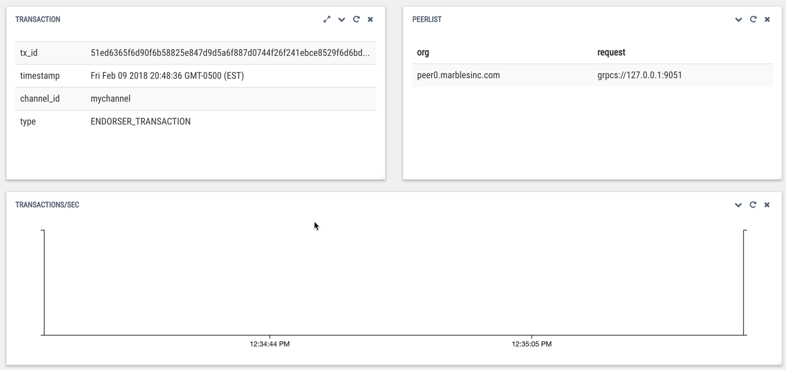

Blockchain Explorer
===================

**What is Blockchain Explorer**

Blockchain Explorer is a simple way to monitor, at a channel level, what is happening on the underlying Hyperledger Fabric. Explorer is not a monitoring tool to analyze what is happening from a capacity or performance standpoint. As you will find, Explorer is good to monitor what channel you are on, how many chaincodes are installed, how many blocks are in the network and how many transactions have there been. It is a fantastic tool that is all open-source. 

**Pre-Requisites** 

*	Nodejs 6.9.x (Nodejs v7.x is not yet supported)
*	Mysql 5.7 or greater
*	Docker 17.06.2-ce
*	Docker Compose 1.14 or greater

Part 1: MySQL Set Up
====================

**1.** Enter this command: sudo apt-get update::

	bcuser@ubuntu16043:~$ sudo apt-get update
	*
	* // A lot of output
	*

**2.** Enter this command: sudo apt-get install mysql-server::

	bcuser@ubuntu16043:~$ sudo apt-get install mysql-server

**3.** Give root a password. I always stick to 'password' for my password because I like to keep things super secure (kidding)

**4.** Enter this command: mysql_secure_installation

When you get prompted, always say YES - Except when it asks if you want to change the root's password, say NO:: 

	bcuser@ubuntu16043:~$ mysql_secure_installation

	Securing the MySQL server deployment.

	Enter password for user root: 
	The 'validate_password' plugin is installed on the server.
	The subsequent steps will run with the existing configuration
	of the plugin.
	Using existing password for root.

	Estimated strength of the password: 25 
	Change the password for root ? ((Press y|Y for Yes, any other key for No) : N

	 ... skipping.
	By default, a MySQL installation has an anonymous user,
	allowing anyone to log into MySQL without having to have
	a user account created for them. This is intended only for
	testing, and to make the installation go a bit smoother.
	You should remove them before moving into a production
	environment.

	Remove anonymous users? (Press y|Y for Yes, any other key for No) : Y
	Success.

	Normally, root should only be allowed to connect from
	'localhost'. This ensures that someone cannot guess at
	the root password from the network.

	Disallow root login remotely? (Press y|Y for Yes, any other key for No) : Y
	Success.

	By default, MySQL comes with a database named 'test' that
	anyone can access. This is also intended only for testing,
	and should be removed before moving into a production
	environment.

	Remove test database and access to it? (Press y|Y for Yes, any other key for No) : Y
	 - Dropping test database...
	Success.

	 - Removing privileges on test database...
	Success.

	Reloading the privilege tables will ensure that all changes
	made so far will take effect immediately.

	Reload privilege tables now? (Press y|Y for Yes, any other key for No) : Y
	Success.

	All done!

**5.** Once you get your command line prompt back, enter mysql -uroot -p. When prompted, enter root's password::

	bcuser@ubuntu16043:~$ mysql -uroot -p
	Enter password: 
	Welcome to the MySQL monitor.  Commands end with ; or \g.
	Your MySQL connection id is 38
	Server version: 5.7.21-0ubuntu0.16.04.1 (Ubuntu)

	Copyright (c) 2000, 2018, Oracle and/or its affiliates. All rights reserved.

	Oracle is a registered trademark of Oracle Corporation and/or its
	affiliates. Other names may be trademarks of their respective
	owners.

	Type 'help;' or '\h' for help. Type '\c' to clear the current input statement.

	mysql>

**6.** Your command prompt should begin with the words 'mysql' If that is the case, we are doing great so far. 

**7.** With your mysql command line, enter CREATE USER 'blockchain@localhost' IDENTIFIED by 'password';

This step will create a user named blockchain with the password of password. Again, security is our top priority here.::

	bcuser@ubuntu16043:~$ CREATE USER 'blockchain@localhost' IDENTIFIED by 'password';

**8.** With your new user created, enter GRANT ALL PRIVILEGES  ON '.' TO 'blockchain@localhost';

This step grants our user, blockchain, to have all privileges to all databases.::

	bcuser@ubuntu16043:~$ GRANT ALL PRIVILEGES  ON '.' TO 'blockchain@localhost';

**9.** Exit mysql as root and log in as blockchain by entering
mysql -ublockchain -p. When prompted for the password, it is password if you followed step 7.::

	bcuser@ubuntu16043:~$ mysql -ublockchain -p
	Enter password: 
	Welcome to the MySQL monitor.  Commands end with ; or \g.
	Your MySQL connection id is 39
	Server version: 5.7.21-0ubuntu0.16.04.1 (Ubuntu)

	Copyright (c) 2000, 2018, Oracle and/or its affiliates. All rights reserved.

	Oracle is a registered trademark of Oracle Corporation and/or its
	affiliates. Other names may be trademarks of their respective
	owners.

	Type 'help;' or '\h' for help. Type '\c' to clear the current input statement.

	mysql>

**10.** Type in exit to get back to our Ubuntu instance::

	bcuser@ubuntu16043:~$

**What did you accomplish?**

You installed a mysql-server package from our Ubuntu instance. You gave a password to our user named root. Then we used root to create another user named blockchain. You did all of this with security being our top concern by naming our password's password. Well done!

Part 2: Set Up Explorer
=======================

This part is dependent on you accomplishing the Hyperledger Fabric installation & verification as well as the Marbles Smart Contract & UI labs.

**1.** To confirm you have 1.1.0-alpha of Hyperledger Fabric running, enter docker images. Your screen should look very similar to what is below

**2.** Also, we need to know if you have Marbles Chaincode installed. Enter docker ps -a. Your screen should look very similar to what is below

**3.** Now run this command to get the needed documentation for Blockchain Explorer::

 wget https://raw.githubusercontent.com/silliman/BlockchainImmersion/master/blockchain-explorer.tar.gz

**4.** Extract the file you just pulled down from GitHub, by entering tar -xvf blockchain-explorer.tar.gz::

	bcuser@ubuntu16043:~$ tar -xvf blockchain-explorer.tar.gz

**5.** You should now have a blockchain-explorer directory in your Ubuntu instance. You can find out by entering ls -l. If you do, enter cd blockchain-explorer to enter that directory::

	bcuser@ubuntu16043:~$ ls -l
	total 139516
	-rw-r--r--  1 bcuser bcuser     53638 Jan  2 21:23 CHANGELOG.md
	-rw-r--r--  1 bcuser bcuser     59059 Jan  2 21:23 LICENSE
	-rw-r--r--  1 bcuser bcuser     26896 Jan  2 21:23 README.md
	drwxr-xr-x  2 bcuser bcuser      4096 Feb  9 11:34 bin
	drwxrwxr-x 13 bcuser bcuser      4096 Feb  9 21:16 blockchain-explorer
	-rw-rw-r--  1 bcuser bcuser 142671149 Feb  9 16:09 blockchain-explorer.tar.gz
	-rwxr-xr-x  1 bcuser bcuser      2056 Feb  9 20:28 bootstrap.sh
	drwxrwxr-x  2 bcuser bcuser      4096 Feb  9 11:04 etc
	-rw-rw-r--  1 bcuser bcuser      9461 Feb  9 16:31 history.txt
	drwxr-xr-x  3 bcuser bcuser      4096 Jan  2 21:23 include
	drwxr-xr-x  3 bcuser bcuser      4096 Jan  2 21:23 lib
	drwxr-xr-x  5 bcuser bcuser      4096 Jan  2 21:23 share
	drwxrwxr-x 11 bcuser bcuser      4096 Feb 10 09:19 zmarbles
	bcuser@ubuntu16043:~$ cd blockchain-explorer/
	bcuser@ubuntu16043:~/blockchain-explorer$

**6.** Once you are in the blockchain-explorer directory, enter cd db to enter the db directory

**7.** Enter chmod u+x fabricexplorer.sql to make the fabricexplorer file executable. Enter ls -l again to see it show up in a different color. On my system it is green::

	bcuser@ubuntu16043:~/blockchain-explorer/db$ chmod u+x fabricexplorer.sql 
	bcuser@ubuntu16043:~/blockchain-explorer/db$ ls -l
	total 20
	-rwxrw-r-- 1 bcuser bcuser  3721 Feb  9 12:17 fabricexplorer.sql
	-rw-rw-r-- 1 bcuser bcuser 14925 Feb  9 12:17 mysqlservice.js
	bcuser@ubuntu16043:~/blockchain-explorer/db$

**8.** Enter cd .. to go back one directory to the blockchain-explorer directory

**9.** You are now going to set up your mysql databases by entering 
mysql -ublockchain -p < db/fabricexplorer.sql. You will be prompt to enter the password for our mysql user blockchain. I hope you haven't forgotten about our super secure password <- hint hint::

	bcuser@ubuntu16043:~/blockchain-explorer$ mysql -ublockchain -p < db/fabricexplorer.sql

**10.** This is where things get a little tricky. Enter cat config.json. Below is what my output looks like. Make sure yours does too, word and number by word and number. This file is the key to making Explorer work

**11.** If your file looks the same as the picture, enter npm install from the blockchain-explorer directory. This will create a node_modules directory and a log.log file to give out information on Explorer

**12.** Now you are ready to start Explorer by entering ./start.sh - You will be given your command prompt right away meaning that it is running in the background::

	bcuser@ubuntu16043:~/blockchain-explorer$ ./start.sh

**13.** Now go to your browser and enter your ip address with port 8081. This will take your Blockchain Explorer

Part 3: Navigating Blockchain Explorer
======================================

**1.** Welcome to the Blockchain Explorer homepage. This Explorer page is for peer 0 from Marbles Inc. That is important to know what perspective you are looking from

**2.** In the middle you will notice Peers, Blocks, Transactions (TX) and Chaincode. You will also notice a Block, Blocklist and Blockview section as well

**3.** You will notice your Channel Name (mychannel) in the top left. If you were involved on multiple channels, you could toggle between them in the top right

**4.** If you scroll down, you will notice sections for Transaction, Peerlist, Transactions per Second, Blocks per Second, Transactions per Minute, Blocks per Minute and then a Chaincode list

**5.** If you scroll back up, my numbers in the middle might be different than yours. When making this lab, it is looking at a fresh marbles interface whereas you have been making transactions on the marbles interface, specifically from the Marbles Inc. interface

**6.** Go ahead and click on a block from the Blocklist section

**7.** The Block section will now be filled with information. If you click on the blue Transactions link, it will then fill in the Transaction section with information on that transaction

**8.** Within the Block section click on the corner arrow icon in the top right

**9.** A pop-up will appear with what looks like a lot of information. Click on level 6 in top right

**10.** Click on the + sign right next to data in the signature section

**11.** This will spill out a lot of numbers. What is interesting is that this is actually ASCII. If you really wanted to, you could go to http://www.asciitable.com/ and match the number to the ASCII table to get what this transaction was doing. One way Blockchain Explorer could improve upon is understanding what the transaction did without having to match to the ASCII conversion table. 

**12.** Exit out of that screen and switch to your one of your Marbles webpages. Once you are at a Marbles webpage, create a marble for one of the participants

**13.** Now quickly jump back to your Explorer homepage. You should notice a new block number and transaction number. 

**14.** Switch back to a Marbles webpage, but this time the United Marbles webpage. Create a marble or delete a marble from one of the participants

**15.** Switch back to Explorer and notice again the block and transaction numbers. 

Step back and make sure you understand what you just did in steps 14 and 15? You went to the United Marbles perspective of the Marbles application. You either created or deleted a marble from one of the United Marbles participants. Then you switched to the Marbles Inc.'s Blockchain Explorer perspective of the Marbles network. You observed an addition to the Block and Transaction number. To make it clear, you made changes from the United Marbles perspective and then observed that change from the Marbles Inc. perspective. That is the power of Blockchain. Everyone in the network, specifically in the same channel, is on the same page due to the ledger. 

**16.** Continue to play around with the Marbles interfaces and then observing them in the Blockchain Explorer

**End of lab!**
