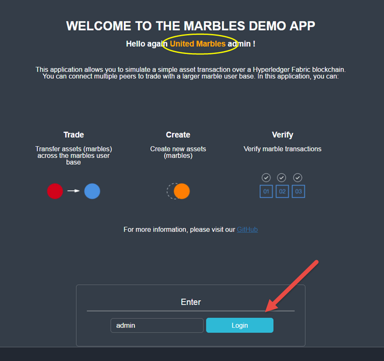
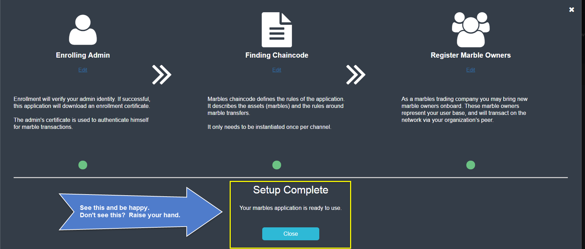
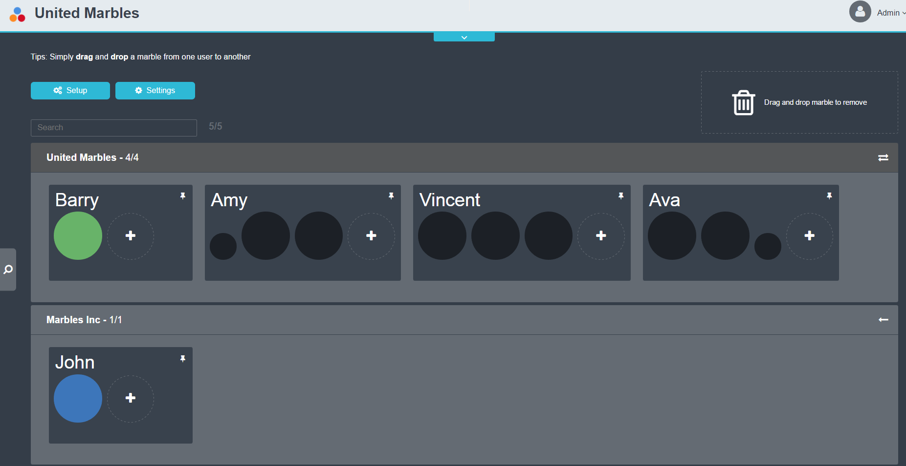
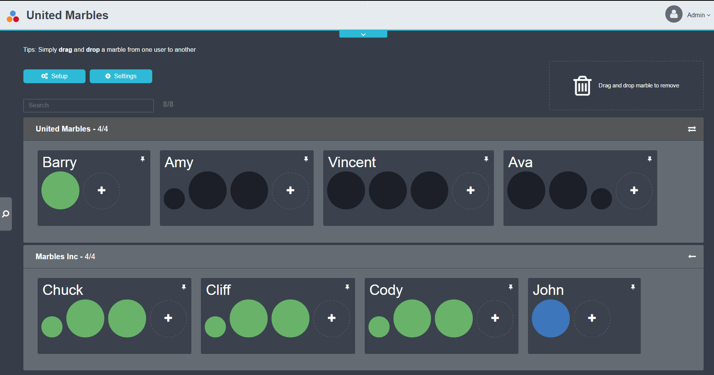
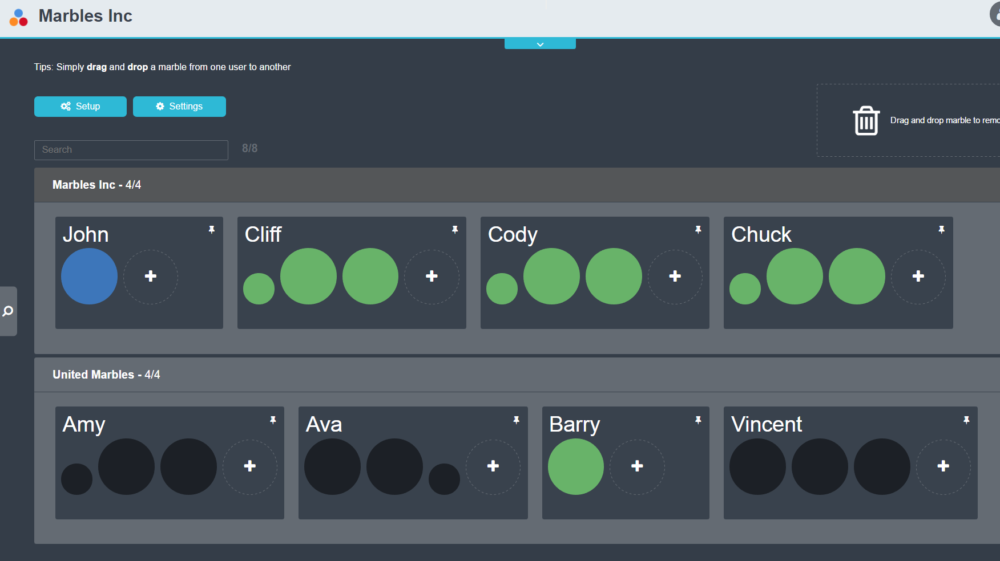

Section 1:  Lab Overview
========================

In this lab, you will use the Hyperledger Fabric network that you created in the previous lab and configure the Marbles User 
Interface (UI) web application so that it will integrate with the marbles chaincode that you installed in the previous lab.

You will use two browser sessions to simulate acting as a user for each of the two organizations in the network- *United Marbles*
and *Marbles Inc*.

Then you can explore the Marbles UI to execute chaincode transactions and see some of the Hyperledger Fabric concepts in action.

Section 2: Marbles user interface setup
=======================================

**Step 2.1:** Switch to the *~/zmarbles/marblesUI* directory::

 ubuntu@wsc00-14:~$ cd ~/zmarbles/marblesUI
 ubuntu@wsc00-14:~/zmarbles/marblesUI$

**Step 2.2:** **NICK CAN SKIP THIS STEP!!!** You will need to do an *npm install* to install the packages needed by the Marbles user interface.  
First you will verify that the *node_modules* directory does not exist.  
This directory will be created when you run an npm *install* in the next step, so right now it shouldn't exist::

 ubuntu@wsc00-14:~/zmarbles/marblesUI$ ls -l node_modules
 ls: cannot access 'node_modules': No such file or directory

**Step 2.3:** Now run the *npm install*::

 ubuntu@wsc00-14:~/zmarbles/marblesUI$ npm install
   .
   .  (output not shown here)
   .

**Step 2.4:** When this command ends, list the *node_modules* directory again. It is there now::

 ubuntu@wsc00-14:~/zmarbles/marblesUI$ ls -l node_modules
   .
   .  (output not shown here)
   .

**Step 2.5:** **Skip this one too Nick** How much ‘there’ is there?  Run this command if you are curious.  I hope you are a speed reader::
 
 ubuntu@wsc00-14:~/zmarbles/marblesUI$ ls -ltrR node_modules/
   .
   .  (output not shown here)
   .

**Step 2.6:** Change to the *config* directory::

 ubuntu@wsc00-14:~/zmarbles/marblesUI$ cd config
 bcuser@ubuntu16045;~/zmarbles/marblesUI/config$ 

**Step 2.7:** There are four files in this directory::

 ubuntu@wsc00-14:~/zmarbles/marblesUI/config$ ls
 blockchain_creds1.json  blockchain_creds2.json  marbles1.json  marbles2.json
 ubuntu@wsc00-14:~/zmarbles/marblesUI/config$ 
 
**Step 2.8:** There are two files for the first fictitious company, *United Marbles*, and two files for the second fictitious 
company, *Marbles Inc.*  
Look at this file with the *cat* command::

 ubuntu@wsc00-14:~/zmarbles/marblesUI/config$ cat marbles1.json 
 {
     "cred_filename": "blockchain_creds1.json",
     "use_events": false,
     "keep_alive_secs": 120,
     "company": "United Marbles",
     "usernames": [
         "amy",
         "alice",
         "ava"
     ],
     "port": 3001,
     "last_startup_hash": ""
 }

**Step 2.9:** Notice that this file points to one of the other existing files, *blockchain_creds1.json*, as the value of 
the *cred_filename* name/value pair.  
You will look at that in a moment.  
Take a note of the usernames array-  *amy*, *alice*, and *ava*.  
If you are comfortable with the *vi* editor you could change those names to your favorite names if you would like.  
You can also use the *sed* command to change the name inline without entering *vi*.  
Here is an example of a command to change the name *alice* to *vincent*.  
**This step is optional- you do not have to do this is you prefer the name alice to vincent**::

 ubuntu@wsc00-14:~/zmarbles/marblesUI/config$ sed -i "s/alice/vincent/" marbles1.json   # optional
 ubuntu@wsc00-14:~/zmarbles/marblesUI/config$

**Step 2.10:** Here is the file after I changed *alice* to *vincent* with the previous sed command::

 ubuntu@wsc00-14:~/zmarbles/marblesUI/config$ cat marbles1.json 
 {
     "cred_filename": "blockchain_creds1.json",
     "use_events": false,
     "keep_alive_secs": 120,
     "company": "United Marbles",
     "usernames": [
         "amy",
         "vincent",
         "ava"
     ],
     "port": 3001,
     "last_startup_hash": ""
 }
 
**NOTE:** Your file will look different if you choose to skip the optional *Step 2.9* or if you made changes other than the example change I showed.  
The purpose of this step is to ensure that your file changed the way you intended it to (if it changed at all).

The other key thing to note is the port number.  
It is *3001* here.  
In the *marbles2.json* file for *Marbles Inc*, port *3002* will be specified.  
This is how, later in this lab, you will pretend to be a user of one company or the other-  by using port 3001 in the URL to pretend to be a “United Marbles” user and by using port 3002 in the URL to pretend to be a “Marbles Inc” user.

**Step 2.11:** It is time to look at the main configuration file the Marbles app uses. 
It is the file specified as the *cred_filename* value in the *marbles1.json* file.  
This name *cred_filename* for the JSON name/value pair and the filename, *blockchain_creds1.json*, indicate that security credentials are specified in this file, and they are, but actually information about the Hyperledger Fabric network itself is specified in this file as well. 
This file is too large to fit in one screen, so I will teach you one more Linux command, named *more*.  
(Pun intended).  
Type this::

 ubuntu@wsc00-14:~/zmarbles/marblesUI/config$ more blockchain_creds1.json

This command will print as much of the file as it can on your screen but will pause until you hit enter before displaying the rest of the file’s contents.  
I will go over the sections in this file- hit enter as my explanations go past what you currently see visible and the next screen’s worth of the file will be displayed.

*orderers* specifies an array of orderer nodes.  
In your configuration file, the array has one entry, which is a map with three entries, *discovery*, *msp_id*, and *tls_certificate*.

*	The discovery value is the URL of the orderer service-  it listens on port 7050 and uses the grpcs (secure grpc) protocol.  
*	The msp_id value is the MSP name for the orderer. Each organization that participates in a Hyperledger Fabric network must have a unique MSP name. 
*	The tls_certificate value of cert_1 is a pointer to another section in the file I’ll discuss later.

::

         "orderers": [
            {   
                "discovery": "grpcs://localhost:7050",
                "msp_id": "OrdererMSP",
                "tls_certificate": "cert_1"
            }
         ],

*cas* specifies an array of certificate authority nodes.  
In your configuration file, the array has one entry, a map with four entries:

* The *api* value is the URL of the certificate authority service- it listens on port 7054 and uses the https protocol.

*	The *msp_id* value is the MSP name for the “United Marbles” company.  This certificate authority and the peer nodes for “United Marbles” share the same name, *Org0MSP*.

*	The *users* value is an array of authorized users of the certificate authority.

*	The *tls_certificate* value of *cert_2* is a pointer to another section in the file I’ll discuss later.

::

        "cas": [
            {   
                "api": "https://localhost:7054",
                "msp_id": "Org0MSP",
                "users": [
                    {   
                        "enrollId": "admin",
                        "enrollSecret": "adminpw"
                    }
                ],
                "tls_certificate": "cert_2"
            }
        ],
        
*peers* specifies an array of peers that the Marbles app will use to send transaction proposals to. 
In your configuration file only one peer is specified.  
It listens on port 7051 for requests, and the peer provides an event hub service that listens on port 7053. 
Note that United Marbles has two peers in the network, but only one of them is specified here.  
This means that the peer specified here will take on the endorsement and committer role for the marbles chaincode, but the other peer not specified here will take on only the committer role for the marbles chaincode.

::

        "peers": [
            {   
                "name": "peer0.unitedmarbles.com",
                "discovery": "grpcs://localhost:7051",
                "events": "grpcs://localhost:7053",
                "msp_id": "Org0MSP",
                "tls_certificate": "cert_3"
            }
        ],
        
The *app* value is a map of other definitions needed by the marbles app, including:

*	the channel on which the chaincode has been *instantiated* 
*	the chaincode id and version given in the chaincode *install* and *instantiate* commands.

::

        "app": {
            "channel_id": "mychannel",
            "chaincode_id": "marbles",
            "chaincode_version": "1.0",
            "block_delay": 1000
        },
        
**IMPORTANT: if you used a channel name other than the default of mychannel, you must change this value from mychannel to the value youused.** 
Either use the *vi* editor if you are comfortable with that, or, you could use *sed*.  
For example, here is a *sed* command, to change the channel name from *mychannel* to *tim*, along with “before” and “after” *grep* commands to show the changes
**(These commands are examples and only needed if you did not use the default channel name of mychannel)**::

 ubuntu@wsc00-14:~/zmarbles/marblesUI/config$ grep mychannel blockchain_creds[12].json 
 blockchain_creds1.json:            "channel_id": "mychannel",
 blockchain_creds2.json:            "channel_id": "mychannel", 
 ubuntu@wsc00-14:~/zmarbles/marblesUI/config$ sed -i "s/mychannel/tim/" blockchain_creds[12].json 
 ubuntu@wsc00-14:~/zmarbles/marblesUI/config$ grep channel_id blockchain_creds[12].json 
 blockchain_creds1.json:            "channel_id": "tim",
 blockchain_creds2.json:            "channel_id": "tim",

The *tls_certificates* value is a map of name/value pairs associated with certificates used for TLS handshaking:

*	*cert_1* is used by the orderer service
*	*cert_2* is used by the United Marbles certificate authority service
*	*cert_3* is used by the United Marbles peer specified in the *peers* section of this file

::

        "tls_certificates": {
            "cert_1": {
                "common_name": "orderer.blockchain.com",
                "pem": "../../crypto-config/ordererOrganizations/blockchain.com/orderers/orderer.blockchain.com/tls/ca.crt"
            },
            "cert_2": {
                "common_name": "ca.unitedmarbles.com",
                "pem": "../../crypto-config/peerOrganizations/unitedmarbles.com/ca/ca.unitedmarbles.com-cert.pem"
            },
            "cert_3": {
                "common_name": "peer0.unitedmarbles.com",
                "pem": "../../crypto-config/peerOrganizations/unitedmarbles.com/peers/peer0.unitedmarbles.com/tls/ca.crt"
            }
        }
        
**Step 2.12:** The considerations for *marbles2.json* and *blockchain_creds2.json* are the same as for *marbles1.json* 
and *blockchain_creds1.json* except that they apply to “Marbles Inc.” instead of “United Marbles”.  
If you would like to compare the differences between *blockchain_creds1.json* and *blockchain_creds2.json*, try the *diff* command and observe its output. 
This command lists sections of the two files that it finds different.  
The lines from the first file, *blockchain_creds1.json*, start with ‘<’ (added by the diff command output, not in the actual file), and the lines from the second file, *blockchain_creds2.json*, start with ‘>’::

 ubuntu@wsc00-14:~/zmarbles/marblesUI/config$ diff blockchain_creds1.json blockchain_creds2.json 
 13,14c13,14
 <                 "api": "https://localhost:7054",
 <                 "msp_id": "Org0MSP",
 ---
 >                 "api": "https://localhost:8054",
 >                 "msp_id": "Org1MSP",
 17,18c17,18
 <                         "enrollId": "admin",
 <                         "enrollSecret": "adminpw"
 ---
 >                         "enrollId": "admin2",
 >                         "enrollSecret": "adminpw2"
 26,29c26,29
 <                 "name": "peer0.unitedmarbles.com",
 <                 "discovery": "grpcs://localhost:7051",
 <                 "events": "grpcs://localhost:7053",
 <                 "msp_id": "Org0MSP",
 ---
 >                 "name": "peer0.marblesinc.com",
 >                 "discovery": "grpcs://localhost:9051",
 >                 "events": "grpcs://localhost:9053",
 >                 "msp_id": "Org1MSP",
 45,46c45,46
 <                 "common_name": "ca.unitedmarbles.com",
 <                 "pem": "../../crypto-config/peerOrganizations/unitedmarbles.com/ca/ca.unitedmarbles.com-cert.pem"
 ---
 >                 "common_name": "ca.marblesinc.com",
 >                 "pem": "../../crypto-config/peerOrganizations/marblesinc.com/ca/ca.marblesinc.com-cert.pem"
 49,50c49,50
 <                 "common_name": "peer0.unitedmarbles.com",
 <                 "pem": "../../crypto-config/peerOrganizations/unitedmarbles.com/peers/peer0.unitedmarbles.com/tls/ca.crt"
 ---
 >                 "common_name": "peer0.marblesinc.com",
 >                 "pem": "../../crypto-config/peerOrganizations/marblesinc.com/peers/peer0.marblesinc.com/tls/ca.crt"
 
Section 3: Start the Marbles user interface
===========================================

In this section, you will use the Marbles user interface.  
You will start two browser sessions- one will be as a “United Marbles” user, and the other as a “Marbles Inc” user.  
Here in this lab, you are serving both companies’ applications from the same server, so you will differentiate between the two companies by the port number. 
You will connect to port 3001 when acting as a United Marbles user, and you will connect to port 3002 when acting as a Marbles Inc user.  
In the real world, each of the two companies would probably either serve the user interface from their own server, or perhaps both companies would log in to a server provided by a service provider-  think “Blockchain-as-a-service”.  
The chosen topology is use-case dependent and beyond the scope of this lab.

**Step 3.1:** You are now ready to start the server for UnitedMarbles.  
Back up to the *~/zmarbles/marblesUI* directory::

 ubuntu@wsc00-14:~/zmarbles/marblesUI/config$ cd ..
 ubuntu@wsc00-14:~/zmarbles/marblesUI$

**Step 3.2:** You will now use *gulp* to start up the server, with this command::

 ubuntu@wsc00-14:~/zmarbles/marblesUI$ gulp marbles1
 [13:06:55] Using gulpfile ~/zmarbles/marblesUI/gulpfile.js
 [13:06:55] Starting 'start_marbles1'...
 
 [International Marbles Trading Consortium] 1
 
 [13:06:55] Finished 'start_marbles1' after 69 μs
 [13:06:55] Starting 'build-sass'...
 [13:06:55] Finished 'build-sass' after 11 ms
 [13:06:55] Starting 'watch-sass'...
 [13:06:55] Finished 'watch-sass' after 9.56 ms
 [13:06:55] Starting 'watch-server'...
 [13:06:55] Finished 'watch-server' after 3.64 ms
 [13:06:55] Starting 'server'...
 info: Loaded config file /home/bcuser/zmarbles/marblesUI/config/marbles1.json
 info: Loaded creds file /home/bcuser/zmarbles/marblesUI/config/blockchain_creds1.json
 info: Returning a new winston logger with default configurations
 info: Loaded config file /home/bcuser/zmarbles/marblesUI/config/marbles1.json
 info: Loaded creds file /home/bcuser/zmarbles/marblesUI/config/blockchain_creds1.json
 debug: cache busting hash js 1497373615994 css 1497373615994
 ------------------------------------------ Server Up - localhost:3001 ------------------------------------------
 ------------------------------------------ Websocket Up ------------------------------------------
 warn: "last_startup_hash" not found in config json: /home/bcuser/zmarbles/marblesUI/config/marbles1.json 

 debug: Detected that we have NOT launched successfully yet
 debug: Open your browser to http://localhost:3001 and login as "admin" to initiate startup

The first line of the output just listed reads::

 [13:06:55] Using gulpfile ~/zmarbles/marblesUI/gulpfile.js

I am not going to go into detail on the *gulp* tool here, but if you are curious, if you look into the *gulpfile.js* file (you would have to use another PuTTY or SSH session as this one is now tied up) you would find that a *marbles1* task (*marbles1* being your argument to the *gulp* command) is defined::

 gulp.task('marbles1', ['start_marbles1', 'watch-sass', 'watch-server', 'server']);

The *marbles1* task specifies four more tasks to run, the first of which is *start_marbles1*.  
This task is adding a value to a map named *env*. 
This value points to the *marbles1.json* file::

 gulp.task('start_marbles1', function () {
         env['creds_filename'] = 'marbles1.json';
         console.log('\n[International Marbles Trading Consortium] 1\n');
 });

The last of the tasks, *server*, when it is started, is receiving this map named *env* as part of its invocation::

 gulp.task('server', function(a, b) {
         if(node) node.kill();
         node = spawn('node', ['app.js'], {env: env, stdio: 'inherit'}); //command, file, options
 });

The syntax is a bit arcane, and this is not a course in JavaScript, but there is a line in the main file for the server, *app.js*, that reads this *creds_filename* value::

 var helper = require(__dirname + '/utils/helper.js')(process.env.creds_filename, logger);

And if you look in *utils/helper.js* you will see several methods that are reading the values that are specified in *marbles1.json*.  
Additionally, there is a place in the code where the *cred_filename* value specified in *marbles1.json* is read and those values are available for retrieval.  
It is unfortunate that in this application, one place uses *creds_filename* to refer to *marbles1.json* and then, inside *marbles1.json*, *cred_filename* is referring to *blockchain_creds1.json*.  
It is an opportunity for confusion.

You did not need to know all this to run the application, but you might need to know where to start looking when your boss asks you to tailor the marbles application because she wants a return on the time and money you spent taking this lab-  assuming you don’t get off the hook when you tell her that nowhere was JavaScript mentioned on the agenda.

**Step 3.3:** Open up a web browser window or tab and point to *http://<your_IP_goes_here>:3001*.
Captain Obvious says to plug in your IP address instead of *<your_IP_goes_here>*. 
Listen to him. 
You should see a screen that looks like this:

    
Notice that you are greeted at the top as a “United Marbles admin”.  
Smart money says that this line in *marble1.json* has something to do with it (you may need to open a new PuTTY session and switch to the directory shown in the command below if you want to run this)::

 ubuntu@wsc00-14:~/zmarbles/marblesUI/config$ grep company marbles1.json 
     "company": "United Marbles",

I have drawn an arrow to the *Login* button.

**Step 3.4:** I did that partly because I want to justify to my management the money they spent on a Camtasia Studio and SnagIt license for me, but also because I want you to click the *Login* button.  
Like, right now. 
Wait, read this first-  watch the screen when you do, because if you are on the happy path, it will update automatically for you.  
Okay, Simon says, click it now, unless you already did. 
If all is well, you will see the message that I have highlighted in the yellow box.  
Follow the instructions I have provided in the blue arrow:
 

    
**Step 3.5:** Click the *Close* button already! 
Ok, that was a bit harsh.  
I’ll switch to decaf.  
But in the interim, you should see a screen like this:
 

    
You can see the userids that you specified in your *marbles1.json* file.  
I have Amy, Vincent, and Ava listed, because I changed Alice to Vincent earlier in the lab.  
You might have different names if you changed them.  
But where did Barry come from? 
(A question that gets asked a lot, but seldom answered).

The reason Barry showed up on your screen is from the earlier lab when you did a *peer chaincode invoke* and called 
the *init_owner* chaincode function.  
You tied the owner “Barry” to the company “United Marbles” with this command::

 peer chaincode invoke -n marbles -c '{"Args":["init_owner","o0000000000002","Barry","United Marbles"]}' $FABRIC_TLS -C $CHANNEL_NAME

If you changed ‘Barry’ to another name, then that name would have shown up on your screen.  
If you changed ‘United Marbles’ to anything else, then you probably aren’t seeing what this lab document is showing.

The application created some marbles for the users Amy, Vincent, and Ava, but where did Barry’s marble come from?  
You guessed it-  it was from when you entered this command in the previous lab::

 peer chaincode invoke -n marbles -c '{"Args":["init_marble","m0000000000002","green","50","o0000000000002","United Marbles"]}' $FABRIC_TLS -C $CHANNEL_NAME

Now that command was in the last step of the lab where it said 'try some or all of these commands'.  
So, if you did not try that command, or did another command that changed things, you may not see Barry’s marble.  
It’s okay.  
He lost most of his marbles a long time ago.  
One more will not be missed.

**Step 3.6:** What about John’s marble for Marbles Inc.  
You only started up the server for United Marbles, so why does Marbles Inc show up and why is John so lonely?   
When you did the previous lab, the first two commands I had you do were an *init_owner* for John, 
tying him to Marbles Inc, and then an *init_marble*, giving him a marble.  
Remember, the “blockchain” is shared among all participants of the channel, so United Marbles and Marbles Inc both see the same chain-  they see each other’s marbles.  

But the user names specified in *config/marbles2.json* are not created until you start the server for *marbles2* and log in the first time.  
List the contents of *marbles2.json* file (switch to a free PuTTY session or start a new one), e.g.::

 ubuntu@wsc00-14:~$ cd ~/zmarbles/marblesUI
 ubuntu@wsc00-14:~/zmarbles/marblesUI$ cat config/marbles2.json 
 {
     "cred_filename": "blockchain_creds2.json",
     "use_events": false,
     "keep_alive_secs": 120,
     "company": "Marbles Inc",
     "usernames": [
         "cliff",
         "cody",
         "chuck"
     ],
     "port": 3002,
     "last_startup_hash": ""
 }

**Step 3.7:** Start the second server, the one for Marbles Inc::

 ubuntu@wsc00-14:~/zmarbles/marblesUI$ gulp marbles2
 [16:22:07] Using gulpfile ~/zmarbles/marblesUI/gulpfile.js
 [16:22:07] Starting 'start_marbles2'...  

 [International Marbles Trading Consortium]  2
 
 [16:22:07] Finished 'start_marbles2' after 91 μs
 [16:22:07] Starting 'build-sass'...
 [16:22:07] Finished 'build-sass' after 14 ms
 [16:22:07] Starting 'watch-sass'...
 [16:22:07] Finished 'watch-sass' after 9.89 ms
 [16:22:07] Starting 'watch-server'...
 [16:22:07] Finished 'watch-server' after 5.6 ms
 [16:22:07] Starting 'server'...
 info: Loaded config file /home/bcuser/zmarbles/marblesUI/config/marbles2.json
 info: Loaded creds file /home/bcuser/zmarbles/marblesUI/config/blockchain_creds2.json
 info: Returning a new winston logger with default configurations
 info: Loaded config file /home/bcuser/zmarblesUI/marbles/config/marbles2.json
 info: Loaded creds file /home/bcuser/zmarblesUI/marbles/config/blockchain_creds2.json
 debug: cache busting hash js 1497385328473 css 1497385328473
 ------------------------------------------ Server Up - localhost:3002 ------------------------------------------
 ------------------------------------------ Websocket Up ------------------------------------------
 warn: "last_startup_hash" not found in config json: /home/bcuser/zmarbles/marblesUI/config/marbles2.json

 debug: Detected that we have NOT launched successfully yet   
 debug: Open your browser to http://localhost:3002 and login as "admin" to initiate startup

If you peek at your browser session from United Marbles, (port 3001), you will not notice any changes yet.

**Step 3.8:** Open a browser tab or window and navigate to *http://<your_IP_here>:3002*. 
The screen will look the same except you’ll be greeted as a “Marbles Inc admin”.  
Scroll down and click *Login*.  
It should reach the same happy conclusion (“Setup Complete”) as it did for United Marbles.  
While this is taking place, go back to your United Marbles tab or window.  
You should observe, after a little while, new users showing up for Marbles Inc-  Cliff, Cody, and Chuck, or whomever you may have changed them to:
 

    
Remember, you are looking at the United Marbles session but you see all the new users and marbles created by the Marbles Inc 
administrator.

**Step 3.9:** Please click *Close* back on the Marbles Inc screen when you are ready (the decaf is working) and your Marbles Inc screen will have their peeps at the top of the screen and the “others” (United Marbles) at the bottom, e.g.:
 

     
**Step 3.10:**  Play with your marbles!!  
Here are some things you can do.  
When you do things as one user, e.g. as the United Marbles admin, go to the other user’s screen to see that the changes one organization makes are visible to the other organization:

* On two different browser sessions, you should be logged in as the administrator for each of the two fictitious companies.  When you are the United Marbles administrator, you can create marbles for you or anybody in United Marbles.  You can delete marbles for you or anybody in United Marbles.  You can take marbles from anybody in United Marbles and give them to anybody in the network, even to Marbles Inc people.  (And vice versa when you are a Marbles Inc administrator).
*	Try clicking on the little magnifying glass to the left of the browser window and follow the directions
*	Right click on a marble (Hint: this is the same as using the magnifying glass)
*	Click on the **Settings** button and **Enable** story mode.  Try an action that is allowed, and try an action that shouldn’t be allowed, such as trying to steal a marble from the other company.  **Disable** story mode when it gets too tedious, which shouldn’t take long.

**Step 3.11:** Most marbles UI labs only have ten steps, but this lab goes to eleven.  
If you want that extra push, try these optional advanced assignments:

*	Break out the previous lab’s material and enter the *cli* container and issue some commands to create, update or delete marbles.  See if the Marbles UI reflects your changes
*	Look at some of the marbles chaincode container logs while you work with the Marbles UI -	**Hint:**  *docker logs [-f] container_name* will show a container’s log.  Try it without the optional *-f* argument first and then try it with it.   *-f* ties up your terminal session but then shows new log messages as they are created.  Press **Ctrl-c** to get out of it.
•	Look at the peer or orderer logs while you work with the Marbles UI
*	Click the **Setup** button in the upper left in the Marbles UI and then under **Register Marble Owners** at the top right click the **Edit** link.  Edit the list of names at the bottom and click **Register**.  Do your new users show up in both companies’ sessions?  What happens if you add a name that exists already?
 
**Leave the system in this state for the final lab, the Hyperledger Explorer lab**

**End of lab!**
