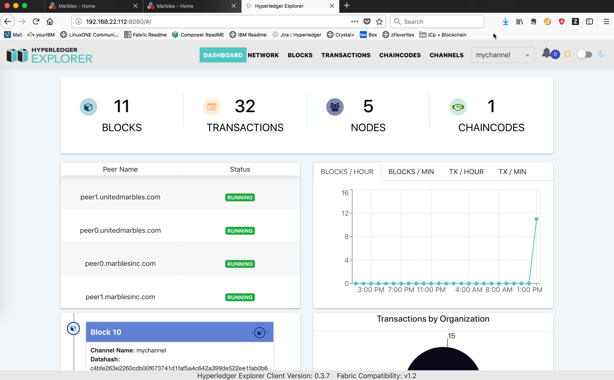

Blockchain Explorer
===================

**What is Blockchain Explorer**

Blockchain Explorer is a simple way to monitor, at a channel level, what is happening on the underlying Hyperledger Fabric. Explorer is not a monitoring tool to analyze what is happening from a capacity or performance standpoint. As you will find, Explorer is good to monitor what channel you are on, how many chaincodes are installed, how many blocks are in the network and how many transactions have there been. It is a fantastic tool that is all open-source. 

**Pre-Requisites** 

*	Node.js 8.11.x (Nodejs v9.x is not yet supported)
*	PostgreSQL or greater
*	Jq (https://stedolan.github.io/jq/)
*	Docker 17.06.2-ce
*	Docker Compose 1.14 or greater
*	Marbles UI is up and running

Part 1: Set Up
====================

**1.** Enter this command to update all of our packages within Ubuntu::

	bcuser@ubuntu16043:~$ sudo apt-get update
	*
	* // A lot of output
	*

**2.** Enter this command: sudo apt-get install mysql-server::

	bcuser@ubuntu16043:~$ sudo apt install postgresql jq

**4.** When you get prompted, say **Yes** to the first question. Then Postgre will continue to download::

	bcuser@ubuntu16044:~$ sudo apt install postgresql jq
	*
	* // Some output
	*
	After this operation, 22.1 MB of additional disk space will be used.
	Do you want to continue? [Y/n] Y
	*
	* // A lot more output
	*

**5.** We will pull down the files we need to execute everything we need. We created a tar file that is configured to our Marbles UI and Chaincode. We will walk you through it later on. Execute the following command to get our tar file::

	bcuser@ubuntu16043:~$ wget https://raw.githubusercontent.com/silliman/BlockchainImmersion/master/blockchain-	explorer.tar.gz
	
**6.** Then unpack our tar file::

	bcuser@ubuntu16043:~$ tar -xvf blockchain-explorer.tar.gz

**7.** Change into a different directory. Here we will run a script to create our Postgres database in the next command.:: 

	bcuser@ubuntu16043:~$ cd blockchain-explorer/app/persistence/fabric/postgreSQL/db/

**8.** Run this script, which creates our database for us in PostgreSQL::

	bcuser@ubuntu16043:~$ ./createdb.sh
	
**9.** Then execute the next command, which will give us a PostgreSQL prompt::

	bcuser@ubuntu16043:~$ sudo -u postgres psql

**10.** If you see the following prompt, we are in good position::

	postgres=# 
	

Part 2: PostgreSQL Set Up
==========================

**1.** Connect to the fabricexplorer database as the postgres user::

	postgres=# \c fabricexplorer
	You are now connected to database "fabricexplorer" as user "postgres".
	
You should know see a fabricexplorer prompt when you command executes perfectly::

	fabricexplorer=# 
	
**2.** Now execute a few more commands to assure that we connected to the database. We should see some things referencing peers, blocks, transactions, etc.::

	fabricexplorer-# \d
                   	List of relations
 	Schema |           Name            |   Type   | Owner 
	--------+---------------------------+----------+-------
	 public | blocks                    | table    | hppoc
	 public | blocks_id_seq             | sequence | hppoc
	 public | chaincodes                | table    | hppoc
	 public | chaincodes_id_seq         | sequence | hppoc
	 public | channel                   | table    | hppoc
	 public | channel_id_seq            | sequence | hppoc
	 public | orderer                   | table    | hppoc
	 public | orderer_id_seq            | sequence | hppoc
	 public | peer                      | table    | hppoc
	 public | peer_id_seq               | sequence | hppoc
	 public | peer_ref_chaincode        | table    | hppoc
	 public | peer_ref_chaincode_id_seq | sequence | hppoc
	 public | peer_ref_channel          | table    | hppoc
	 public | peer_ref_channel_id_seq   | sequence | hppoc
	 public | transactions              | table    | hppoc
	 public | transactions_id_seq       | sequence | hppoc
	 public | write_lock                | table    | hppoc
	 public | write_lock_write_lock_seq | sequence | hppoc
	(18 rows)
	
	fabricexplorer-# \dt
              	List of relations
 	Schema |        Name        | Type  | Owner 
	--------+--------------------+-------+-------
	 public | blocks             | table | hppoc
	 public | chaincodes         | table | hppoc
	 public | channel            | table | hppoc
	 public | orderer            | table | hppoc
	 public | peer               | table | hppoc
	 public | peer_ref_chaincode | table | hppoc
	 public | peer_ref_channel   | table | hppoc
	 public | transactions       | table | hppoc
	 public | write_lock         | table | hppoc
	(9 rows)
	
	fabricexplorer-# \di
                                  	List of relations
 	Schema |                 Name                  | Type  | Owner |       Table        
	--------+---------------------------------------+-------+-------+--------------------
	 public | blocks_blocknum_idx                   | index | hppoc | blocks
	 public | blocks_channel_genesis_hash_idx       | index | hppoc | blocks
	 public | blocks_createdt_idx                   | index | hppoc | blocks
	 public | blocks_pkey                           | index | hppoc | blocks
	 public | chaincodes_pkey                       | index | hppoc | chaincodes
	 public | channel_channel_genesis_hash_idx      | index | hppoc | channel
	 public | channel_channel_hash_idx              | index | hppoc | channel
	 public | channel_pkey                          | index | hppoc | channel
	 public | orderer_pkey                          | index | hppoc | orderer
	 public | peer_pkey                             | index | hppoc | peer
	 public | peer_ref_chaincode_pkey               | index | hppoc | peer_ref_chaincode
	 public | peer_ref_channel_pkey                 | index | hppoc | peer_ref_channel
	 public | transactions_blockid_idx              | index | hppoc | transactions
	 public | transactions_channel_genesis_hash_idx | index | hppoc | transactions
	 public | transactions_createdt_idx             | index | hppoc | transactions
	 public | transactions_md5_idx                  | index | hppoc | transactions
	 public | transactions_pkey                     | index | hppoc | transactions
	 public | transactions_txhash_idx               | index | hppoc | transactions
	 public | write_lock_pkey                       | index | hppoc | write_lock
	(19 rows)
	
**3.** Now to get back to our bcuser prompt, execut the following command to get there.::

	fabricexplorer-# \q
	bcuser@ubuntu16045:~$ 

Part 3: Finish Explorer Set Up
===============================

In order to get the Hyperledger Explorer UI connected and working, we need to install a few node modules installed. We will do that throughout this section. 

**1.** Change into the fabric directory within our Blockchain-Explorer folder::

	bcuser@ubuntu16045:~$ cd $HOME/blockchain-explorer/app/platform/fabric
	bcuser@ubuntu16045:~/blockchain-explorer/app/platform/fabric$
	
**2.** When you pulled down the tar file, we already configured the config.json file for you to match the Marbles UI and Chaincode. The config.json file is vital to getting everything to work. You have to map the file path to the keys, the correct channel and ports. I will include some of the important parts of the config.json file::

	bcuser@ubuntu16045:~/blockchain-explorer/app/platform/fabric$ cat config.json
	
	"channels": {
         "mychannel": {
          "peers": {
            "peer0.unitedmarbles.com": {}
	
	"Org0MSP": {
         "mspid": "Org0MSP",
          "fullpath": false,
           "adminPrivateKey": {
            "path":
             "/home/bcuser/zmarbles/crypto-config/peerOrganizations/unitedmarbles.com/users/Admin@unitedmarbles.com/msp/keystore"
	      
	"OrdererMSP": {
         "mspid": "OrdererMSP",
          "adminPrivateKey": {
           "path":
            "/home/bcuser/zmarbles/crypto-config/ordererOrganizations/blockchain.com/users/Admin@blockchain.com/msp/keystore"
	    
	"peers": {
         "peer0.unitedmarbles.com": {
          "tlsCACerts": {
           "path":
            "/home/bcuser/zmarbles/crypto-config/peerOrganizations/unitedmarbles.com/peers/peer0.unitedmarbles.com/tls/ca.crt"
	    
	"url": "grpcs://localhost:7051",
         "eventUrl": "grpcs://localhost:7053",
          "grpcOptions": {
           "ssl-target-name-override": "peer0.unitedmarbles.com"

**3.** Now we will run a few npm install commands from certain directories::

	bcuser@ubuntu16045:~$ cd $HOME/blockchain-explorer/
	bcuser@ubuntu16045:~/blockchain-explorer$ npm install
	
	bcuser@ubuntu16045:~$ cd app/test
	bcuser@ubuntu16045:~/blockchain-explorer/app/test$ npm install
	
**4.** Now that we have install some npm modules, let's run a test. You should see toward the bottom a number of tests that passed::

	bcuser@ubuntu16045:~/blockchain-explorer/app/test$ npm test
	
	*
	*/ 19 passing (68ms)
	*

You should see a lot check marks meaning that the test passed. If you do see a message about password authication, you can ignore that issue. 
	
**5.** Change directories and then run on final npm install and a couple of test commands::

	bcuser@ubuntu16045:~$ n
	bcuser@ubuntu16045:~/blockchain-explorer/client$ npm install
	
	bcuser@ubuntu16045:~/blockchain-explorer/client$ npm test -- -u --coverage
	
	*
	* / npm ERR! Test failed.  See above for more details.
	*
	
If you see the message above, you can ignore it.::
	
	bcuser@ubuntu16045:~/blockchain-explorer/client$ npm run build
	
**6.** Now that we have everything working successfully, let's actually start up Explorer UI::

	bcuser@ubuntu16045:~/blockchain-explorer/client$ cd $HOME/blockchain-explorer
	bcuser@ubuntu16045:~/blockchain-explorer$ ./start.sh
	
You won't get a bunch of output from that command, but you can view the logs by going to the file mentioned in the output.

Part 4: Hyperledger Explorer Walk Through
==========================================

**1.** If you go to your IP address with the port 8080, you will be graced by the Hyperledger Explorer homepage::

	IP Address: 192.168.22.1xx:8080
	

If you look at the bottom, you will see that the Fabric Compatability showing as Fabric v1.2 - Well, we are working on Fabric v1.4. Hyperledger Explorer supports v1.2 of Fabric, but getting this to work with Fabric v1.4 isn't too hard.

**2.** Let's break down this Homepage. In the (1) box you will find the toolbar, which includes the dashboard, network, blocks, transactions, chaincodes and channels - which you can toggle between the channels this peers is bound to. In the (2) box you will find the high level information, which is the number of blocks, transactions, nodes and chaincodes. The (3) box, you will see all the peers in the channel. In the (4) box, you will see a graphical representation of the blocks/transactions coming in by the minute or hour. In the (5) box - which you can scroll in, you will find the the blocks in the network. There is always 1 more block in the (2) box due to the genesis block. In the (6) box you will find out who is sending the transactions by organization. 

**3.** If you click on the Network button at the top, you will find all the peers in the network. In blockchain terms, you will want to see the block height all the same amongst the peers. 

**4.** If you jump over to the Block section up at the top, you will then see all the blocks in the channel. You will notice that blocks can contain multiple transactions. In our channel the default is 10 transactions or every 2 seconds - whichever comes first - cut a block. This parameter is customizable to however you would like it. 

**5.** Go ahead and click on the blue highlighted block hash on one of the blocks. This will give you information concerning the block, including the block number, hashes and transactions in the block. 

**6.** If you click out of the block detail section, you should be on the block section with all the blocks. Blockchain is linking blocks cryptographically from one block to another. You can actually view that from the current block to the previous block. It references the previous hash

**7.** Now, click on one of the transactions on the far right. You will then see the transaction in detail

**8.** If a transaction gets commited to the ledger, it has to have matching read/write sets. You can view that by clicking on the down arrows of the reads/writes to find the matching key values as well as what the transaction is trying to do. In this case, add a small white marble to Cliff of Marbles Inc.

**9.** If you click out of the transaction details section, you can then click on the transactions section. This will just give you all the transactions within a specific time parameter - all without the blocks. It will give you the same information as the step above. 

**10.** Next, click on the chaincodes section. This will give you all chaincodes on this peer. In this case, it is just the Marbles 1.0 chaincode with 32 transactions. 

**11.** Then you can click on the channels section. This will give you high level information regarding the channels this peer is operating in. 

Part 5: Marbles UI & Hyperledger Explorer
==========================================

**1.** Now that you have gone through Hyperledger Explorer. Now is the perfect time to tell you that you can submit transactions through the Marbles UI and then see them being being monitored in Explorer.

**2.** Jump over to the Marbles UI - either one will work. Then add a marble or trade marbles with someone. Once you have done that, jump over to the Explorer UI from the dashboard perspective. You should see a transaction coming through.

**3.** Now, let's try to make a bunch of transactions. You can do that by trading marbles very quickly in the UI. Once you do, observe the Explorer UI represent your transactions.

**4.** Continue to make various transactions and observe them in Explorer.

**End of lab!**
